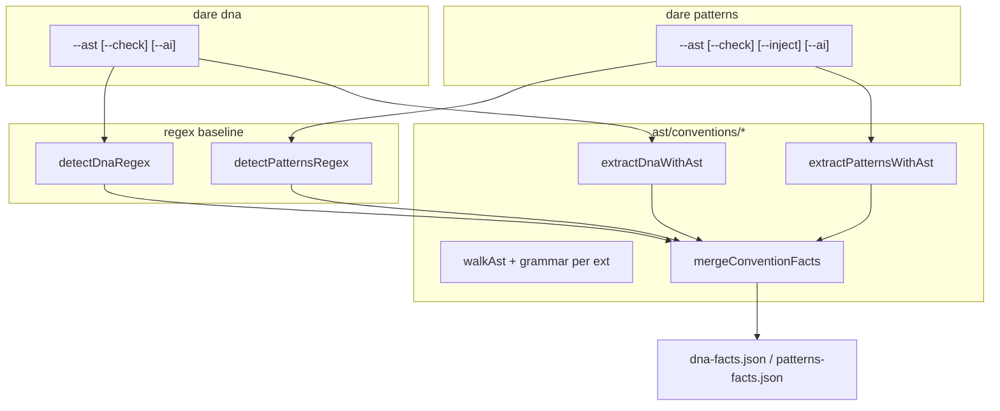

# Feature Blueprint: Brownfield AST — DNA + Patterns (v3.15)

> Derivado de [DESIGN-Feature-brownfield-ast-dna-patterns.md](DESIGN-Feature-brownfield-ast-dna-patterns.md).
> Branch: `feat/v3.15-brownfield-ast-dna-patterns` · Target: **v3.15.0** · License: MIT.
>
> **Base:** v3.14.0 `ast/*` loader; `dna-detector.ts`, `pattern-detector.ts` (regex);
> `commands/dna.ts`, `commands/patterns.ts`. **Não toca** `datamodel.ts`, `static-analyzer.ts`.

---

## 1. Visão Geral da Arquitetura

### 1.1 Princípio reitor

**Regex permanece baseline; AST enriquece conventions e patterns com `--ast`.**
Reutiliza `initAstLoader` + grammars v3.14. Merge superset em `DnaFacts` e `PatternsFacts`.
Zero LLM no core.

### 1.2 Diagrama



### 1.3 Decisões Arquiteturais

| # | Decisão | Justificativa |
|---|---|---|
| A-1 | Subpacote `ast/conventions/` | Separa rotas/entidades (v3.14) de conventions |
| A-2 | `detectDnaDetailed` / `detectPatternsDetailed` | Paridade com `extractDataModelDetailed` |
| A-3 | Merge patterns por `id` + union evidence | RF merge superset |
| A-4 | DNA AST foco: layers, libraries, DI hints | O-01 |
| A-5 | Patterns AST foco: call-idiom + structural Nest/Zod | O-02 |
| A-6 | `extraction` meta em facts JSON | Auditável `--check --ast` |
| A-7 | Sem novas optionalDependencies | RNF-03 |

---

## 2. Stack Técnica

| Camada | Arquivo | Nota |
|---|---|---|
| AST runtime | `ast/loader.ts` | Inalterado |
| DNA extract | `ast/conventions/dna-extract.ts` | NEW |
| Patterns extract | `ast/conventions/patterns-extract.ts` | NEW |
| Merge | `ast/conventions/merge-facts.ts` | NEW |
| DNA orchestrator | `utils/dna-detector.ts` | EXTEND |
| Patterns orchestrator | `utils/pattern-detector.ts` | EXTEND |
| CLI DNA | `commands/dna.ts` | `--ast` |
| CLI Patterns | `commands/patterns.ts` | `--ast` |
| Testes | vitest fixtures multi-linha | bloco `ast-conventions` |

---

## 3. Contratos TypeScript

### 3.1 `ast/conventions/types.ts` (NEW)

```ts
export interface ConventionExtractOptions {
  readonly root: string;
  readonly files: readonly string[];
  readonly modules: readonly ModuleInfo[];
  readonly maxFileBytes?: number;
}

export interface DnaAstSlice {
  readonly extraLayers: readonly string[];
  readonly libraryHints: Partial<DnaFacts['libraries']>;
  readonly diPatterns: readonly string[]; // e.g. 'nestjs-constructor-injection'
}

export interface PatternsAstSlice {
  readonly patterns: readonly DiscoveredPattern[];
}

export interface ConventionExtractionMeta {
  readonly mode: 'regex' | 'hybrid';
  readonly astEnabled: boolean;
  readonly astAvailable: boolean;
  readonly astPatternCount: number;
  readonly regexPatternCount: number;
}
```

### 3.2 `ast/conventions/dna-extract.ts` (NEW)

```ts
export async function extractDnaWithAst(
  opts: ConventionExtractOptions,
): Promise<{ slice: DnaAstSlice; astAvailable: boolean }>;
```

**Queries mínimas (P1 TS/JS + Python + PHP):**
- `import` nodes → ORM/HTTP/auth library hints
- `@Module`, `@Injectable`, `@Controller` → layer `nestjs-module`
- `constructor` com typed params → DI hint

### 3.3 `ast/conventions/patterns-extract.ts` (NEW)

```ts
export async function extractPatternsWithAst(
  opts: ConventionExtractOptions,
): Promise<{ slice: PatternsAstSlice; astAvailable: boolean }>;
```

**Queries mínimas:**
- `call_expression` / `new_expression` com `z.object` → `call-idiom:schema-validation`
- Controller class + constructor param type ending `Service` → `call-idiom:controller-service`
- `@Module(` decorator → `structural-idiom:nest-module`

### 3.4 `ast/conventions/merge-facts.ts` (NEW)

```ts
export function mergeDnaFacts(regex: DnaFacts, ast: DnaAstSlice): DnaFacts;
export function mergePatternsFacts(
  regex: PatternsFacts,
  ast: PatternsAstSlice,
): PatternsFacts;
```

### 3.5 `utils/dna-detector.ts` (EXTEND)

```ts
export interface DetectDnaOptions {
  readonly ast?: boolean;
  readonly maxFileBytes?: number;
}

export interface DetectDnaResult {
  readonly facts: DnaFacts;
  readonly extraction?: ConventionExtractionMeta;
}

export async function detectDnaDetailed(
  root: string,
  generatedAt: string,
  opts?: DetectDnaOptions,
): Promise<DetectDnaResult>;

// backward compat
export async function detectDna(root: string, generatedAt: string): Promise<DnaFacts>;
```

### 3.6 `utils/pattern-detector.ts` (EXTEND)

```ts
export interface DetectPatternsOptions {
  readonly ast?: boolean;
  readonly maxFileBytes?: number;
  readonly modulesOnly?: readonly string[];
}

export interface DetectPatternsResult {
  readonly facts: PatternsFacts;
  readonly extraction?: ConventionExtractionMeta;
}

export async function detectPatternsDetailed(
  root: string,
  dna: DnaFacts | null,
  opts?: DetectPatternsOptions,
): Promise<DetectPatternsResult>;
```

### 3.7 CLI flags

```bash
dare dna --ast
dare dna --check --ast
dare patterns --ast
dare patterns --check --ast
```

---

## 4. Mudanças por Arquivo

| Arquivo | Ação |
|---|---|
| `ast/conventions/types.ts` | NEW |
| `ast/conventions/dna-extract.ts` | NEW |
| `ast/conventions/patterns-extract.ts` | NEW |
| `ast/conventions/merge-facts.ts` | NEW |
| `ast/conventions/__tests__/*` | NEW |
| `utils/dna-detector.ts` | EDIT |
| `utils/pattern-detector.ts` | EDIT |
| `commands/dna.ts` | EDIT `--ast` |
| `commands/patterns.ts` | EDIT `--ast` |
| `__tests__/brownfield-ast-dna-patterns-regression.test.ts` | NEW |
| `docs-site/brownfield.md` | EDIT |
| `implementations/**/dare-dna*`, `dare-patterns*` | EDIT |
| `CHANGELOG.md`, `ROADMAP.md` | EDIT `[3.15.0]` |

---

## 5. Fixtures de teste (MVP)

| ID | Cenário | Regex hoje | AST espera |
|---|---|---|---|
| F-D01 | Nest `@Module({ imports: [...] })` multi-linha | miss layer | `nestjs-module` layer hint |
| F-D02 | `import {\n  Entity,\n} from 'typeorm'` | parcial | `libraries.orm = typeorm` |
| F-D03 | Constructor DI multi-linha | miss | `diPatterns` includes injection |
| F-P01 | `constructor(\n  private svc: UserService,\n)` in controller | miss call-idiom | `controller-service` |
| F-P02 | `z.object({\n  email: z.string(),\n})` | miss | `schema-validation` |
| F-P03 | `@Module({\n  controllers: [X],\n})` | miss | `nest-module` structural |
| F-R01 | Default `detectDna`/`detectPatterns` sem opts | baseline v3.14 | inalterado |

---

## 6. Plano de Validação (Gates)

| Gate | Comando | Critério |
|---|---|---|
| Unit conventions | `vitest run ast-conventions` | F-D01..F-P03 |
| DNA default | `vitest run dna` | F-R01 |
| Patterns default | `vitest run patterns pattern-detector` | F-R01 |
| Regressão | `vitest run brownfield-ast-dna-patterns-regression` | locked |
| Core | `vitest run no-llm-in-core patterns-no-llm` | verde |
| Docs | `verify-docs-coverage.mjs` | exit 0 |
| Build | `pnpm --filter @dewtech/dare-cli build` | 0 erros |

---

## 7. Sequenciamento (bloco 15xx)

1. **Fundação** — `ast/conventions/types`, merge helpers
2. **DNA AST** — extract + hybrid detector
3. **DNA CLI** — `--ast` + facts meta
4. **Patterns AST** — extract + hybrid detector (paralelo após fundação)
5. **Patterns CLI** — `--ast`
6. **Testes + regressão + release** — bump **3.15.0**

**Caminho crítico:** `1501 → 1502 → 1503 → 1509 → 1510`
**Paralelo:** `1504/1505/1506` após 1501 (patterns track) vs DNA track

---

> **Próximo passo:** executar DAG `dare-dag-brownfield-ast-dna-patterns.yaml` (bloco **15xx**).
