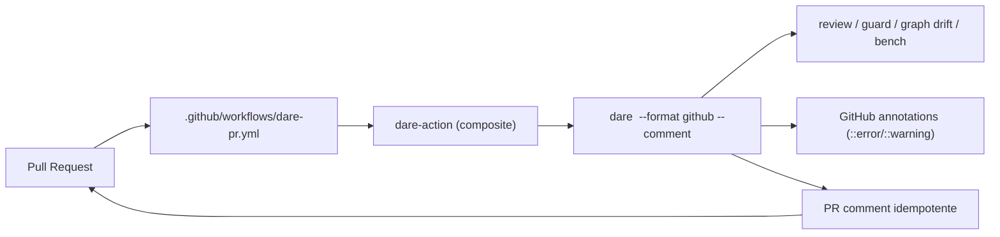

# Feature Blueprint: CI/PR Integration (`dare` gates como GitHub Action)

> Derivado de [DESIGN-Feature-ci-pr-integration.md](DESIGN-Feature-ci-pr-integration.md).
> Único entregável desta etapa: este BLUEPRINT. Tasks/DAG/specs virão em `/dare-tasks`.
> Branch proposta: `feat/ci-pr-integration` · Target: **v3.11.0** · License: MIT.
>
> **Base de evidências:** reusa os gates determinísticos (`dare review`/`guard`/`graph drift`/`bench`) e
> a cadeia Actions/OIDC + `verify-actions-pinned` (v3.4). Sem verificação nova — só **formato** + **post**.

---

## 1. Visão Geral da Arquitetura

### 1.1 Princípio reitor

A Action é **fina**: roda gates determinísticos que já existem, formata o resultado como **GitHub
annotations** e posta um **comentário idempotente** no PR. Zero LLM. Default **não-bloqueante**
(`fail-on: none`) — o bloqueio é opt-in. É o **funil de adoção open-core**.

### 1.2 Diagrama



### 1.3 Decisões Arquiteturais

| # | Decisão | Alternativas | Justificativa |
|---|---|---|---|
| A-1 | **`--format github`** emite annotations nos gates | parser externo | Aproveita o formato nativo do Actions |
| A-2 | **`--comment`** posta/atualiza 1 comentário por PR | comentário por finding | RF-05; não polui o PR |
| A-3 | **Emitter compartilhado** (`reporters/github.ts`) | duplicar por gate | DRY entre review/guard/drift |
| A-4 | **Composite action** (`action.yml`) no repo | Docker action | Mais leve; instala o CLI e roda |
| A-5 | **`fail-on: none` default** | bloquear sempre | Adoção sem atrito (RF-04); bloqueio opt-in |
| A-6 | **Sanitizar findings postados** | postar cru | RS-04; reusa sanitização do guard |
| A-7 | **Idempotência por marcador HTML** no comentário | buscar por texto | Marker `<!-- dare-report -->` localiza o comentário a atualizar |

---

## 2. Stack Técnica

| Camada | Tecnologia | Nota |
|---|---|---|
| Gates | `review`/`guard`/`graph drift`/`bench` | reuso — sem lógica nova |
| Formato | GitHub annotations (`::error file=..,line=..::msg`) | emitter novo |
| Post | GitHub REST (`GITHUB_TOKEN`) — comentário do PR | idempotente |
| Action | composite `action.yml` | publicável no Marketplace |
| CI base | Actions + OIDC (v3.4) | reuso; actions pinadas por SHA |

---

## 3. Contratos

### 3.1 `src/reporters/github.ts` (NEW)

```ts
export interface Finding {
  readonly severity: 'error' | 'warning';
  readonly file?: string; readonly line?: number;
  readonly rule: string; readonly message: string;   // sanitizado
}

/** Emite anotações no formato Actions (stdout). */
export function emitAnnotations(findings: ReadonlyArray<Finding>): void;

export interface PrCommentInput {
  readonly repo: string; readonly prNumber: number; readonly token: string;
  readonly summary: ReadonlyArray<{ gate: string; verdict: string; count: number }>;
  readonly findings: ReadonlyArray<Finding>;
}

/** Cria ou ATUALIZA o comentário marcado com <!-- dare-report -->. */
export async function upsertPrComment(input: PrCommentInput): Promise<void>;
```

**Regras:**
- `emitAnnotations`: `::${severity} file=${file},line=${line}::${message}` (uma por finding); sem path absoluto/segredo.
- `upsertPrComment`: lista comentários do PR, acha o que contém `<!-- dare-report -->`, **edita**; se não existir, **cria** (A-2/A-7).
- Mensagens sanitizadas (reusa a sanitização do guard — RS-04).

### 3.2 Flags nos gates — `commands/{review,guard,graph}.ts` (MODIFY)

```bash
dare review <task>        --format github [--comment] [--fail-on none|warn|error]
dare guard  <path|--all>  --format github [--comment] [--fail-on none|warn|error]
dare graph drift          --format github [--comment] [--fail-on none|warn|error]
```
- `--format github` → `emitAnnotations` (além da saída normal).
- `--comment` → `upsertPrComment` (lê `GITHUB_TOKEN`, `GITHUB_REPOSITORY`, nº do PR do evento).
- `--fail-on`: controla o exit code (none→0 sempre; warn→≠0 em WARN+; error→≠0 só em FAIL). Default `none`.

### 3.3 Composite Action — `action.yml` (NEW, raiz do repo)

```yaml
name: 'DARE Gate'
inputs:
  gate: { description: 'review | guard | drift | bench', required: true }
  args: { description: 'extra CLI args', required: false }
  fail-on: { default: 'none' }
  comment: { default: 'true' }
runs:
  using: 'composite'
  steps:
    - shell: bash
      run: npm i -g @dewtech/dare-cli@latest
    - shell: bash
      run: dare ${{ inputs.gate }} ${{ inputs.args }} --format github ${{ inputs.comment == 'true' && '--comment' || '' }} --fail-on ${{ inputs.fail-on }}
      env: { GITHUB_TOKEN: ${{ github.token }} }
```
Permissões mínimas documentadas: `pull-requests: write`, `contents: read` (RNF-02/RS-02).

### 3.4 Workflow template — `dare init` (MODIFY, opcional RF-07)

`templates/.github/workflows/dare-pr.yml` gerado opcionalmente no scaffold (actions pinadas por SHA).

---

## 4. Estrutura de Diretórios (mudanças)

```
packages/cli/src/
├── reporters/github.ts            # NEW — emitAnnotations + upsertPrComment
├── commands/review.ts             # MODIFY — --format github / --comment / --fail-on
├── commands/guard.ts              # MODIFY — idem
├── commands/graph.ts              # MODIFY — drift idem
├── __tests__/github-reporter.test.ts  # NEW
action.yml                         # NEW — composite action (raiz)
packages/cli/templates/.github/workflows/dare-pr.yml  # NEW (opcional)
.github/workflows/ (próprio repo)  # MODIFY — dogfood: usar a action no CI do DARE
```

---

## 5. Requisitos de Segurança — Rastreabilidade

| RS | Implementação | Teste |
|---|---|---|
| RS-01 | token via `GITHUB_TOKEN`/OIDC | `github-reporter.test.ts` (token não logado) |
| RS-02 | permissões mínimas na action | revisão `action.yml` |
| RS-03 | sem segredo em comentário/log | `github-reporter.test.ts` |
| RS-04 | sanitizar findings (reusa guard) | `github-reporter.test.ts` |
| RS-05 | actions pinadas por SHA | `verify-actions-pinned` (v3.4) |

---

## 6. Plano de Execução (Fases)

### Fase 1 — Emitter
**DONE:** `emitAnnotations` (formato Actions) + `upsertPrComment` (idempotente por marker) testados com GitHub API mockada.

### Fase 2 — Flags nos gates
**DONE:** `--format github`/`--comment`/`--fail-on` em review/guard/drift; exit codes corretos por `fail-on`.

### Fase 3 — Action + dogfood
**DONE:** `action.yml` composite; o CI do próprio DARE usa a action (dogfood); template `dare-pr.yml` opcional no `init`.

### Fase N-1 — Auditoria
**DONE:** `ci-pr-regression.test.ts`: annotations bem formadas; comentário atualiza (não duplica); token nunca logado; `fail-on none` não bloqueia; findings sanitizados; `verify-actions-pinned` verde.

---

## 7. Validation Gates (Node/TS)

```powershell
cd packages/cli
pnpm exec tsc --noEmit
pnpm exec vitest run github-reporter ci-pr-regression
pnpm exec eslint src/reporters src/commands
```

## 8. PADRÕES PROIBIDOS (ANTI-STUB)

- Nova lógica de verificação (deve só **formatar/postar** o que os gates já produzem).
- Comentário duplicado a cada push (deve atualizar via marker).
- Token em log/comentário.
- `permissions` excessivas na action.
- Bot baseado em LLM (quebra LLM-free).
- Actions não pinadas por SHA.

## 9. Definition of Done (feature)

- [ ] RF-01..RF-04 MUST com testes; RF-05..RF-07 SHOULD.
- [ ] Action composite funcional + dogfood no CI do DARE.
- [ ] Default `fail-on: none` (comenta, não bloqueia).
- [ ] Token nunca logado; findings sanitizados.
- [ ] CHANGELOG `[3.11.0]` + docs (flags + action) — cobertura de docs verde.
- [ ] `dare review` sem achados HIGH.

---

## Próximas Etapas

1. Revisar/aprovar. 2. `/dare-tasks` → bloco **11xx**. 3. Branch `feat/ci-pr-integration`.
