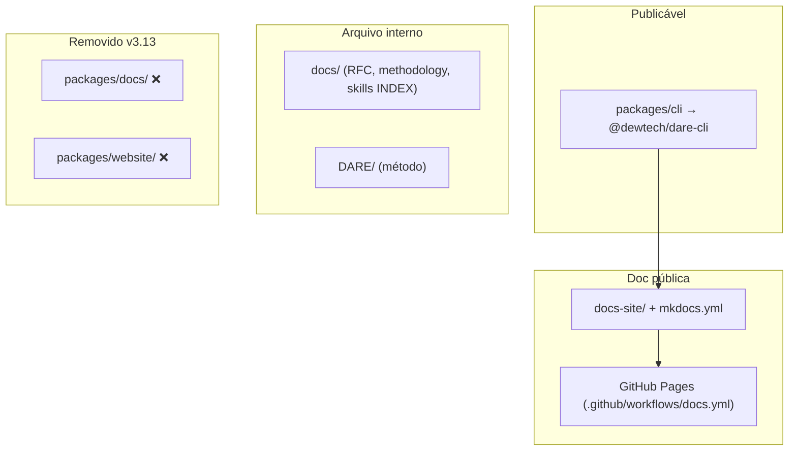

# Feature Blueprint: Faxina CLI-only (monorepo enxuto)

> Derivado de [DESIGN-Feature-cli-only-cleanup.md](DESIGN-Feature-cli-only-cleanup.md).
> Tasks/DAG/specs em `/dare-tasks`. Branch: `feat/v3.13-cli-only` · Target: **v3.13.0** · License: MIT.

---

## 1. Visão Geral da Arquitetura

### 1.1 Princípio reitor

**Um produto, um pacote, uma doc pública.** O `@dewtech/dare-cli` é o único artefato npm.
Toda documentação de usuário vive em `docs-site/` (MkDocs na raiz). `docs/` na raiz permanece
como arquivo interno (RFC, metodologia, INDEX de skills). Diretórios `packages/docs/` e
`packages/website/` são legado pré-v3.8 e saem do tree.

### 1.2 Diagrama (estado alvo)



### 1.3 Decisões Arquiteturais

| # | Decisão | Alternativas | Justificativa |
|---|---|---|---|
| A-1 | **Delete direto** de `packages/docs` e `packages/website` | deprecation period | dirs não são API; zero consumidores npm |
| A-2 | **`docs-site/` permanece** fonte única de doc de usuário | mover tudo p/ `docs/` | gate `verify-docs-coverage` já aponta p/ docs-site |
| A-3 | **`docs/` raiz permanece** | merge em docs-site nesta fase | escopo menor; RFC/methodology fora do site |
| A-4 | **Auditoria doc antes do delete** (RF-08) | delete cego | evita perda de conteúdo único |
| A-5 | **Teste invariante** impede regressão estrutural | só grep manual | RNF-03; CI trava dirs removidos |
| A-6 | **Bump semver antes da tag** | tag antes do bump | lição v3.12 |
| A-7 | **Sem mudança funcional no CLI** | refactor oportunista | RNF-01 |

---

## 2. Stack Técnica

| Camada | Tecnologia | Nota |
|---|---|---|
| Produto | `packages/cli` | único pacote com `package.json` |
| Docs públicas | MkDocs Material + i18n | `docs-site/`, `mkdocs.yml` |
| Gate docs | `scripts/verify-docs-coverage.mjs` | CI job `lint` |
| Gate estrutural | `cli-only-invariants.test.ts` (NEW) | vitest no CLI |
| Monorepo | pnpm workspaces `packages/*` | após faxina = só `cli` |

---

## 3. Contratos e Invariantes

### 3.1 Invariantes estruturais (pós-v3.13)

```text
MUST NOT exist:
  packages/docs/
  packages/website/

MUST exist:
  packages/cli/package.json
  docs-site/
  mkdocs.yml
  .github/workflows/docs.yml

MUST NOT reference (tracked files, exceto histórico DESIGN/CHANGELOG):
  packages/docs
  packages/website
```

### 3.2 Teste `cli-only-invariants.test.ts` (NEW)

```ts
// packages/cli/src/__tests__/cli-only-invariants.test.ts
// - fs.pathExistsSync(repo/packages/docs) === false
// - fs.pathExistsSync(repo/packages/website) === false
// - rg packages/docs|packages/website em paths allowlist → 0 matches
// - packages/cli/package.json version alinhado (opcional em task docs)
```

### 3.3 Checklist paridade doc (pré-delete)

| Fonte legada | Destino canônico | Ação |
|---|---|---|
| `packages/docs/docs/getting-started/*` | `docs-site/getting-started.md` | já coberto |
| `packages/docs/docs/cli/skill-*` | `docs-site/cli-reference.md`, `utilities.md` | já coberto |
| `packages/docs/docs/skills/*` | `docs-site/stacks.md`, `agents.md` | já coberto |
| `packages/docs/docs/contributing/publish-a-skill.md` | `docs-site/utilities.md` | **verificar/migrar 1 parágrafo se faltar** |

---

## 4. Mudanças por Arquivo

| Arquivo / path | Ação | Conteúdo |
|---|---|---|
| `packages/docs/**` | DELETE | MkDocs legado + Docker/K8s + workflow |
| `packages/website/**` | DELETE | landing legada + Docker/K8s + workflow |
| `README.md` | EDIT | link GitHub Pages; remover refs legadas |
| `ROADMAP.md` | EDIT | Shipped v3.13.0 |
| `packages/cli/README.md` | EDIT | corrigir links se necessário |
| `implementations/*/README.md` | EDIT | só se citarem paths removidos |
| `package.json` (root) | EDIT | remover `packages/stacks/*` de workspaces se morto |
| `CHANGELOG.md` | EDIT | `[3.13.0]` removed legacy packages |
| `docs-site/index.md` | EDIT (opcional) | nota "doc canônica = docs-site" |
| `__tests__/cli-only-invariants.test.ts` | NEW | invariantes estruturais |
| `__tests__/cli-only-regression.test.ts` | NEW | mkdocs + verify-docs + suíte CLI |

**Não tocar:** `packages/cli/src/**` (lógica), `implementations/**` (skills), `.github/workflows/docs.yml`.

---

## 5. Plano de Validação (Gates)

| Gate | Comando | Critério |
|---|---|---|
| Invariantes | `vitest run cli-only-invariants` | dirs ausentes; zero refs |
| Build CLI | `pnpm --filter @dewtech/dare-cli build` | 0 erros |
| Testes CLI | `pnpm --filter @dewtech/dare-cli test` | 0 falhas |
| Docs coverage | `node scripts/verify-docs-coverage.mjs` | exit 0 |
| MkDocs strict | `mkdocs build --strict` | exit 0 |
| npm pack | `npm pack --dry-run` em `packages/cli` | tarball ≤ baseline +5% |
| Links | `rg packages/docs\|packages/website` | 0 em tracked (allowlist) |

---

## 6. Sequenciamento (fases)

1. **Auditoria doc** — confirmar paridade `packages/docs` → `docs-site`; migrar gap se houver.
2. **Delete** — remover `packages/docs/` e `packages/website/` atomicamente.
3. **Links + workspace** — README/ROADMAP/implementations; limpar `workspaces` mortos.
4. **Testes invariante** — travar estrutura CLI-only.
5. **N-1 regressão** — suíte completa + gates de doc.
6. **Release docs** — CHANGELOG, ROADMAP, bump `3.13.0` (tag depois do bump).

---

> **Próximo passo:** executar via `dare execute --next --dag DARE/dare-dag-cli-only-cleanup.yaml`
> na branch `feat/v3.13-cli-only`. Bloco de IDs **13xx**.
