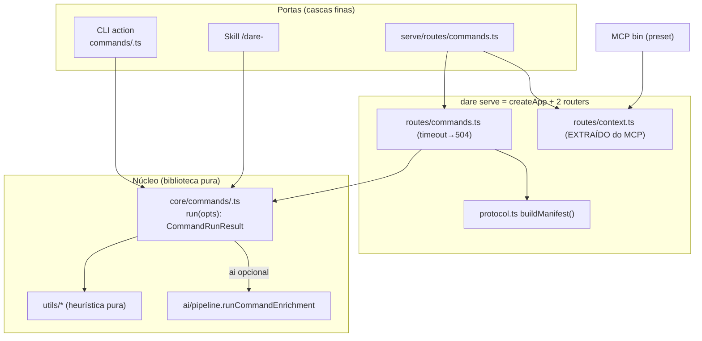

# Feature Blueprint: `dare serve` — núcleo unificado de comandos + protocolo de fio

> Derivado de [DESIGN-Feature-dare-serve-protocol.md](DESIGN-Feature-dare-serve-protocol.md).
> Tasks/DAG/specs em `/dare-tasks`. Branch: `feat/v3.16-serve-protocol` · Target: **v3.16.0** · License: MIT.

---

## 1. Visão Geral da Arquitetura

### 1.1 Princípio reitor

**Um comando, um núcleo, três portas.** A lógica de cada comando (heurística determinística → escreve
artifacts → enrich opcional) é extraída da action do Commander para uma função pura `run<Cmd>()` em
`core/commands/<cmd>.ts`. Terminal, chat e `dare serve` chamam **a mesma função** — zero duplicação.
A heurística **sempre roda**; `ai` só acrescenta o enrich. `facts` e `cwd` nunca vêm do cliente.

### 1.2 Diagrama (estado alvo)



### 1.3 Decisões Arquiteturais

| # | Decisão | Alternativas | Justificativa |
|---|---|---|---|
| A-1 | **Extrair `run<Cmd>` dos 8 comandos** | serve só enrichment | heurística tem que rodar; senão quebra a doutrina (D-01) |
| A-2 | **Cores usam `runCommandEnrichment`**; `maybeRunAiEnrichment` aposentado | manter wrapper | wrapper tem `console`+`process.exit` (D-03) |
| A-3 | **CLI actions viram cascas** | reescrever do zero | RNF-01: suíte CLI atual é o gate de paridade |
| A-4 | **`facts`/`cwd` server-side** | body carrega facts | cliente fino não produz facts (D-02/RS-02) |
| A-5 | **Timeout + 504** | pendurar até 20 min | request previsível (D-04/RF-07) |
| A-6 | **`/providers` sem probe por padrão** | spawnar sempre | GET sem efeito colateral (D-05/RF-08) |
| A-7 | **`provider` explícito no serve** | herdar default | evita IA escrever no workspace por um POST silencioso (D-06) |
| A-8 | **Manifest derivado de `PARITY_CONTRACTS`** | catálogo hardcoded | fonte única (A-1 do contrato) |
| A-9 | **Router de contexto extraído/compartilhado** | duplicar rotas | zero regressão MCP (RF-10) |

---

## 2. Stack Técnica

| Camada | Tecnologia | Nota |
|---|---|---|
| Núcleo | `core/commands/*.ts` | `run<Cmd>` puro; registry `COMMAND_RUNNERS` |
| Heurística | `utils/*` (existente) | puro, reusado sem alteração |
| Enrichment | `ai/pipeline.runCommandEnrichment` | sem console |
| Transporte | Express + `createApp` (`http/app.ts`) | auth/CORS/helmet prontos |
| Contrato | `PARITY_CONTRACTS` + `jsonSchemaForCommand` | manifest derivado |
| Providers | `probeAllProviders` + `capabilitiesForProvider` | probe opt-in + cache |
| Timeout | `AbortController` → `AgentRequest.signal` → `safeSpawn` | cancela subprocesso |
| Boot | `mcp-server/boot-config.ts` | `DARE_*` |

---

## 3. Contratos e Invariantes

### 3.1 Núcleo de comando (`core/commands/types.ts`)

```ts
export interface CommandRunOptions {
  cwd: string;                 // = projectRoot; NUNCA do body
  ai?: boolean;                // liga o enrich (heurística sempre roda)
  provider?: string;           // obrigatório no serve quando ai:true (RS-04)
  deep?: boolean;
  input?: Record<string, unknown>; // ex.: { description } no design, { taskId } no review
  signal?: AbortSignal;        // cancelamento/timeout (RF-07)
  timeoutSeconds?: number;
}

export interface CommandRunResult {
  command: AiCommandName;
  ok: boolean;
  facts: unknown;                 // saída determinística (sempre presente)
  artifacts: ReadonlyArray<string>; // paths escritos
  enrichment?: EnrichmentResult;  // só quando ai:true
  summary?: ReadonlyArray<string>; // linhas legíveis (a casca imprime)
  error?: string;
}

export type CommandRunner = (opts: CommandRunOptions) => Promise<CommandRunResult>;
export const COMMAND_RUNNERS: Record<AiCommandName, CommandRunner>; // 8 entradas
```

**Lei do núcleo:** `run<Cmd>` (1) roda heurística e escreve artifacts determinísticos; (2) se `ai`,
chama `runCommandEnrichment`; (3) retorna `CommandRunResult`. **Proibido** `console`/`ora`/`process.exit`.

### 3.2 Superfície HTTP (`dare serve`)

| Método | Rota | Body / Query | Resposta |
|---|---|---|---|
| GET | `/health` | — | `{status, version, projectRoot}` |
| GET | `/protocol` | — | `ProtocolManifest` |
| GET | `/providers` | `?probe=false` (default) / `?probe=true` | `{providers}` (sem spawn por default) |
| POST | `/commands/:command` | `{ai?, provider?, deep?, input?}` | `CommandRunResult` (504 em timeout) |
| GET/POST/PUT | `/context/*` `/blueprint` `/dag` `/tasks/:id` `/graph/*` `/steering` `/project` | (inalterado) | (inalterado) |
| ALL | `/execute` | — | **405** (reservado v3.17) |

### 3.3 Manifest (`serve/protocol.ts`)

```ts
export const PROTOCOL_VERSION = '1.0.0';
export interface OperationDescriptor {
  command: AiCommandName;
  route: string;                       // POST /commands/<command>
  heuristicAlwaysRuns: true;           // doutrina explícita no fio
  requiresInput?: ReadonlyArray<string>; // ex.: ['description'] design, ['taskId'] review
  schemaFields: ReadonlyArray<string>;
  artifacts: ReadonlyArray<string>;
  jsonSchema: Record<string, unknown>;
}
export interface ProtocolManifest {
  protocolVersion: string; cliVersion: string;
  operations: ReadonlyArray<OperationDescriptor>;     // derivado de SEMANTIC_COMMANDS
  capabilities: Record<AiProviderName, ProviderCapabilities>;
}
export function buildManifest(): ProtocolManifest;
```

### 3.4 Invariantes (pós-v3.16)

```text
MUST: GET /protocol cobre EXATAMENTE SEMANTIC_COMMANDS (8)
MUST: run<Cmd> retorna facts mesmo com ai:false (heurística sempre roda)
MUST: POST /commands/:command usa cwd = app.locals.projectRoot (nunca body)
MUST: timeout ⇒ 504 e AbortSignal cancela o subprocesso
MUST: GET /providers default NÃO spawna subprocesso
MUST NOT (em src/core/commands/** e src/serve/**): ora( | chalk. | process.exit
MUST NOT (em qualquer src): maybeRunAiEnrichment  (aposentado)
MUST NOT (em src/commands/*.ts e src/serve/**): runCommandEnrichment | detectModules | detectDnaDetailed | extractDataModel
MUST: createMcpServer expõe as rotas de contexto atuais (mesma resposta)
```

### 3.5 Mapa de input por comando (RF-06 / manifest)

| Comando | input requerido | heurística (sempre) |
|---|---|---|
| reverse | — (`deep?`) | `detectProject`+`detectModules`+`extractDataModelDetailed`+`buildFacts` |
| dna | — | `detectDnaDetailed` |
| patterns | — | minerador de padrões |
| migrate | — | facts de migração |
| design | `description` | parse de requisitos |
| blueprint | — | lê DESIGN.md |
| review | `taskId` | `runReview` (analisador estático) |
| refine | `taskId` | heurística de complexidade |

---

## 4. Mudanças por Arquivo

| Arquivo / path | Ação | Conteúdo |
|---|---|---|
| `src/core/commands/types.ts` | NEW | contrato + `COMMAND_RUNNERS` |
| `src/core/commands/{reverse,dna}.ts` | NEW | `run<Cmd>` extraído |
| `src/core/commands/{patterns,migrate}.ts` | NEW | idem |
| `src/core/commands/{design,blueprint}.ts` | NEW | idem |
| `src/core/commands/{review,refine}.ts` | NEW | idem |
| `src/commands/{reverse,dna,migrate,design,patterns,blueprint,review,refine}.ts` | EDIT | action → casca (chama `run<Cmd>`, imprime) |
| `src/ai/pipeline.ts` | EDIT | aposentar `maybeRunAiEnrichment` (cascas imprimem; cores usam `runCommandEnrichment`) |
| `src/serve/protocol.ts` | NEW | `PROTOCOL_VERSION`, `buildManifest()` |
| `src/serve/routes/context.ts` | NEW (extração) | rotas movidas do MCP |
| `src/serve/routes/commands.ts` | NEW | `/protocol`, `/providers`, `POST /commands/:command` (timeout→504) |
| `src/serve/index.ts` | NEW | `createServeApp` |
| `src/serve/bin/serve.ts` | NEW | boot |
| `src/commands/serve.ts` | NEW | Commander `serve` |
| `src/bin/dare.ts` | EDIT | `addCommand(serveCommand)` |
| `src/mcp-server/server.ts` | EDIT | monta `routes/context.ts` |
| `CHANGELOG/ROADMAP/docs-site/protocol.md` | EDIT/NEW | release |

**Não tocar:** `src/ai/parity.ts`, `ai/types.ts`, `ai/schemas.ts`, `src/utils/*` (heurísticas), `src/agent/*`.

---

## 5. Plano de Validação (Gates)

| Gate | Comando | Critério |
|---|---|---|
| Núcleo puro | `rg "ora\(\|chalk\.\|process.exit" src/core/commands src/serve` | 0 |
| Wrapper aposentado | `rg "maybeRunAiEnrichment" src` | 0 |
| Anti-duplicação | `rg "runCommandEnrichment\|detectModules\|detectDnaDetailed\|extractDataModel" src/commands src/serve` | 0 |
| Heurística no serve | `vitest run core/commands` | `facts` presente com `ai:false` |
| Paridade manifest | `vitest run protocol-parity` | 8/8 = `SEMANTIC_COMMANDS` |
| Timeout | `vitest run serve-timeout` | request longo ⇒ 504 |
| Providers | `vitest run providers` | GET default sem spawn |
| Segurança cwd | `vitest run security-cwd` | escrita só no projectRoot |
| Regressão CLI | `pnpm --filter @dewtech/dare-cli test` | 0 falhas |
| Regressão MCP | `vitest run src/mcp-server/__tests__` | 0 falhas |
| Build | `pnpm --filter @dewtech/dare-cli build` | 0 erros |

---

## 6. Sequenciamento (fases)

1. **Fundação (paralelo)** — `protocol.ts` + extração do router de contexto + contrato `core/commands/types.ts`.
2. **Extração dos núcleos (paralelo)** — 8 `run<Cmd>` (2 por task); CLI actions viram cascas.
3. **Rotas de comando** — `/protocol`, `/providers` (cache), `POST /commands/:command` (timeout→504).
4. **Montagem** — `createServeApp` + `bin/serve.ts` + `dare serve`.
5. **Testes** — anti-duplicação, heurística-sempre, manifest, timeout, providers, cwd.
6. **N-1 regressão** — CLI + MCP verdes; superfície serve vs MCP.
7. **Release** — CHANGELOG, ROADMAP, doc-site, bump `3.16.0` (tag depois do bump).

---

> **Próximo passo:** executar via `dare execute --next --dag DARE/dare-dag-dare-serve-protocol.yaml`
> na branch `feat/v3.16-serve-protocol`. Bloco de IDs **16xx**.
