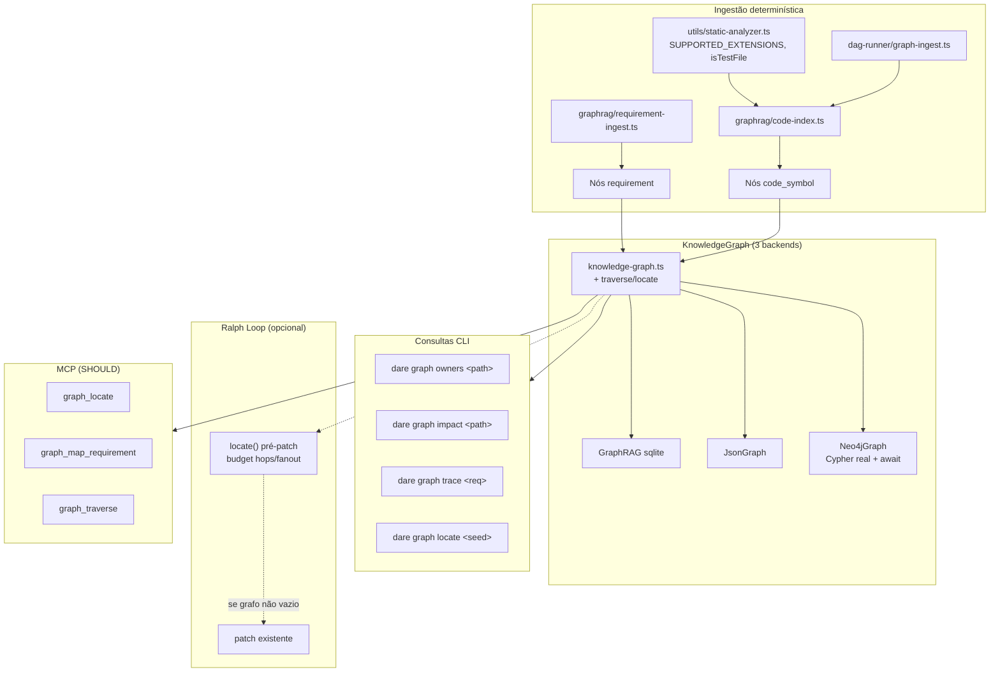

# Feature Blueprint: Grafo Dual Requisito↔Código (Dual Graph)

> Derivado de [DESIGN-Feature-dual-graph.md](DESIGN-Feature-dual-graph.md).
> Único entregável desta etapa: este BLUEPRINT. Tasks/DAG/specs de execução virão em `/dare-tasks`.
> Branch proposta: `feat/dual-graph` · Target release: **v3.5.0** (v3.3.0 verification-core + v3.4.0 security-hardening já reservados) · License: MIT.
>
> **Base de evidências:** papers `idea-4` (GraphCodeAgent, arXiv:2504.10046), `idea-5` (LocAgent, arXiv:2503.09089),
> CodexGraph (arXiv:2408.03910). Ancoragem verificada em `graphrag/types.ts`, `neo4j-graph.ts`, `dag-runner/graph-ingest.ts`,
> `utils/static-analyzer.ts`, `commands/graph.ts`, `graphrag/factory.ts`.
>
> **Pré-requisitos cruzados (não reimplementar):**
> - `gate` + `verified_by` já entregues pelo verification-core (`types.ts:9,18`).
> - `assertRelativeSafe` / `resolveSafePath` da security-hardening (`utils/path-safety.ts`) — reusar em consultas CLI/MCP.

---

## 1. Visão Geral da Arquitetura

### 1.1 Princípio reitor

**O grafo dual é 100% determinístico** — extração de símbolos por regex (reuso do `static-analyzer`),
ingestão de requisitos por parsing markdown, travessia tipada BFS. **Nenhum LLM** no CLI para gerar
arestas, embeddings ou NL→Cypher. Inferência semântica fica nas **skills das IDEs**, consumindo MCP.

Duas camadas ligadas por chave canônica `file_path::symbol` (padrão GraphCodeAgent / idea-4):

| Camada | Nós | Arestas principais | Fonte |
|---|---|---|---|
| **Requirement Graph (RG)** | `requirement`, `task` | `derives_from`, `depends_on` | DESIGN/BLUEPRINT/TASKS.md + DAG |
| **Structural Code Graph (SCG)** | `code_symbol`, `file` | `contains`, `implements` | `code-index.ts` + ingestão de task |
| **Ponte RG↔SCG** | — | `implements` (req/task→symbol), `affects` (symbol→requirement/task) | mapeamento `path::name` |

### 1.2 Diagrama



### 1.3 Decisões Arquiteturais

| # | Decisão | Alternativas | Justificativa |
|---|---|---|---|
| A-1 | **Estender** `KnowledgeGraph` com `traverse`/`locate` — não novo serviço paralelo | Graph service separado | RNF-04: mesma semântica nos 3 backends; suíte de contrato única |
| A-2 | **`code-index.ts` isolado** — extrai símbolos; `static-analyzer.ts` só exporta helpers compartilhados (`isTestFile`, `SUPPORTED_EXTENSIONS`) | AST por linguagem | DESIGN: sem explosão de deps; aceita falso-positivo regex |
| A-3 | Chave de mapeamento **`qualifiedName = normalize(path)::symbol`** | Só path de arquivo | idea-4: `file_path::name` liga RG→SCG; normalizar `/` (RNF-06) |
| A-4 | **`implements` reusado** para task/requirement→code_symbol; **`affects`** para impacto inverso symbol→upstream | Novo edge `maps_to` | RF-02: minimiza union; `implements` já existe em `types.ts` |
| A-5 | **`derives_from`** requirement-pai→filho espelhando hierarquia spec | Só metadata | RF-05: meta-path requisito→task→símbolo em ≤3 hops (O-07) |
| A-6 | Travessia **BFS tipada** com limites `maxHops` (default 3) e `maxFanout` (default 50) | DFS ilimitado | RNF-01: evita explosão; LocAgent ablation: hops=1 corta function-level |
| A-7 | Localização no Ralph **opcional** — cai para fluxo atual se grafo vazio | Obrigatório sempre | DESIGN: não bloquear execução sem grafo populado |
| A-8 | **Consertar Neo4j C1** (RF-08): `await` escritas, leituras Cypher, `init()` hidrata cache | Só gate experimental | O-05/O-06; se não couber na release, RF-09 fecha atrás de `neo4j.experimental: true` |
| A-9 | **Suíte de contrato** `graphrag/__tests__/contract/*.test.ts` roda contra sqlite+json+neo4j (skip neo4j se indisponível) | Testar só JsonGraph | RNF-04 |
| A-10 | Ingestão **incremental** — só arquivos tocados pela task DONE | Reindexar repo inteiro | RNF-02: orçamento de poucos segundos |
| A-11 | `dare graph viz` com **subgraphs por camada** (COULD) | Cores fixas | RF-11: requirement=azul, code_symbol=verde sem quebrar render atual |

---

## 2. Stack Técnica (CLI)

| Camada | Tecnologia | Nota |
|---|---|---|
| Interface | `KnowledgeGraph` (`graphrag/knowledge-graph.ts`) | estendida com travessia |
| Backends | `GraphRAG` (sqlite), `JsonGraph`, `Neo4jGraph` | default sqlite até C1 fechar |
| Extração | `graphrag/code-index.ts` + helpers de `static-analyzer.ts` | regex line-based, determinístico |
| Requisitos | `graphrag/requirement-ingest.ts` | parser markdown de DESIGN/BLUEPRINT/TASKS |
| Path safety | `utils/path-safety.ts` | `assertRelativeSafe` em owners/impact/locate |
| Visualização | Mermaid/DOT (`commands/graph.ts`) | subgraphs opcionais RF-11 |
| MCP | `mcp-server/server.ts` | tools `graph_*` (RF-10 SHOULD) |
| Testes | Vitest + fixtures em `__tests__/graphrag/fixtures/` | snapshot + contract |

---

## 3. Modelo de Dados / Contratos TypeScript

### 3.1 `graphrag/types.ts` — estender união fechada

```ts
export type NodeType =
  | 'task' | 'file' | 'schema' | 'endpoint' | 'component'
  | 'entity' | 'concept' | 'gate'           // gate: verification-core (existente)
  | 'code_symbol'                           // NOVO
  | 'requirement';                          // NOVO

export type EdgeType =
  | 'depends_on' | 'implements' | 'uses' | 'references'
  | 'related_to' | 'contains' | 'extends' | 'verified_by'  // verified_by: verification-core
  | 'affects'      // NOVO: mudança em source impacta target (symbol→req/task)
  | 'derives_from'; // NOVO: requirement-filho deriva de requirement-pai

export type CodeSymbolKind = 'function' | 'class' | 'method';

export interface CodeSymbolNode extends GraphNode {
  type: 'code_symbol';
  path: string;              // posix, relativo ao project root
  symbol: string;            // nome curto, ex. 'add'
  kind: CodeSymbolKind;
  qualifiedName: string;     // 'src/math.ts::add' — chave de mapeamento
  line?: number;             // 1-based, opcional
}

export interface RequirementNode extends GraphNode {
  type: 'requirement';
  reqId: string;             // 'RF-01', 'O-03', 'task-101'
  source: 'design' | 'blueprint' | 'tasks' | 'dag';
  title: string;
  priority?: 'MUST' | 'SHOULD' | 'COULD';
}

export interface TraverseOptions {
  readonly seedNodeIds: readonly string[];
  readonly maxHops?: number;           // default 3
  readonly maxFanout?: number;         // default 50 — max edges expandidos por nível
  readonly nodeTypes?: readonly NodeType[];
  readonly edgeTypes?: readonly EdgeType[];
  readonly direction?: 'out' | 'in' | 'both';  // default 'both'
}

export interface TraverseResult {
  readonly nodes: readonly GraphNode[];
  readonly edges: readonly GraphEdge[];
  readonly hops: number;               // profundidade alcançada
}

export interface LocateOptions {
  readonly hops?: number;              // default 3
  readonly nodeTypes?: readonly NodeType[];  // default ['code_symbol','file','task']
  readonly edgeTypes?: readonly EdgeType[];    // default ['implements','contains','depends_on']
  readonly limit?: number;             // default 10
}

export interface LocateResult {
  readonly candidates: readonly Array<{
    node: GraphNode;
    score: number;                     // 1.0 = match exato qualifiedName; decresce por hop
    path: readonly string[];           // ids do caminho BFS
  }>;
}
```

**Regras de ID canônico:**

| Tipo | Formato `id` | Exemplo |
|---|---|---|
| `code_symbol` | `code_symbol:{qualifiedName}` | `code_symbol:src/math.ts::add` |
| `requirement` | `requirement:{reqId}` | `requirement:RF-01` |
| `task` | `task:{taskId}` | `task:task-101` (existente) |
| `file` | `file:{posixPath}` | `file:src/math.ts` (existente) |

**`getStatistics`:** inicializar contadores com `0` para **todos** os membros de `NodeType`/`EdgeType`; tipos ausentes ⇒ `0` (não `NaN`, RNF-05).

### 3.2 `graphrag/code-index.ts` (novo)

```ts
export interface ExtractedSymbol {
  readonly path: string;           // posix relativo
  readonly symbol: string;
  readonly kind: CodeSymbolKind;
  readonly qualifiedName: string;  // path::symbol
  readonly line: number;
}

/** Lê arquivo do disco; retorna [] se extensão não suportada ou isTestFile. */
export function extractSymbolsFromFile(
  absPath: string,
  projectRoot: string,
): ExtractedSymbol[];

/** Batch incremental — só paths listados. */
export function extractSymbolsFromPaths(
  paths: readonly string[],
  projectRoot: string,
): ExtractedSymbol[];

/** Normaliza path para qualifiedName (posix, lowercase drive no win32). */
export function toQualifiedName(path: string, symbol: string): string;
```

**Padrões regex (top-level only, v1):**

| Linguagem | Kind | Padrão (line-based) |
|---|---|---|
| TS/JS | function | `export function Name(` / `export async function Name(` / `function Name(` (não aninhado) |
| TS/JS | class | `export class Name` / `class Name` |
| TS/JS | method | `Name(` dentro de bloco `class` (heurística: indent + `Name(` após `class`) |
| Python | function | `def name(` top-level (col 0) |
| Python | class | `class Name` top-level |
| Go | function | `func Name(` / `func (r *T) Name(` |
| Rust | function | `fn name(` / `pub fn name(` |
| PHP | function | `function name(` / `public function name(` |
| Java/Kotlin/C# | class/method | `class Name` / modificador + tipo + `name(` |

Regras:
- Pular linhas onde match está `inString` (reusar helper de `static-analyzer.ts` — exportar se privado).
- Pular `isTestFile(path)`.
- Reusar `SUPPORTED_EXTENSIONS` — exportar constante de `static-analyzer.ts`.
- **Determinismo:** mesma entrada ⇒ mesma saída ordenada por `(path, line, symbol)` (snapshot test).

### 3.3 `graphrag/requirement-ingest.ts` (novo, RF-05 SHOULD)

```ts
export interface ParsedRequirement {
  readonly reqId: string;
  readonly title: string;
  readonly priority?: 'MUST' | 'SHOULD' | 'COULD';
  readonly parentId?: string;      // derives_from target
  readonly source: RequirementNode['source'];
}

export function parseRequirementsFromMarkdown(
  content: string,
  source: RequirementNode['source'],
): ParsedRequirement[];

export function ingestRequirements(
  graph: KnowledgeGraph,
  projectRoot: string,
): { nodes: number; edges: number };
```

**Parser determinístico (sem LLM):**

| Fonte | Padrão | Exemplo capturado |
|---|---|---|
| DESIGN/BLUEPRINT tabelas RF | `\| RF-(\d+) \|` + coluna título | `RF-01` |
| DESIGN objetivos O | `\| O-(\d+) \|` | `O-01` |
| TASKS.md | `\| task-(\d+) \|` ou `task-(\d+):` | `task-101` |
| Headings hierárquicos | `### Phase N` → filhos `derives_from` pai da fase | hierarquia spec |

`ingestRequirements` lê `DARE/DESIGN*.md`, `DARE/BLUEPRINT*.md`, `DARE/TASKS*.md` se existirem.

### 3.4 `graphrag/traverse.ts` (novo)

```ts
export function traverse(
  graph: KnowledgeGraph,
  opts: TraverseOptions,
): TraverseResult;

export function locate(
  graph: KnowledgeGraph,
  seedQuery: string,
  opts?: LocateOptions,
): LocateResult;
```

**Algoritmo `locate(seedQuery)`:**

1. Validar `seedQuery` — se contém `..` ou é absoluto fora do projeto → `PathValidationError`.
2. Resolver seeds:
   - Se match `^[\w./-]+::\w+$` → nó `code_symbol` por `qualifiedName` exato.
   - Se match path-like → nós `file` + `code_symbol` cujo `path` prefix-match.
   - Senão → `searchNodes(seedQuery, limit=5)` como seeds.
3. BFS a partir dos seeds com `opts.edgeTypes`/`opts.nodeTypes`/`opts.hops`.
4. Ranquear: score `1.0` match exato; `-0.15` por hop; boost `+0.1` se tipo `code_symbol`.
5. Retornar top `opts.limit` (default 10).

**Limites (RNF-01):**

| Parâmetro | Default | Máximo |
|---|---|---|
| `maxHops` / `hops` | 3 | 5 |
| `maxFanout` | 50 | 200 |
| `limit` (locate) | 10 | 50 |

### 3.5 `graphrag/knowledge-graph.ts` — estender interface

```ts
export interface KnowledgeGraph {
  // ... métodos existentes ...

  traverse(opts: TraverseOptions): TraverseResult;
  locate(seedQuery: string, opts?: LocateOptions): LocateResult;

  /** Índice interno — opcional expor para testes */
  findByQualifiedName(qn: string): CodeSymbolNode | null;
}
```

Implementação default em `traverse.ts` usando `getEdges`/`getNode` — backends podem override Neo4j com Cypher parametrizado para performance.

### 3.6 `dag-runner/graph-ingest.ts` — modificar

Após passo 3 (file nodes), para cada `filePath` tocado:

```ts
const symbols = extractSymbolsFromPaths([normalized], projectRoot);
for (const sym of symbols) {
  graph.addNode({ id: `code_symbol:${sym.qualifiedName}`, type: 'code_symbol', ... });
  graph.addEdge({ type: 'contains', sourceId: `file:${normalized}`, targetId: `code_symbol:${sym.qualifiedName}` });
  graph.addEdge({ type: 'implements', sourceId: `task:${task.id}`, targetId: `code_symbol:${sym.qualifiedName}` });
}
```

Se output da task menciona símbolo explicitamente (`::symbol` ou nome de classe), criar aresta direta mesmo sem extração.

### 3.7 `graphrag/neo4j-graph.ts` — conserto C1 (RF-08)

**Mudanças obrigatórias:**

| Método | Antes (bug) | Depois |
|---|---|---|
| `addNode` / `addEdge` / `deleteNode` | `void this.runMany(...)` | `async` + `await this.runMany(...)` — interface pode usar fire-and-forget sync wrapper que enfileira, **ou** tornar métodos async (breaking interno; preferir fila + flush síncrono no `close()`) |
| `getNode` | só cache | `MATCH (n:DareNode {id:$id}) RETURN n` → validar shape (RS-05) → cache |
| `queryNodes` | só cache | `MATCH (n:DareNode) WHERE ($type IS NULL OR n.type=$type) RETURN n LIMIT $limit` |
| `getEdges` | só cache | Cypher por direção com `$nodeId` |
| `init()` | só constraints | + hidratar cache opcional (`MATCH (n) RETURN n LIMIT 10000`) |
| `close()` | noop | `await flushPendingWrites()` |

**Decisão de API sync:** manter `KnowledgeGraph` síncrono para compat; Neo4j usa **write-behind queue** com `await flush()` em `close()` e após batch de ingestão. Leituras sempre batem no servidor.

**Cypher parametrizado (RS-01) — exemplos:**

```cypher
MATCH (n:DareNode {id:$id}) RETURN n.id, n.type, n.label, n.description, n.metadata, n.created_at, n.updated_at
```

```cypher
MATCH (a:DareNode {id:$nodeId})-[r:DARE_EDGE]-(b:DareNode)
WHERE ($direction = 'out' AND startNode(r) = a)
   OR ($direction = 'in' AND endNode(r) = a)
   OR $direction = 'both'
RETURN r.id, r.type, a.id AS sourceId, b.id AS targetId, r.weight, r.metadata
```

**Propagação de erro (O-06):** qualquer `res.ok === false` ou `errors[]` não vazio → `throw new Neo4jQueryError(code, message)` — nunca engolir.

### 3.8 `graphrag/factory.ts` — gate experimental (RF-09)

```ts
// Em loadGraphConfig / createGraph:
if (backend === 'neo4j' && !subBlock.experimental) {
  throw new Error(
    'Neo4j backend requires neo4j.experimental: true in dare-graph.yml until C1 is verified. ' +
    'Use sqlite or json (recommended).'
  );
}
```

Se RF-08 entrar na release e passar O-05, remover o gate na v3.5.1 (ticket separado).

---

## 4. Comandos CLI — Contratos Executáveis

### 4.1 `dare graph owners <path>`

| Aspecto | Valor |
|---|---|
| Args | `path` — relativo ao project root; validado com `assertRelativeSafe` |
| Flags | `--json` (saída JSON), `--limit <n>` (default 20) |
| Algoritmo | 1) Resolver nós `file:{path}` e `code_symbol` com `path` prefix; 2) BFS `in` por `implements`/`derives_from`; 3) Coletar `task` + `requirement` |
| Exit 0 | stdout tabela ou JSON |
| Exit 1 | path inválido: `Error: path must be relative and stay within the project` |

**Response JSON:**

```json
{
  "path": "src/math.ts",
  "owners": [
    { "id": "task:task-101", "type": "task", "label": "path-safety extend" },
    { "id": "requirement:RF-03", "type": "requirement", "label": "Extração determinística" }
  ],
  "durationMs": 42
}
```

**Meta O-02:** `durationMs < 200` em fixture ≤10k nós (json/sqlite).

### 4.2 `dare graph impact <path>`

| Aspecto | Valor |
|---|---|
| Args | `path` — validado |
| Flags | `--json`, `--hops <n>` (default 3, max 5) |
| Algoritmo | Seeds = file + code_symbols do path; BFS `out`+`in` por `affects`, `implements`, `depends_on`; retorna `requirements` + `tasks` alcançáveis |
| Exit 1 | path inválido |

**Response JSON:**

```json
{
  "path": "src/math.ts",
  "impacted": {
    "tasks": ["task-101", "task-103"],
    "requirements": ["RF-03", "O-01"]
  },
  "durationMs": 128
}
```

**Meta O-03:** recall 100% em fixture `fixtures/dual-graph/impact-chain.json`; `durationMs < 500`.

### 4.3 `dare graph trace <req>`

| Aspecto | Valor |
|---|---|
| Args | `req` — `RF-\d+`, `O-\d+`, ou `task-\d+` |
| Flags | `--json` |
| Algoritmo | Seed `requirement:{req}` ou `task:{req}`; BFS até `code_symbol` via `derives_from`→`depends_on`→`implements` |
| Exit 1 | req não encontrado: `Error: requirement or task '<req>' not found in graph` |

**Response JSON:**

```json
{
  "req": "RF-03",
  "path": [
    { "id": "requirement:RF-03", "type": "requirement" },
    { "id": "task:task-101", "type": "task" },
    { "id": "code_symbol:src/math.ts::add", "type": "code_symbol" }
  ],
  "symbols": ["src/math.ts::add", "src/math.ts::multiply"]
}
```

**Meta O-07:** ≤ 3 hops em fixtures canônicas.

### 4.4 `dare graph locate <seed>`

| Aspecto | Valor |
|---|---|
| Args | `seed` — qualifiedName, path, ou termo de busca |
| Flags | `--json`, `--hops`, `--limit`, `--type`, `--edge-type` (repeatable) |
| Algoritmo | `locate()` §3.4 |
| Exit 0 | candidatos ranqueados |

**Response JSON:**

```json
{
  "seed": "math",
  "candidates": [
    { "id": "code_symbol:src/math.ts::add", "score": 0.85, "kind": "code_symbol", "qualifiedName": "src/math.ts::add" }
  ]
}
```

**Meta O-04:** top-5 contém alvo em ≥85% das fixtures `fixtures/dual-graph/locate/*.json`.

### 4.5 `dare graph ingest` (estender existente)

Além de `ingestDag`, chamar:

```ts
ingestRequirements(graph, projectRoot);
// code symbols já entram via ingestTask modificado
```

Flag nova: `--requirements-only` — só re-parse markdown, sem DAG.

### 4.6 `commands/graph.ts` — `KNOWN_NODE_TYPES`

Atualizar para incluir `code_symbol`, `requirement`, `gate`.

---

## 5. Integração Ralph Loop (RF-06)

**Arquivo:** `dag-runner/ralph-loop.ts` (ou `execute.ts` pré-patch hook)

```ts
export interface GraphLocateConfig {
  readonly enabled: boolean;          // default false; true se dare.config.json#graph.locateBeforePatch
  readonly hops?: number;           // default 3
  readonly limit?: number;          // default 5
}

export function buildLocateContext(
  graph: KnowledgeGraph,
  task: DagTask,
): string | undefined;
```

**Comportamento:**
1. Se `!enabled` ou grafo vazio (`totalNodes === 0`) → retorna `undefined` (sem mudança).
2. Extrair seeds do `subtask_prompt` (paths + qualifiedNames via regex).
3. `locate(seed, { hops, limit })` → formatar bloco markdown:

```markdown
## Graph locate (deterministic)
Candidates:
- src/math.ts::add (score 0.85)
- src/math.ts (score 0.70)
```

4. Anexar ao contexto do agente **antes** do patch — não bloqueia se falhar.

**Config opcional** em `dare.config.json`:

```json
{
  "graph": {
    "locateBeforePatch": false,
    "locateHops": 3,
    "locateLimit": 5
  }
}
```

---

## 6. MCP Tools (RF-10 SHOULD)

Registrar em `mcp-server/server.ts`:

### `graph_locate`

**Request:**
```json
{ "seed": "string (1..200)", "hops": 3, "limit": 10 }
```

**Response 200:**
```json
{ "success": true, "candidates": [...] }
```

**Errors:** `400` `{ "error": "seed is required" }`; path inválido `400`.

### `graph_map_requirement`

**Request:**
```json
{ "reqId": "RF-01" }
```

**Response 200:**
```json
{ "success": true, "symbols": ["src/x.ts::Foo"], "tasks": ["task-101"] }
```

### `graph_traverse`

**Request:**
```json
{
  "seedNodeIds": ["task:task-101"],
  "maxHops": 3,
  "nodeTypes": ["code_symbol"],
  "edgeTypes": ["implements"]
}
```

**Response 200:** `{ "success": true, "nodes": [...], "edges": [...] }`

Todas as rotas: auth middleware (security-hardening), paths validados, saída determinística.

---

## 7. Estrutura de Diretórios (mudanças)

```
packages/cli/src/
├── graphrag/
│   ├── types.ts                    # MODIFY — code_symbol, requirement, affects, derives_from
│   ├── knowledge-graph.ts          # MODIFY — traverse, locate
│   ├── traverse.ts                 # NEW — BFS + locate
│   ├── code-index.ts               # NEW — extração de símbolos
│   ├── requirement-ingest.ts       # NEW — parser markdown
│   ├── neo4j-graph.ts              # MODIFY — C1 fix
│   ├── graph-rag.ts                # MODIFY — traverse delegate + stats tolerante
│   ├── json-graph.ts               # MODIFY — idem
│   ├── factory.ts                  # MODIFY — neo4j experimental gate
│   └── __tests__/
│       ├── code-index.test.ts      # NEW — snapshot
│       ├── traverse.test.ts        # NEW
│       ├── requirement-ingest.test.ts
│       ├── path-confinement-graph.test.ts
│       └── contract/
│           ├── traverse.contract.ts   # NEW — roda nos 3 backends
│           └── neo4j-persistence.test.ts  # NEW — O-05
├── dag-runner/
│   └── graph-ingest.ts             # MODIFY — code_symbol + contains
├── commands/
│   └── graph.ts                    # MODIFY — owners, impact, trace, locate
├── utils/
│   └── static-analyzer.ts          # MODIFY — export SUPPORTED_EXTENSIONS, inString (se necessário)
├── mcp-server/
│   └── server.ts                   # MODIFY — graph_* tools (RF-10)
└── __tests__/graphrag/fixtures/
    └── dual-graph/                 # NEW — impact, locate, owners fixtures

DARE/templates (project-generator):
└── dare-graph.yml template         # MODIFY — novos node/edge types
```

---

## 8. Requisitos de Segurança — Rastreabilidade

| RS | Implementação | Teste |
|---|---|---|
| RS-01 | Cypher 100% parametrizado em `neo4j-graph.ts` | grep: zero concat de input em `statement` |
| RS-02 | `assertRelativeSafe` em owners/impact/locate/MCP | `path-confinement-graph.test.ts` |
| RS-03 | Credenciais Neo4j só via `dare-graph.yml`/env | grep código |
| RS-04 | Manter `fetch` nativo; audit deps | `pnpm audit --prod` |
| RS-05 | Validar shape ao reidratar nós Neo4j | `neo4j-graph.test.ts` malformed payload |
| RS-06 | `code-index` só lê arquivos; nunca executa | revisão estática |

---

## 9. Plano de Execução (Fases)

### Fase 1 — Tipos + code-index (foundation)

**Critério DONE:**
- `types.ts` estendido; `getStatistics` sem NaN
- `code-index.ts` + snapshot tests; ≥90% símbolos top-level em fixtures (O-01)

### Fase 2 — Ingestão dual

**Critério DONE:**
- `graph-ingest.ts` cria `code_symbol` + `contains` + `implements`
- `requirement-ingest.ts` parseia RF/O/task ids (RF-05)
- `dare graph ingest` re-sincroniza ambas camadas

### Fase 3 — Travessia + comandos

**Critério DONE:**
- `traverse.ts` + `locate()` com limites
- `dare graph owners|impact|trace|locate` com metas O-02/O-03/O-07
- Contract tests sqlite+json

### Fase 4 — Neo4j C1

**Critério DONE:**
- O-05/O-06 passam; ou gate `experimental` ativo (RF-09)
- Contract tests neo4j (skip se servidor ausente)

### Fase 5 — Ralph + MCP + viz

**Critério DONE:**
- `buildLocateContext` opcional no execute/ralph
- MCP tools (RF-10) ou ticket deferido com justificativa
- `dare graph viz` subgraphs (RF-11 COULD)

### Fase N-1 — Auditoria

**Critério DONE:**
- Suite integrada `dual-graph.test.ts` cobre O-01…O-07
- `dare review` sem achados HIGH

---

## 10. Métricas de Aceite (O-01…O-07)

| ID | Verificação automatizada |
|---|---|
| O-01 | `code-index.test.ts`: ≥90% símbolos top-level em fixtures multi-linguagem |
| O-02 | `owners.test.ts`: `durationMs < 200` em grafo 10k nós (json) |
| O-03 | `impact.test.ts`: recall 100% fixture chain; `durationMs < 500` |
| O-04 | `locate.test.ts`: top-5 hit rate ≥85% em fixtures |
| O-05 | `neo4j-persistence.test.ts`: write → close → reopen → read igual |
| O-06 | `neo4j-graph.test.ts`: erro Cypher propaga; zero `void this.runMany` |
| O-07 | `trace.test.ts`: meta-path ≤3 hops |

---

## 11. PADRÕES PROIBIDOS (ANTI-STUB)

- `addNode`/`addEdge` Neo4j com `void this.runMany` — usar await/flush.
- `getNode` que retorna só cache sem query no Neo4j.
- Arestas `implements` criadas sem nó `code_symbol` real (só `file` path-string).
- `locate()` que retorna lista vazia hardcoded.
- Parser de requisitos que chama LLM ou API externa.
- `traverse` sem limite de `maxFanout`/`maxHops`.
- Concatenação de input do usuário em Cypher.
- `dare graph owners` que ignora `code_symbol` e lista só `file`.

---

## 12. Definition of Done (feature)

- [ ] RF MUST (RF-01…RF-04, RF-06…RF-09) implementados com testes
- [ ] RF SHOULD (RF-05, RF-10) implementados ou ticket com justificativa
- [ ] RF COULD (RF-11) implementado ou explicitamente deferido
- [ ] Metas O-01…O-07 verificadas em CI
- [ ] Três backends passam suíte de contrato (neo4j skip se indisponível)
- [ ] `dare-graph.yml` template atualizado com novos tipos
- [ ] CHANGELOG `[3.5.0]` com notas: grafo dual, comandos owners/impact/trace/locate, Neo4j fix ou experimental gate
- [ ] Nenhum LLM no caminho de ingestão/travessia

---

## Próximas Etapas

1. **Revisar e aprovar** este Blueprint (checklist §DESIGN + §12).
2. Rodar `/dare-tasks` para gerar `TASKS-dual-graph.md`, `dare-dag-dual-graph.yaml` e `EXECUTION/task-*.md`.
3. Branch `feat/dual-graph` → implementação via `/dare-dag-run`.
