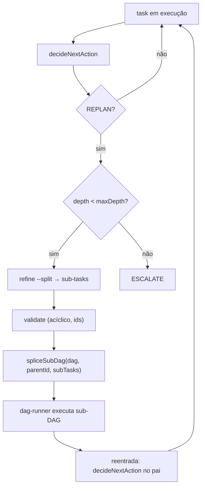

# Feature Blueprint: Dynamic DAG (nested sub-DAGs + replan estrutural)

> Derivado de [DESIGN-Feature-dynamic-dag.md](DESIGN-Feature-dynamic-dag.md).
> Único entregável desta etapa: este BLUEPRINT. Tasks/DAG/specs virão em `/dare-tasks`.
> Branch proposta: `feat/dynamic-dag` · Target: **v3.11.0** · License: MIT.
>
> **Base de evidências:** reusa `decideNextAction` (`verification/decay/policy.ts` → `REPLAN`),
> `dare refine --split` e o dag-runner. Ancoragem: `commands/execute.ts` (loop), `commands/refine.ts`,
> `dag-runner/*`, `commands/validate.ts` (aciclicidade/ids).

---

## 1. Visão Geral da Arquitetura

### 1.1 Princípio reitor

`REPLAN` deixa de ser só veredito e vira **ação estrutural determinística**: gerar sub-DAG (via refine) →
validar (sem ciclo) → **splice** no DAG ativo → executar → reentrar no pai. Zero LLM no splice/topo-sort;
o LLM só aparece no `AgentDriver` de cada sub-task (igual ao executor v3.9.0).

### 1.2 Diagrama



### 1.3 Decisões Arquiteturais

| # | Decisão | Alternativas | Justificativa |
|---|---|---|---|
| A-1 | **Sub-DAG como nós filhos do pai** (parentId), não DAG separado | DAG paralelo isolado | Reentrada natural no pai; `dag viz` agrupa |
| A-2 | **`spliceSubDag` puro** no dag-runner | lógica no comando | Testável; reusável por REPLAN automático e `refine --apply` manual |
| A-3 | **Sub-tasks via `refine --split`** | nova decomposição | Determinístico e já testado; não reinventar |
| A-4 | **`maxDepth` (default 2) → `ESCALATE`** | sem limite | Evita replan infinito (O-04) |
| A-5 | **Validar aciclicidade no splice** (reusa `validate`) | confiar | RNF-03; splice não pode introduzir ciclo |
| A-6 | **Idempotência por hash do conjunto de sub-tasks** | re-splice cego | RNF-04; re-tentar não duplica |
| A-7 | **Persistir sub-DAG em `state.json`** | só memória | RF-05; sobrevive a reinício; `--status` mostra |

---

## 2. Stack Técnica

| Camada | Tecnologia | Nota |
|---|---|---|
| Decisão | `decideNextAction` | reuso (REPLAN) |
| Decomposição | `dare refine --split` | reuso |
| Execução | dag-runner + `execute --agent` | estendidos com splice |
| Validação | `dare validate` | reuso (acíclico/ids) |
| Estado | `DARE/state.json` | persistência do nesting |

---

## 3. Contratos TypeScript

### 3.1 `src/dag-runner/sub-dag.ts` (NEW)

```ts
export interface SubTask {
  readonly id: string;            // 'task-034a', 'task-034b' (refine convention)
  readonly parentId: string;      // a task que deu replan
  readonly dependsOn: ReadonlyArray<string>;
  readonly specPath: string;
}

export interface SpliceResult {
  readonly inserted: ReadonlyArray<string>;   // ids inseridos
  readonly dag: DagState;                      // DAG com o sub-DAG
}

export class CycleError extends Error { readonly code = 'DAG_CYCLE' as const; }
export class MaxDepthError extends Error { readonly code = 'DAG_MAX_DEPTH' as const; }

/** Insere sub-tasks como filhas de parentId; valida aciclicidade e profundidade. */
export function spliceSubDag(
  dag: DagState, parentId: string, subTasks: ReadonlyArray<SubTask>, maxDepth: number,
): SpliceResult;

/** Profundidade de aninhamento de uma task (0 = topo). */
export function nestingDepth(dag: DagState, taskId: string): number;
```

**Regras executáveis:**
- `nestingDepth(parentId) + 1 > maxDepth` → `MaxDepthError` (chamador converte em `ESCALATE`).
- após inserir, rodar a checagem de aciclicidade de `validate`; se ciclo → `CycleError` (rollback, não persiste).
- idempotência: se o conjunto `{subTask.id}` já existe sob `parentId` (mesmo hash), no-op.
- o pai passa a depender da conclusão das sub-tasks (reentrada).

### 3.2 Integração no loop — `commands/execute.ts` (MODIFY)

```ts
const verdict = decideNextAction({ result, current, history, loop });
if (verdict.action === 'REPLAN') {
  try {
    const sub = await refineSplit(task.id);                 // reusa refine --split (A-3)
    spliceSubDag(dag, task.id, sub.subTasks, config.loop.maxDepth ?? 2);
    persistState(dag);                                       // A-7
    continue;                                                // dag-runner pega as sub-tasks no próximo pick
  } catch (e) {
    if (e instanceof MaxDepthError) return escalate(task);   // A-4
    if (e instanceof CycleError) return escalate(task, 'replan would create a cycle');
    throw e;
  }
}
```

### 3.3 `refine --split --apply` no DAG ativo — `commands/refine.ts` (MODIFY)

```bash
dare refine <task-id> --split --apply   # injeta o sub-DAG no DAG ativo (modo manual, RF-07)
```
Reusa a quebra existente; chama `spliceSubDag` + persiste.

### 3.4 Config — bloco `loop.maxDepth` (MODIFY `verification/config.ts`)

```jsonc
"loop": { "maxAttempts": 3, "maxDepth": 2 }   // maxDepth novo (default 2)
```

### 3.5 `dag viz` agrupa sub-DAGs — `commands/dag.ts` (MODIFY)

Sub-tasks renderizadas em subgraph aninhado sob o `parentId` (mermaid/dot/excalidraw).

---

## 4. Estrutura de Diretórios (mudanças)

```
packages/cli/src/
├── dag-runner/
│   ├── sub-dag.ts                 # NEW — spliceSubDag, nestingDepth, CycleError, MaxDepthError
│   └── __tests__/sub-dag.test.ts  # NEW
├── commands/
│   ├── execute.ts                 # MODIFY — REPLAN → splice
│   ├── refine.ts                  # MODIFY — --split --apply no DAG ativo
│   └── dag.ts                     # MODIFY — viz agrupa sub-DAG
├── verification/config.ts         # MODIFY — loop.maxDepth
DARE/state.json (schema)           # MODIFY — nesting persistido
```

---

## 5. Requisitos de Segurança — Rastreabilidade

| RS | Implementação | Teste |
|---|---|---|
| RS-01 | ids de sub-task validados (kebab-case, sem colisão) | `sub-dag.test.ts` |
| RS-02 | sub-DAG herda o pré-flight do guard (executor v3.9.0) | integração |

---

## 6. Plano de Execução (Fases)

### Fase 1 — `spliceSubDag` + tipos
**DONE:** splice insere filhas, valida aciclicidade, respeita `maxDepth`, idempotente — testado.

### Fase 2 — Integração REPLAN
**DONE:** `execute.ts` converte `REPLAN` em splice via `refine --split`; `MaxDepth`/`Cycle` → `ESCALATE`.

### Fase 3 — Manual + viz + persistência
**DONE:** `refine --split --apply` injeta no DAG ativo; `state.json` persiste nesting; `dag viz` agrupa.

### Fase N-1 — Auditoria
**DONE:** `dynamic-dag-regression.test.ts`: replan resolve via sub-DAG; nunca cria ciclo; respeita maxDepth (→ESCALATE); DAG flat inalterado; determinístico.

---

## 7. Validation Gates (Node/TS)

```powershell
cd packages/cli
pnpm exec tsc --noEmit
pnpm exec vitest run sub-dag dynamic-dag-regression
pnpm exec eslint src/dag-runner src/commands/execute.ts
```

## 8. PADRÕES PROIBIDOS (ANTI-STUB)

- Reimplementar a decomposição em vez de usar `refine --split`.
- Splice sem checagem de aciclicidade.
- Replan sem `maxDepth` (loop infinito).
- Reimplementar a decisão em vez de `decideNextAction`.
- DAG flat alterado quando não há replan.

## 9. Definition of Done (feature)

- [ ] RF-01..RF-04 MUST com testes; RF-05..RF-07 SHOULD implementados ou ticket.
- [ ] `maxDepth` testado (→ ESCALATE); aciclicidade garantida.
- [ ] DAG flat sem regressão.
- [ ] CHANGELOG `[3.11.0]`; `dag viz` documentado p/ nesting.
- [ ] `dare review` sem achados HIGH.

---

## Próximas Etapas

1. Revisar/aprovar. 2. `/dare-tasks` → bloco **9xx**. 3. Branch `feat/dynamic-dag`.
