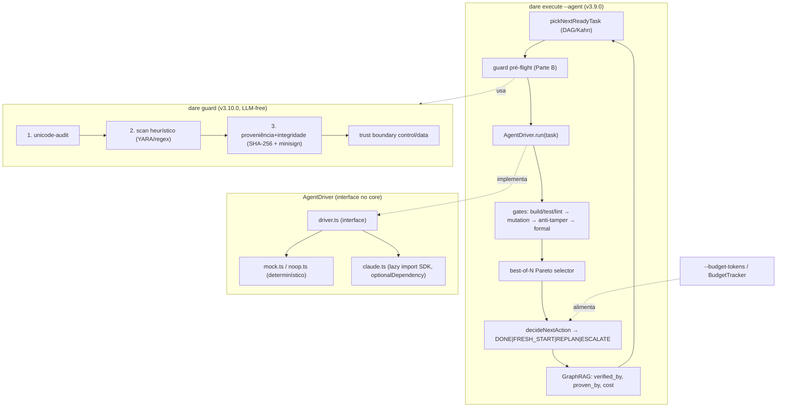

# Feature Blueprint: Secure Autonomous Executor

> Derivado de [DESIGN-Feature-secure-autonomous-executor.md](DESIGN-Feature-secure-autonomous-executor.md)
> e de [RFC-001](../docs/rfcs/RFC-001-secure-autonomous-executor.md) (Accepted).
> Único entregável desta etapa: este BLUEPRINT. Tasks/DAG/specs virão em `/dare-tasks`.
> Branch proposta: `feat/secure-autonomous-executor` · Target: **v3.9.0** (executor) + **v3.10.0** (gate) · License: MIT.
>
> **Decisões fechadas:** D-002 (internalizar tudo no `@dewtech/dare-cli`; SDK do LLM como
> `optionalDependency` + lazy `import()`); default `--require-approval rank`; D-003 (assinatura
> **minisign/Ed25519**).
>
> **Base de evidências:** RFC-driven + research-driven (`papers-dare/idea-12`). Ancoragem verificada em
> `verification/decay/policy.ts` (`decideNextAction`), `commands/execute.ts:384,417`,
> `commands/execute-verification.ts:316-332` (exit codes 0/1/3/4/5), `graphrag/knowledge-graph.ts`
> (`addNode`/`addEdge`), `verification/config.ts`, `mcp-server/server.ts` (rota `/steering`),
> `hooks/dispatcher.ts` + `exec/safe-spawn.ts` (spawn argv, shell:false).

---

## 1. Visão Geral da Arquitetura

### 1.1 Princípio reitor

**O motor de decisão é 100% determinístico** (DAG, gates, `decideNextAction`, guard). O LLM entra
**apenas** atrás da interface `AgentDriver`, invocado só em `dare execute --agent` modo não-mock
(D-002). O `dare guard` é LLM-free; a **garantia de segurança vem da arquitetura** (trust boundaries
control/data + tamper-evidence), **não** da detecção heurística (recall ~25%).

### 1.2 Diagrama



### 1.3 Decisões Arquiteturais

| # | Decisão | Alternativas | Justificativa |
|---|---|---|---|
| A-1 | **`AgentDriver` interface no core** (`src/agent/driver.ts`); drivers concretos em `src/agent/drivers/*` | Hardcode do SDK no loop | Permite mock determinístico (RNF-03) e confina o LLM (O-02) |
| A-2 | **Driver Claude internalizado, SDK lazy** via `await import('@anthropic-ai/...')` em `optionalDependency` | Pacote separado (rejeitado, D-002); dep dura (rejeitado) | Um pacote só (regra da casa); caminho determinístico nunca importa LLM |
| A-3 | **Loop autônomo reusa `decideNextAction`** existente (`verification/decay/policy.ts`) — não reimplementa decisão | Nova máquina de estados | A decay policy já é canônica e testada; só adicionamos o *driver* e o *budget* |
| A-4 | **`BudgetTracker` soma custo de TODOS os candidatos best-of-N** e injeta no `LoopConfig` | Contar só o vencedor | Best-of-N multiplica custo ~N×; orçamento precisa ver o total (RNF-07) |
| A-5 | **Telemetria de custo como metadados no nó `task`** + nova aresta, via `addNode/addEdge` | Tabela separada | Reusa o GraphRAG existente; consultável por `dare graph` |
| A-6 | **`dare guard` comando próprio** (`src/commands/guard.ts`), não sub-modo de `review` | Estender `review` | `review` = pós-implementação no código produzido; `guard` = pré-consumo nos inputs (lifecycle diferente) |
| A-7 | **Pipeline guard em 3 camadas determinísticas** (`src/guard/{unicode,scan,provenance}.ts`) | Um scanner monolítico | Camadas testáveis isoladamente; veredito agregado PASS\|WARN\|FAIL |
| A-8 | **Trust boundary por classificação de origem** (`control` vs `data`) antes de qualquer execução | Confiar no scan | Garantia real: dado não-confiável não invoca shell nem reordena gate (RS-02/03) |
| A-9 | **minisign/Ed25519 internalizado** para assinar artefatos confiáveis; verificação por digest SHA-256 | cosign/sigstore (infra externa, rejeitado D-003) | Local-first, zero infra; complementar à provenance OIDC do publish |
| A-10 | **Exit code 6 = guard-fail** (estende 0/1/3/4/5 de `execute-verification.ts`) | Reusar 1 genérico | Códigos específicos já são a convenção (3/4/5 são tipos de falha distintos) |
| A-11 | **`--require-approval rank` default**; pausa por fronteira de rank do DAG | `none` default | Autonomia é opt-in seguro (O-08) |

---

## 2. Stack Técnica (versões fixas)

| Camada | Tecnologia | Versão/Nota |
|---|---|---|
| Runtime | Node | `>=18` (engines já fixado) |
| Linguagem | TypeScript | `5.9.x` (repo) |
| Driver LLM (opcional) | `@anthropic-ai/sdk` (ou Claude Agent SDK) | `optionalDependencies`; lazy `import()`; **nunca** em `dependencies` |
| Hash | `node:crypto` (SHA-256) | nativo, zero dep |
| Assinatura | minisign/Ed25519 via `node:crypto` (`sign`/`verify` ed25519) | nativo — **não** adicionar dep externa de minisign; formato compatível |
| Scan | regex + tabela de regras YARA-like em JSON | determinístico, sem dep nova |
| Grafo | `graphrag/*` existente (`KnowledgeGraph`) | reuso |
| CLI | `commander` 11 | existente |
| Testes | Vitest 1 + driver `mock` | sem rede/LLM |

> **Nota D-003:** usamos Ed25519 nativo do `node:crypto` (mesma curva do minisign) para não introduzir
> binário/dependência externa — coerente com a regra mono-pacote. O formato de chave/assinatura segue
> o esquema minisign para interoperabilidade com a CLI `minisign` se o usuário preferir assinar fora.

---

## 3. Contratos TypeScript — Parte A (Executor)

### 3.1 `src/agent/driver.ts` (NEW)

```ts
/** Resultado de uma execução de task por um agente. */
export interface AgentRunResult {
  readonly status: 'implemented' | 'failed' | 'aborted';
  readonly worktree: string;            // path do worktree onde o patch foi escrito
  readonly summary: string;             // resumo curto (não-autoritativo)
  readonly usage: TokenUsage;           // custo desta execução
  readonly failureSignature?: string;   // alimenta decideNextAction
}

export interface TokenUsage {
  readonly inputTokens: number;
  readonly outputTokens: number;
  readonly costUsd: number;             // estimado a partir do modelo
  readonly model: string;
}

export interface AgentRunInput {
  readonly taskId: string;
  readonly spec: string;                // EXECUTION/task-*.md já validado pelo guard
  readonly steering: ReadonlyArray<GuardedArtifact>;  // só artefatos PASS/WARN
  readonly worktree: string;
  readonly budgetRemaining: number;     // tokens restantes (BudgetTracker)
  readonly signal: AbortSignal;         // cancelamento por budget/aprovação
}

export interface AgentDriver {
  readonly id: string;                  // 'mock' | 'noop' | 'claude'
  readonly requiresNetwork: boolean;
  run(input: AgentRunInput): Promise<AgentRunResult>;
}
```

**Pré-condições:** `spec` e cada `steering[]` JÁ passaram pelo guard (status ≠ FAIL).
**Pós-condições:** em `status:'implemented'`, há um patch aplicável no `worktree`; `usage` sempre
preenchido (mock retorna zeros).

### 3.2 `src/agent/drivers/mock.ts`, `noop.ts` (NEW)

```ts
/** Determinístico: aplica um patch pré-gravado da fixture; usage = 0. Para --dry-run e testes. */
export const mockDriver: AgentDriver;       // requiresNetwork = false
/** Não faz nada; marca a task como aborted. Para validar o loop sem efeito. */
export const noopDriver: AgentDriver;
```

### 3.3 `src/agent/drivers/claude.ts` (NEW — lazy)

```ts
/**
 * Carrega o SDK só aqui, lazy. Lança AgentSdkMissingError com mensagem acionável
 * se o optionalDependency não estiver instalado.
 */
export async function createClaudeDriver(opts: ClaudeDriverOptions): Promise<AgentDriver>;

export class AgentSdkMissingError extends Error {
  readonly code = 'AGENT_SDK_MISSING' as const;
  // message: "Optional dependency '@anthropic-ai/sdk' not installed. Run: npm i @anthropic-ai/sdk
  //           — or use --dry-run."
}
```

**Regra inviolável (O-02):** este é o **único** arquivo do `src/` autorizado a `import()` o SDK.
Teste de arquitetura (`no-llm-in-core.test.ts`) faz grep no bundle e falha se `@anthropic-ai`
aparecer fora de `src/agent/drivers/claude.ts`.

### 3.4 `src/agent/budget.ts` (NEW)

```ts
export class BudgetTracker {
  constructor(totalTokens: number | null);   // null = ilimitado
  add(usage: TokenUsage): void;               // soma TODOS os candidatos best-of-N (A-4)
  remaining(): number;                        // Infinity se total null
  exhausted(): boolean;                       // remaining() <= 0
}
```

### 3.5 Integração no `commands/execute.ts` (MODIFY)

Novo modo quando `--agent` presente. Reusa o pipeline existente; insere `driver.run` entre o pick e
os gates, e `guard` como pré-flight:

```ts
// pseudocontrato — dentro do loop por task
const guarded = await runGuard(task.spec, task.steeringArtifacts, config.guard);  // Parte B
if (guarded.verdict === 'FAIL') { return markFailed(task, exit=6); }

const driver = await resolveDriver(args, config);   // mock se --dry-run
const candidates = await Promise.all(
  range(args.bestOf ?? 1).map(() => driver.run({ ...input, budgetRemaining: budget.remaining() }))
);
candidates.forEach(c => budget.add(c.usage));        // A-4
const winner = selectPareto(candidates, gateResults);
const verdict = decideNextAction({ result: winner.verification, current, history, loop });
recordCostTelemetry(graph, task.id, sum(candidates.map(c => c.usage)));  // A-5
```

**Flags (commander) em `execute`:**

| Flag | Tipo | Default | Efeito |
|---|---|---|---|
| `--agent` | bool | false | liga o modo autônomo |
| `--budget-tokens <n>` | int | (none=∞) | teto; alimenta decay |
| `--require-approval <mode>` | `rank\|none` | `rank` | pausa por fronteira de rank |
| `--on-fail <mode>` | `replan\|escalate\|stop` | `escalate` | ação default em FAILED |
| `--dry-run` | bool | false | usa `mockDriver` |
| `--best-of <n>` | int | 1 | candidatos por task (reusa existente) |

**Edge cases enumerados:**

| Situação | Comportamento |
|---|---|
| `--agent` sem SDK e sem `--dry-run` | `AgentSdkMissingError` → exit 1, mensagem acionável |
| budget esgota no meio de um rank | termina candidatos em voo; `decideNextAction` recebe `ESCALATE`; não inicia nova task |
| `--require-approval rank` e usuário recusa rank | execução pausa (exit 0, estado `PENDING` preservado) |
| guard retorna `FAIL` na spec | task não chega ao driver; exit 6 |
| driver retorna `aborted` | conta como tentativa falha; entra na decay policy |

### 3.6 Telemetria de custo (A-5) — GraphRAG

Reusa `addNode`/`addEdge` (`graphrag/knowledge-graph.ts`). Não cria backend novo:

- Metadados no nó `task` existente: `{ inputTokens, outputTokens, costUsd, model, attempts }`.
- Nova aresta opcional `task --incurred_cost--> run` se `run` virar nó (decisão de tasks).
- `EdgeType`/`NodeType` novos (se necessários) adicionados em `graphrag/types.ts` mantendo
  compatibilidade com `dare graph stats`.

---

## 4. Contratos TypeScript — Parte B (`dare guard`)

### 4.1 `src/guard/types.ts` (NEW)

```ts
export type GuardVerdict = 'PASS' | 'WARN' | 'FAIL';
export type ArtifactOrigin = 'human' | 'agent' | 'external';
export type TrustChannel = 'control' | 'data';

export interface GuardedArtifact {
  readonly path: string;
  readonly origin: ArtifactOrigin;
  readonly channel: TrustChannel;
  readonly trust: 'signed' | 'unsigned';
  readonly taskId?: string;
  readonly digest: string;              // sha256 hex
}

export interface GuardFinding {
  readonly layer: 'unicode' | 'scan' | 'provenance';
  readonly severity: GuardVerdict;      // WARN | FAIL
  readonly rule: string;                // id da regra (ex.: 'zero-width-char', 'instr-override')
  readonly evidence: string;            // trecho/offset — sanitizado
}

export interface GuardResult {
  readonly artifact: string;
  readonly verdict: GuardVerdict;       // pior severidade entre findings
  readonly findings: ReadonlyArray<GuardFinding>;
  readonly sanitized?: string;          // conteúdo após strip (modo unicode=strip)
}
```

### 4.2 Camada 1 — `src/guard/unicode.ts` (NEW) [RF-09]

```ts
/** Detecta/remove zero-width, bidi overrides, variation selectors, tag chars. */
export function auditUnicode(content: string, mode: 'strip' | 'block'): {
  findings: GuardFinding[];     // rule ∈ {zero-width, bidi-override, variation-selector, tag-char, homoglyph}
  sanitized: string;            // == content se mode='block' e houver achado (não higieniza)
};
```

**Regras executáveis (codepoints):** `U+200B-200F`, `U+202A-202E`, `U+2066-2069`, `U+FE00-FE0F`,
`U+E0000-E007F`; homóglifos por tabela Latin/Cyrillic/Greek confusables.
- `mode='block'`: qualquer achado → `FAIL`.
- `mode='strip'`: remove os codepoints, retorna `sanitized`, severidade `WARN`.

### 4.3 Camada 2 — `src/guard/scan.ts` (NEW) [RF-10]

```ts
/** Sinais heurísticos. Recall baixo (~25%) — best-effort, default WARN. */
export function scanHeuristics(content: string): GuardFinding[];
```

**Regras (mínimo, combinação 2-of-N eleva para WARN forte):**

| rule | padrão (exemplo) |
|---|---|
| `instr-override` | `/ignore (all )?previous (instructions\|rules)/i`, `/disregard the (system\|above)/i` |
| `shell-exec` | `/\b(curl\|wget\|bash -c\|powershell -enc\|Invoke-Expression)\b/` |
| `exfiltration` | `/(cat\|type)\s+.*\.env/i`, `/(api[_-]?key\|secret\|token)\b.*(post\|fetch\|curl)/i` |
| `hidden-directive` | comentário HTML/markdown contendo imperativo p/ o agente |

- Achado isolado → `WARN`. Nunca `FAIL` sozinho (decisão de design — não é garantia).

### 4.4 Camada 3 — `src/guard/provenance.ts` (NEW) [RF-11, D-003]

```ts
export function computeDigest(content: Buffer): string;       // sha256 hex
export function signArtifact(content: Buffer, privKey: Ed25519Key): string;  // minisign-compat
export function verifyArtifact(content: Buffer, sig: string, pubKey: Ed25519Key): boolean;

/** Classifica origem/canal a partir do path + manifesto de assinatura. */
export function classify(path: string, cfg: GuardConfig): { origin: ArtifactOrigin; channel: TrustChannel; trust: 'signed'|'unsigned' };
```

**Comportamento:**
- Artefato em `trustedPaths` **com** assinatura válida → `trust:'signed'`, `channel:'control'`.
- `trustedPaths` com assinatura **inválida ou ausente quando esperada** → `FAIL` (tamper-evidence).
- **Crucial (correção do DESIGN):** artefato assinado **ainda** passa por camadas 1-2; assinatura
  prova origem/integridade, não ausência de injeção.

### 4.5 Trust boundary — `src/guard/boundary.ts` (NEW) [RF-12]

```ts
/** Dado não-confiável NÃO pode virar controle. */
export function enforceBoundary(a: GuardedArtifact): void;  // throws BoundaryViolationError
```

**Regra:** se `channel==='data'` e o artefato é usado como hook executável ou tenta reordenar gates
→ `BoundaryViolationError` (exit 6). Hooks só executam de `channel==='control'` + `trust:'signed'`.

### 4.6 `src/commands/guard.ts` (NEW)

```bash
dare guard <path> | --staged | --all  [--strict] [--format json] [--sign] [--unicode strip|block]
```

| Aspecto | Valor |
|---|---|
| Default verdict gate | `FAIL` → exit 6; `WARN` → exit 0 (a menos de `--strict`, que trata WARN como FAIL) |
| `--sign` | assina `<path>` se estiver em `trustedPaths`; grava `.minisig` ao lado |
| `--format json` | imprime `GuardResult[]` |
| pré-flight no `execute --agent` | chamado por artefato consumido; `FAIL` bloqueia a task |

### 4.7 Config `dare.config.json` — bloco `guard` (MODIFY `verification/config.ts` ou novo loader)

```jsonc
"guard": {
  "enabled": false,
  "onExecute": true,
  "unicode": "strip",
  "trustedPaths": [".dare/steering/**", "DARE/TASKS.md"],
  "signing": { "enabled": false, "publicKey": "minisign.pub" }
}
```

Schema validado por zod (já dep do projeto). `enabled:false` → guard não roda (compat, RNF-02).

---

## 5. Estrutura de Diretórios (mudanças)

```
packages/cli/src/
├── agent/                       # NEW (Parte A)
│   ├── driver.ts                # interface AgentDriver
│   ├── budget.ts                # BudgetTracker
│   ├── drivers/
│   │   ├── mock.ts              # determinístico
│   │   ├── noop.ts
│   │   └── claude.ts            # ÚNICO ponto de import() do SDK (lazy)
│   └── __tests__/
│       ├── budget.test.ts
│       ├── mock-driver.test.ts
│       └── no-llm-in-core.test.ts   # falha se SDK importado fora de claude.ts (O-02)
├── guard/                       # NEW (Parte B)
│   ├── types.ts
│   ├── unicode.ts
│   ├── scan.ts
│   ├── provenance.ts
│   ├── boundary.ts
│   ├── rules/scan-rules.json    # tabela YARA-like
│   └── __tests__/
│       ├── unicode.test.ts      # fixtures 2510.05025
│       ├── scan.test.ts
│       ├── provenance.test.ts   # tamper-evidence
│       └── boundary.test.ts     # data-channel não invoca shell
├── commands/
│   ├── execute.ts               # MODIFY — modo --agent, flags, loop driver+guard
│   └── guard.ts                 # NEW — comando dare guard
├── verification/
│   ├── config.ts                # MODIFY — bloco guard + agent
│   └── decay/policy.ts          # REUSE — decideNextAction (não modificar a lógica)
├── graphrag/
│   └── types.ts                 # MODIFY — NodeType/EdgeType de custo (se necessário)
package.json (cli)               # MODIFY — optionalDependencies: @anthropic-ai/sdk
dare.config.json (template)      # MODIFY — bloco guard default
```

---

## 6. Requisitos de Segurança — Rastreabilidade

| RS | Implementação | Teste |
|---|---|---|
| RS-01 | pipeline guard (3 camadas) por artefato | `unicode/scan/provenance.test.ts` |
| RS-02 | `boundary.ts` — dado não vira controle | `boundary.test.ts` |
| RS-03 | hooks só de `control+signed` | `boundary.test.ts` (data-channel → shell negado) |
| RS-04 | `verifyArtifact` + digest | `provenance.test.ts` (mutação de byte → FAIL) |
| RS-05 | capability tags `{origin,trust,task-id}` | `provenance.test.ts` |
| RS-06 | `auditUnicode` strip/block | `unicode.test.ts` (codepoints da §4.2) |
| RS-07 | token/credencial fora de prompt/log | `claude.test.ts` (redação) |
| RS-08 | `BudgetTracker.exhausted` | `budget.test.ts` |
| RS-09 | spawn argv (reuso `exec/safe-spawn.ts`) | referência |

---

## 7. Plano de Execução (Fases)

### Fase 1 — `AgentDriver` foundation (v3.9.0)
**Critério DONE:**
- `driver.ts` + `mock`/`noop` implementados e testados.
- `no-llm-in-core.test.ts` verde (nenhum import de SDK fora de `claude.ts`).
- `BudgetTracker` com soma best-of-N (A-4) testado.

### Fase 2 — Executor autônomo (v3.9.0)
**Critério DONE:**
- `dare execute --agent` dirige um DAG de fixture até DONE com `mockDriver` (`--dry-run`).
- Reusa `decideNextAction` sem alterar a lógica; budget dispara ESCALATE ao esgotar.
- Telemetria de custo gravada no grafo e visível em `dare graph` (O-03).
- `--require-approval rank` default pausa nas fronteiras de rank (O-08).
- `claude.ts` lazy: sem SDK → `AgentSdkMissingError` acionável.

### Fase 3 — `dare guard` core (v3.10.0)
**Critério DONE:**
- Camadas unicode + scan implementadas; `dare guard <path>` emite `PASS|WARN|FAIL`.
- 100% dos payloads unicode de fixture (2510.05025) detectados/strippados (O-06).
- Exit code 6 em `FAIL`.

### Fase 4 — Proveniência + boundaries + integração (v3.10.0)
**Critério DONE:**
- `provenance.ts` (digest + Ed25519) + `--sign`; adulteração → FAIL (O-05).
- `boundary.ts`: dado não-confiável não invoca shell/reordena gate (O-04).
- Guard plugado como pré-flight em `execute --agent` (`guard.onExecute`).
- Artefato assinado **também** passa por unicode+scan (correção do DESIGN).

### Fase N-1 — Auditoria de regressão de segurança
**Critério DONE:**
- Suíte `secure-executor-regression.test.ts`: budget nunca estourado; data-channel nunca executa;
  tamper sempre detectado; nenhum import de LLM no caminho determinístico.
- `pnpm audit --prod --audit-level=high` = 0 HIGH (inclui o `optionalDependency`).

---

## 8. Validation Gates (Node/TS)

| Etapa | Comando |
|---|---|
| Build | `pnpm --filter @dewtech/dare-cli build` |
| Test | `pnpm --filter @dewtech/dare-cli exec vitest run` |
| Lint | `pnpm --filter @dewtech/dare-cli lint` |
| Audit | `pnpm audit --prod --audit-level=high` |
| Arquitetura | `no-llm-in-core.test.ts` (grep de import de SDK) |

---

## 9. PADRÕES PROIBIDOS (ANTI-STUB)

- `import '@anthropic-ai/...'` (estático) em **qualquer** arquivo que não seja `agent/drivers/claude.ts`.
- Declarar o SDK em `dependencies` (deve ser `optionalDependencies`).
- `FAIL` no guard a partir de um único achado de `scan` heurístico (só `WARN`).
- Executar hook de `channel:'data'` ou `trust:'unsigned'`.
- Reimplementar a lógica de decisão (usar `decideNextAction`, não copiar).
- Best-of-N contando custo só do vencedor (deve somar todos — A-4).
- Engolir `usage` (toda execução de driver retorna `TokenUsage`, mock retorna zeros).

---

## 10. Definition of Done (feature)

- [ ] RF-01…RF-16 MUST implementados com testes; SHOULD implementados ou ticket justificado.
- [ ] `no-llm-in-core.test.ts` garante o core determinístico (O-02 / D-002).
- [ ] Mensagens de erro batem exatamente as strings deste blueprint.
- [ ] Exit code 6 reservado e testado para guard-fail.
- [ ] `dare execute --agent --dry-run` roda um DAG fixture fim-a-fim sem rede.
- [ ] `dare guard` detecta 100% dos unicode fixtures e toda adulteração de artefato assinado.
- [ ] CHANGELOG `[3.9.0]` (executor) e `[3.10.0]` (guard) com notas; flags documentadas no README/skills.
- [ ] `dare review` sem achados HIGH nas tasks desta feature.

---

## Próximas Etapas

1. **Revisar e aprovar** este Blueprint (checklist §10 + §DESIGN).
2. Rodar `/dare-tasks` para gerar `TASKS-secure-autonomous-executor.md`,
   `dare-dag-secure-autonomous-executor.yaml` e `EXECUTION/task-*.md`.
3. Branch `feat/secure-autonomous-executor` → implementação via `/dare-dag-run`.
