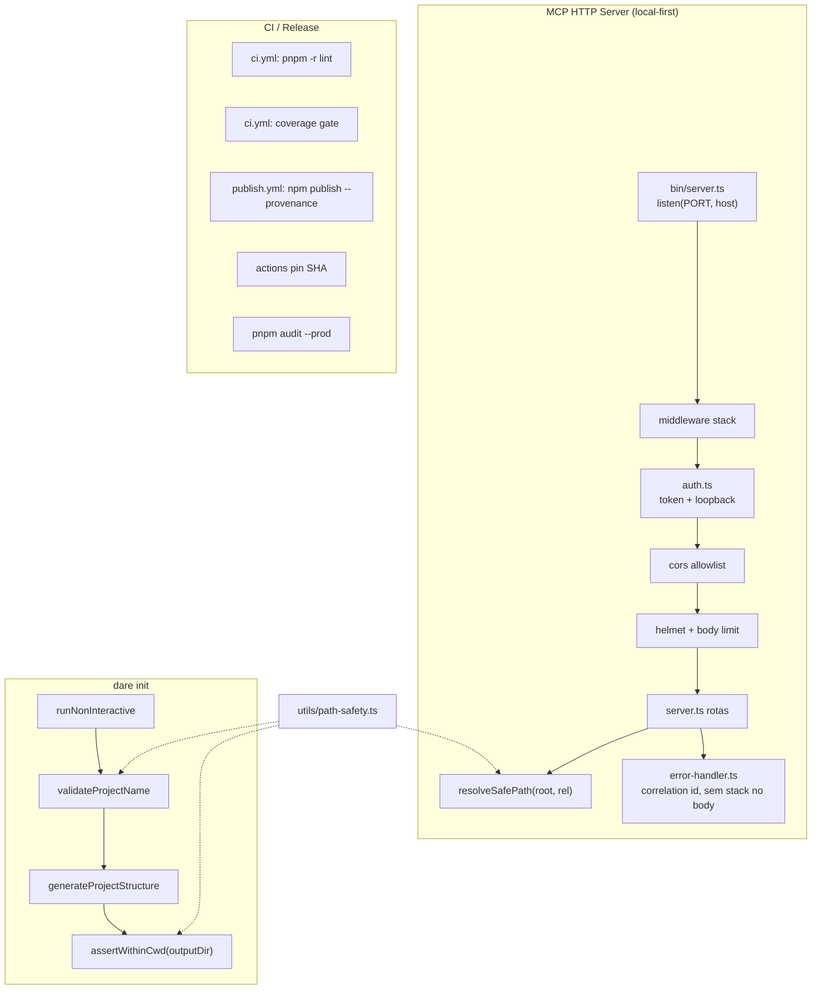

# Feature Blueprint: Endurecimento de Segurança e Supply-Chain

> Derivado de [DESIGN-Feature-security-hardening.md](DESIGN-Feature-security-hardening.md).
> Único entregável desta etapa: este BLUEPRINT. Tasks/DAG/specs de execução virão em `/dare-tasks`.
> Branch proposta: `feat/security-hardening` · Target release: **v3.4.0** (v3.3.0 já entregue pelo verification-core) · License: MIT.
>
> **Base de evidências:** audit-driven — achados **C1**, **C2** (MCP), **H1** (`dare init --non-interactive`), supply-chain/CI.
> Ancoragem verificada em `packages/cli/src/mcp-server/server.ts`, `mcp-server/bin/server.ts`,
> `commands/init.ts`, `utils/project-generator.ts`, `.github/workflows/*.yml`.
>
> **Pré-requisito cruzado:** RS-06 (`shell:false` no runner) está em `DESIGN-Feature-verification-core.md` —
> **não reimplementar** aqui; apenas referenciar `exec/safe-spawn.ts`.

---

## 1. Visão Geral da Arquitetura

### 1.1 Princípio reitor

**O endurecimento é 100% determinístico** — middleware Express, validação de path, gates de CI.
Nenhum LLM no caminho. O MCP permanece **local-first**: loopback + token por padrão; exposição LAN
só com opt-in explícito (`DARE_MCP_BIND=0.0.0.0` + aviso no boot).

### 1.2 Diagrama



### 1.3 Decisões Arquiteturais

| # | Decisão | Alternativas | Justificativa |
|---|---|---|---|
| A-1 | **Middleware chain única** em `mcp-server/middleware/*` aplicada em `createMcpServer` **antes** de rotas | Inline em cada handler | C1/C2 exigem auth/CORS/helmet em todas as rotas; uma cadeia evita esquecimento |
| A-2 | **Root do projeto = `PROJECT_PATH` do processo**; `projectPath` do body **ignorado** com warn | Rejeitar body com 400 | RNF-02: compat retroativa; clientes legados não quebram |
| A-3 | **`resolveSafePath(root, segments)`** — extensão de `assertRelativeSafe` com checagem de prefixo realpath | Só `assertRelativeSafe` em segmentos | Path traversal via `..` após join exige validação de prefixo (C1) |
| A-4 | **Token MCP gerado no boot** se `DARE_MCP_TOKEN` ausente; impresso uma vez (mascarado parcialmente) | Token obrigatório manual | RNF-01: IDE local sem fricção |
| A-5 | **Bind default `127.0.0.1`**; `0.0.0.0` só com `DARE_MCP_BIND=0.0.0.0` + `logger.warn` | Sempre `0.0.0.0` | C2: fecha exposição LAN acidental |
| A-6 | **`validateProjectName` compartilhado** entre fluxo interativo e `runNonInteractive` | Duplicar regex | H1: paridade obrigatória |
| A-7 | **`assertWithinCwd` no gerador** — defesa em profundidade após validação no init | Só validar no comando | Qualquer caller futuro de `generateProjectStructure` fica protegido |
| A-8 | **Publish via OIDC** (`permissions: id-token: write`) + `npm publish --provenance` | `NPM_TOKEN` de longa duração | RS-08 / O-05 |
| A-9 | **eslint real + cobertura** no CI com baseline inicial documentado | Só typecheck via build | RF-10/RF-11; lint job hoje é falso (`ci.yml:68-69`) |
| A-10 | **Pin de actions por SHA** com comentário da tag | Tags móveis | O-08 / RS-10 |

---

## 2. Stack Técnica (CLI)

| Camada | Tecnologia | Nota |
|---|---|---|
| HTTP | Express 4.x | já em uso |
| Headers | **helmet** | nova dep de produção |
| CORS | `cors` com `origin` callback | substitui `cors()` aberto (`server.ts:32`) |
| Logging | pino (MCP) + `utils/logger.ts` (CLI) | erros com correlation id; RF-14 |
| Path safety | `utils/path-safety.ts` | estender com `assertWithinRoot`, `resolveSafePath` |
| Lint | ESLint 8 + @typescript-eslint | ativar no CI |
| Cobertura | Vitest `--coverage` + thresholds em `vitest.config.ts` | baseline inicial ~70% lines (ajustável) |
| Publish | npm `--provenance` + GitHub OIDC | trusted publishing |
| Secret scan | gitleaks (existente) | manter |

---

## 3. Modelo de Dados / Contratos TypeScript

### 3.1 `utils/path-safety.ts` (estender)

```ts
/** Rejeita absoluto e '..' em segmentos relativos (já existe). */
export function assertRelativeSafe(targetPath: string): void;

/**
 * Garante que `resolved` está sob `root` (prefixo realpath).
 * @throws PathEscapeError com mensagem estável para testes
 */
export function assertWithinRoot(root: string, resolved: string): void;

/**
 * Junta root + segmentos relativos e valida confinamento.
 * Usado por MCP (ler DARE/*) e init (outputDir).
 */
export function resolveSafePath(
  root: string,
  ...segments: string[]
): string;

export class PathEscapeError extends Error {
  readonly code = 'PATH_ESCAPE' as const;
}
```

**Regras executáveis:**
- Normalizar `\` → `/` antes de checar `..` (RNF-05).
- Windows: resolver drive letters; rejeitar UNC `\\server\share` como root de escrita.
- Erro: `Path escape: resolved path is outside allowed root` (mensagem exata para teste).

### 3.2 `commands/init-validation.ts` (novo)

```ts
export const PROJECT_NAME_RE = /^[a-z0-9-_]+$/;

export interface ValidateProjectNameResult {
  readonly ok: true;
  readonly sanitized: string;
} | {
  readonly ok: false;
  readonly error: string; // mensagem exata para stderr
};

/**
 * Valida nome de projeto (paridade interativo + --non-interactive).
 * Rejeita: vazio, absoluto, '..', chars fora do regex, apenas '.' ou '..'.
 */
export function validateProjectName(name: string): ValidateProjectNameResult;

/**
 * Resolve outputDir = path.resolve(cwd, name) e garante assertWithinCwd.
 */
export function resolveProjectOutputDir(cwd: string, name: string): string;

export function assertWithinCwd(cwd: string, targetDir: string): void;
```

**Mensagens de erro exatas (init):**

| Caso | stderr (exit 1) |
|---|---|
| Nome com `..` ou absoluto | `Error: project name must be a simple directory name under the current folder (got '<name>')` |
| Regex inválida | `Error: project name may only contain lowercase letters, numbers, hyphens and underscores (got '<name>')` |
| outputDir fora do cwd | `Error: project directory must stay inside the current working directory` |

### 3.3 `mcp-server/middleware/*` (novo)

```ts
// auth.ts
export interface McpAuthOptions {
  readonly token: string;
  readonly allowLoopbackWithoutToken?: boolean; // default true em dev local
}

/** Header: Authorization: Bearer <token> OU query ?token= (só loopback) */
export function createAuthMiddleware(opts: McpAuthOptions): RequestHandler;

// cors.ts
export interface McpCorsOptions {
  readonly allowedOrigins: ReadonlyArray<string>; // default: ['http://127.0.0.1:*', 'http://localhost:*']
}

export function createCorsMiddleware(opts?: McpCorsOptions): RequestHandler;

// error-handler.ts
export interface SanitizedErrorBody {
  readonly success: false;
  readonly error: string;           // sempre genérico: 'Internal server error'
  readonly correlationId: string;   // uuid v4
}

export function createErrorHandler(logger: Logger): ErrorRequestHandler;
```

**Comportamento auth (RF-02):**
- Sem `Authorization: Bearer` válido **e** IP não loopback → `401` body: `{ "error": "Unauthorized" }`.
- Loopback (`127.0.0.1`, `::1`) + token ausente → permitido se `allowLoopbackWithoutToken` (default true).
- Token nunca logado: logger usa `token: '[REDACTED]'` (RF-14).

**CORS (RF-03):**
- Origin não na allowlist → sem header `Access-Control-Allow-Origin`; preflight falha.
- Requests sem header `Origin` (curl, agente local) → permitidos.

**Erros (RF-06 / O-03):**
- Log interno: `logger.error({ err, correlationId, route }, 'mcp request failed')`.
- Body: `{ "success": false, "error": "Internal server error", "correlationId": "<uuid>" }`.
- **Proibido** no body: `err.message`, stack, paths absolutos.

### 3.4 Configuração por env

| Variável | Default | Descrição |
|---|---|---|
| `DARE_MCP_PORT` | `3000` | Porta |
| `DARE_MCP_BIND` | `127.0.0.1` | Host; `0.0.0.0` exige valor explícito + warn |
| `DARE_MCP_TOKEN` | (gerado uuid no boot) | Bearer token |
| `DARE_PROJECT_PATH` | `process.cwd()` | Root único de I/O |
| `DARE_MCP_BODY_LIMIT` | `1mb` | Limite `express.json` |
| `DARE_MCP_CORS_ORIGINS` | (allowlist local) | CSV opcional de origins extras |

---

## 4. Endpoints MCP — Contratos Executáveis

> Todas as rotas passam por auth + cors + helmet. `projectPath` no body de `POST /context/query`
> é **ignorado**; se presente, log `warn` uma vez por request: `deprecated projectPath ignored`.

### GET `/health`

| Aspecto | Valor |
|---|---|
| Auth | opcional em loopback; obrigatória fora |
| Response 200 | `{ "status": "ok", "version": "<pkg.version>", "projectRoot": "<basename only>" }` |
| **Proibido** | path absoluto completo do projeto no body |

### POST `/context/query`

**Request:**
```json
{
  "type": "architecture" | "file" | "task" | "dependency" | "schema" | "endpoint",
  "query": "string (1..500 chars)",
  "limit": 1
}
```
- `projectPath` no body: ignorado (warn).
- `query` vazio → `400` `{ "error": "query is required" }`.
- `type` inválido → `400` `{ "error": "invalid type" }`.

**Response 200:**
```json
{ "success": true, "results": [...], "total": 0, "query": "...", "type": "..." }
```

**I/O:** todos os paths via `resolveSafePath(projectRoot, 'DARE', filename)`.

### GET `/blueprint`, GET `/dag`, GET `/project`

- Leem apenas sob `projectRoot`.
- 404: `{ "error": "<file> not found. Run: dare <cmd>" }` — sem path absoluto.

### GET `/tasks/:taskId`

- `taskId` deve casar `^task-[0-9]{3}$` ou `^task-[0-9a-z-]+$`; senão `400`.
- 404 se task ausente em TASKS.md.

### PUT `/tasks/:taskId`

**Request:**
```json
{ "status": "PENDING" | "IN_PROGRESS" | "DONE" | "FAILED" | "SKIPPED" }
```
- Status inválido → `400`.
- Escrita em `DARE/TASKS.md` via `resolveSafePath` apenas.
- Side effect: reescreve linha da task; não cria arquivo fora de `DARE/`.

---

## 5. `dare init` — Contratos

### Fluxo interativo (existente)

- Manter regex `init.ts:40`; extrair para `validateProjectName` compartilhado.

### Fluxo `--non-interactive` (`runNonInteractive`)

**Antes** de `generateProjectStructure` (`init.ts:316`):

```ts
const validated = validateProjectName(name);
if (!validated.ok) { console.error(chalk.red(validated.error)); process.exit(1); }
const outputDir = resolveProjectOutputDir(process.cwd(), validated.sanitized);
```

### `generateProjectStructure` (`project-generator.ts:68`)

```ts
assertWithinCwd(process.cwd(), path.resolve(outputDir));
await fs.ensureDir(outputDir);
```

**Edge cases enumerados:**

| Input | Resultado |
|---|---|
| `dare init "../../tmp/x" --non-interactive --stack go-gin` | exit 1 antes de escrita |
| `dare init "/etc/passwd" ...` | exit 1 (absoluto) |
| `dare init "valid-name" ...` | `cwd/valid-name` criado |
| Windows `dare init "..\\escape" ...` | exit 1 |
| Nome `my--app` | OK |
| Nome `MyApp` (maiúsculas) | exit 1 (regex) |

---

## 6. CI / Supply-Chain — Contratos

### 6.1 `ci.yml` — lint real (RF-10)

Substituir step "Type check all packages" (`ci.yml:68-69`) por:

```yaml
- name: ESLint (packages/cli)
  run: pnpm --filter @dewtech/dare-cli lint
```

Job falha se eslint retorna ≠ 0.

### 6.2 `ci.yml` — cobertura (RF-11)

No job `build-and-test`, após testes:

```yaml
- name: Test with coverage gate
  run: pnpm --filter @dewtech/dare-cli exec vitest run --coverage
```

`vitest.config.ts` thresholds iniciais (baseline documentado em `KNOWN-COV-BASELINE.md`):

```ts
coverage: {
  provider: 'v8',
  thresholds: { lines: 70, functions: 65, branches: 60, statements: 70 },
}
```

Introdução gradual: se baseline atual < limiar, fixar limiar no valor atual − 2pp e subir 2pp por release até meta.

### 6.3 `publish.yml` — provenance (RF-09)

Adicionar após testes:

```yaml
permissions:
  contents: write
  id-token: write

- name: Setup Node.js for publish
  uses: actions/setup-node@v4
  with:
    node-version: 20.x
    registry-url: https://registry.npmjs.org

- name: Publish to npm with provenance
  run: pnpm --filter @dewtech/dare-cli publish --access public --provenance
  env:
    NODE_AUTH_TOKEN: ${{ secrets.NPM_TOKEN }}  # substituído por OIDC quando trusted publishing ativo
```

**Nota operacional:** configurar trusted publisher no npm para ` @dewtech/dare-cli` ↔ repo GitHub antes do primeiro release v3.4.0.

### 6.4 Pin de actions (RF-12)

Formato:

```yaml
- uses: actions/checkout@<sha> # v4.2.2
```

Aplicar em: `ci.yml`, `publish.yml`, `publish-smoke.yml`, `release.yml`.

### 6.5 `SECURITY.md` (RF-13)

Adicionar seções:
- Superfície MCP HTTP (loopback, token, disclosure)
- Pacote `@dewtech/dare-cli` publicado
- Provenance npm / OIDC
- Manter SLA existente

---

## 7. Estrutura de Diretórios (mudanças)

```
packages/cli/src/
├── mcp-server/
│   ├── server.ts              # MODIFY — remover cors() aberto; usar middleware; resolveSafePath
│   ├── bin/server.ts          # MODIFY — bind 127.0.0.1; token boot; mascarar token no log
│   ├── middleware/
│   │   ├── auth.ts            # NEW
│   │   ├── cors.ts            # NEW
│   │   └── error-handler.ts   # NEW
│   └── __tests__/
│       ├── auth.test.ts       # NEW
│       ├── path-confinement.test.ts  # NEW — traversal fixtures
│       └── error-sanitize.test.ts    # NEW — O-03
├── commands/
│   ├── init.ts                # MODIFY — runNonInteractive usa validateProjectName
│   └── init-validation.ts     # NEW
├── utils/
│   ├── path-safety.ts         # MODIFY — assertWithinRoot, resolveSafePath
│   └── project-generator.ts   # MODIFY — assertWithinCwd guard
.github/workflows/
├── ci.yml                     # MODIFY — lint + coverage
├── publish.yml                # MODIFY — npm publish --provenance
├── publish-smoke.yml          # MODIFY — valida pacote publicado
└── release.yml                # MODIFY — pin SHA (bench job já existe)
SECURITY.md                    # MODIFY
KNOWN-COV-BASELINE.md          # NEW (documentar limiar inicial)
```

---

## 8. Requisitos de Segurança — Rastreabilidade

| RS | Implementação | Teste |
|---|---|---|
| RS-01 | auth middleware + resolveSafePath | `auth.test.ts`, `path-confinement.test.ts` |
| RS-02 | assertWithinRoot / assertWithinCwd | `path-safety.test.ts`, `init-validation.test.ts` |
| RS-03 | cors allowlist | `auth.test.ts` (origin bloqueada) |
| RS-04 | helmet + body limit + bind | `server.test.ts` integration |
| RS-05 | error-handler | `error-sanitize.test.ts` — 0 paths no body |
| RS-06 | (verification-core) | referência apenas |
| RS-07 | env para token | grep CI logs em teste |
| RS-08 | publish --provenance | publish.yml + smoke |
| RS-09 | pnpm audit (existente) | ci.yml audit job |
| RS-10 | pin SHA | script `scripts/verify-actions-pinned.mjs` |
| RS-11 | redact token em logs | `auth.test.ts` boot log |

---

## 9. Plano de Execução (Fases)

### Fase 1 — Path safety compartilhado (H1 foundation)

**Critério DONE:**
- `resolveSafePath`, `assertWithinRoot`, `assertWithinCwd` implementados e testados (POSIX + Windows fixtures).
- `init-validation.ts` com mensagens exatas da tabela §3.2.

### Fase 2 — `dare init` endurecido (H1)

**Critério DONE:**
- `runNonInteractive` valida antes de `generateProjectStructure`.
- `generateProjectStructure` chama `assertWithinCwd`.
- Testes: 100% dos payloads de traversal da tabela §5 rejeitados (O-04).

### Fase 3 — MCP middleware (C1/C2)

**Critério DONE:**
- Bind `127.0.0.1` default; `0.0.0.0` só com env + warn.
- Auth + CORS + helmet + body limit aplicados globalmente.
- `projectPath` ignorado com warn; I/O confinado (O-01, O-02).
- Erros sanitizados (O-03).

### Fase 4 — CI endurecido (supply-chain)

**Critério DONE:**
- eslint bloqueante no CI (O-06).
- Cobertura com limiar documentado (O-06).
- `publish.yml` publica com `--provenance` (O-05).
- Actions pinadas (O-08).
- `SECURITY.md` atualizado (RF-13).

### Fase N-1 — Auditoria de regressão

**Critério DONE:**
- Suite `security-hardening.test.ts` prova: traversal 100% rejeitado, erro sem path, token ausente em logs.
- `pnpm audit --prod --audit-level=high` = 0 HIGH (O-07).

---

## 10. Métricas de Aceite (O-01…O-08)

| ID | Verificação automatizada |
|---|---|
| O-01 | `path-confinement.test.ts`: 20+ fixtures `projectPath` malicioso → 403/400, zero bytes lidos fora do root |
| O-02 | `auth.test.ts`: request de IP não-loopback sem token → 401 |
| O-03 | `error-sanitize.test.ts`: regex `([A-Za-z]:\\|/etc/|/home/)` não aparece em bodies 5xx |
| O-04 | `init-validation.test.ts`: tabela §5 completa |
| O-05 | `publish-smoke.yml` instala versão recém-publicada com provenance no npm |
| O-06 | CI falha se eslint ou cobertura abaixo do limiar |
| O-07 | audit job verde |
| O-08 | `verify-actions-pinned.mjs` exit 0 |

---

## 11. PADRÕES PROIBIDOS (ANTI-STUB)

- `cors()` sem opções em qualquer novo código MCP.
- `res.status(500).json({ error: String(err) })` — usar error-handler.
- `path.join(userControlled, ...)` sem `resolveSafePath`.
- `app.listen(PORT)` sem host explícito.
- `console.log` do token completo no boot.
- Job CI chamado "lint" que só roda `tsc`/build.
- `uses: actions/checkout@v4` sem SHA após esta feature.

---

## 12. Definition of Done (feature)

- [ ] Todos os RF MUST (RF-01…RF-11, RF-14) implementados com testes.
- [ ] RF SHOULD (RF-12, RF-13) implementados ou ticket explícito com justificativa.
- [ ] Mensagens de erro batem **exatamente** as strings das tabelas deste blueprint.
- [ ] Nenhum endpoint MCP lê/escreve fora de `DARE_PROJECT_PATH`.
- [ ] `dare review` sem achados HIGH nas tasks de segurança.
- [ ] CHANGELOG `[3.4.0]` com breaking notes: auth MCP, bind loopback, init validation.

---

## Próximas Etapas

1. **Revisar e aprovar** este Blueprint (checklist §DESIGN + §12).
2. Rodar `/dare-tasks` (ou `dare-blueprint` → tasks) para gerar `TASKS.md`, `dare-dag.yaml` e `EXECUTION/task-*.md`.
3. Branch `feat/security-hardening` → implementação via `/dare-dag-run`.
