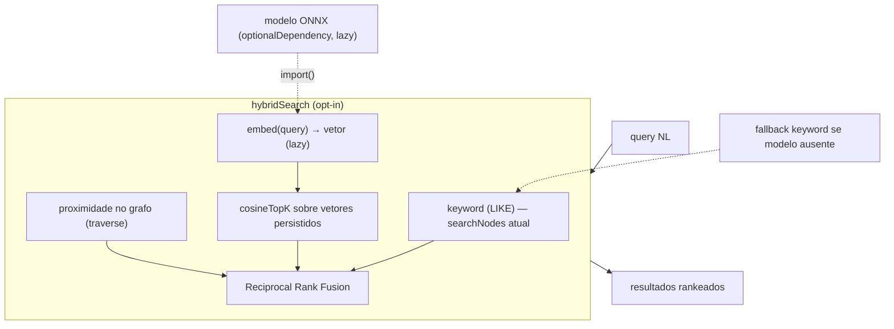

# Feature Blueprint: Local Semantic Search (GraphRAG híbrido)

> Derivado de [DESIGN-Feature-semantic-search.md](DESIGN-Feature-semantic-search.md).
> Único entregável desta etapa: este BLUEPRINT. Tasks/DAG/specs virão em `/dare-tasks`.
> Branch proposta: `feat/semantic-search` · Target: **v3.12.0** · License: MIT.
>
> **Decisão fechada:** D-002 — mono-pacote; runtime/modelo de embeddings como `optionalDependency` +
> lazy `import()`. Core segue keyword-only por default.
> **Base de evidências:** ancoragem verificada em `graphrag/graph-rag.ts:120` (`searchNodes` é **LIKE**),
> `:200` (`locate` por travessia), `graphrag/knowledge-graph.ts` (interface + `GraphNode`).

---

## 1. Visão Geral da Arquitetura

### 1.1 Princípio reitor

Retrieval **híbrido determinístico**: keyword (LIKE atual) + vetor (cosseno) + proximidade no grafo,
fundidos por Reciprocal Rank Fusion. Embeddings são determinísticos (não LLM gerativo) — **LLM-free
preservado**. O modelo de embeddings entra atrás de uma fronteira lazy (espelha o `AgentDriver` do executor).

### 1.2 Diagrama



### 1.3 Decisões Arquiteturais

| # | Decisão | Alternativas | Justificativa |
|---|---|---|---|
| A-1 | **`embed()` lazy** (`graphrag/embeddings.ts`) — único ponto de `import()` do runtime | dep dura no core | D-002/O-03; quem não usa semântica não baixa o modelo |
| A-2 | **Vetor como BLOB no store atual** + cosseno em JS | sqlite-vec (nativo) | Sem dep nativa na v1; sqlite-vec é otimização futura |
| A-3 | **RRF para fusão** dos 3 sinais | soma ponderada de scores | RRF é robusta sem calibrar escalas heterogêneas |
| A-4 | **Caminho híbrido sob flag** — `searchNodes`/`locate` ganham branch | substituir keyword | Compat retroativa (RNF-03); default keyword |
| A-5 | **Fallback keyword** se modelo ausente/erro | falhar duro | Degradação graciosa (O-04) |
| A-6 | **Re-embedding incremental** por hash de conteúdo | re-embeddar tudo | Evita custo a cada ingest (RF-06) |
| A-7 | **Teste de arquitetura** — runtime de embeddings só em `embeddings.ts` | confiança | Espelha `no-llm-in-core`; protege D-002 |

---

## 2. Stack Técnica

| Camada | Tecnologia | Nota |
|---|---|---|
| Embeddings | modelo ONNX pequeno (ex.: all-MiniLM-L6-v2) via runtime ONNX/transformers.js | **`optionalDependency`** + lazy |
| Vetores | `Float32Array` serializado (BLOB) no store sql.js/JSON | sem dep nativa |
| Similaridade | cosseno em JS | v1; sqlite-vec depois |
| Fusão | Reciprocal Rank Fusion (k=60 padrão) | determinístico |
| Base | `graph-rag.ts` `searchNodes`(LIKE)/`locate`(traverse) | estendidos |

---

## 3. Contratos TypeScript

### 3.1 `src/graphrag/embeddings.ts` (NEW — lazy, único import do runtime)

```ts
export interface Embedder {
  readonly dim: number;
  embed(text: string): Promise<Float32Array>;   // determinístico
}

export class EmbeddingModelMissingError extends Error {
  readonly code = 'EMBEDDING_MODEL_MISSING' as const;
  // message: "Optional embedding runtime not installed. Run: npm i <pkg> — or disable graphrag.semantic."
}

/** Carrega o runtime/modelo lazy; lança EmbeddingModelMissingError se ausente. */
export async function loadEmbedder(cfg: SemanticConfig): Promise<Embedder>;
```

> **Regra (A-1/A-7):** este é o **único** arquivo autorizado a `import()` o runtime de embeddings.
> Teste `no-heavy-dep-in-core.test.ts` falha se aparecer fora daqui.

### 3.2 `src/graphrag/vector-search.ts` (NEW)

```ts
export function cosine(a: Float32Array, b: Float32Array): number;

export interface ScoredId { readonly id: string; readonly score: number; }

/** Top-k por cosseno sobre vetores persistidos (carregados do store). */
export function cosineTopK(query: Float32Array, vectors: ReadonlyArray<{ id: string; v: Float32Array }>, k: number): ScoredId[];
```

### 3.3 `src/graphrag/hybrid.ts` (NEW)

```ts
export interface HybridOptions { readonly k?: number; readonly rrfK?: number; }

/** Funde keyword (LIKE) + vetor (cosine) + grafo (proximidade) por RRF. */
export async function hybridSearch(
  graph: KnowledgeGraph, embedder: Embedder | null,
  query: string, opts?: HybridOptions,
): Promise<SearchResult[]>;
```

- `embedder === null` (modelo ausente / `enabled:false`) → retorna **só** o ranking keyword (fallback, A-5).
- RRF: `score(d) = Σ 1/(rrfK + rank_i(d))` sobre as listas keyword/vetor/grafo.

### 3.4 Persistência do vetor — `graphrag/knowledge-graph.ts` / `graph-rag.ts` (MODIFY)

- `GraphNode` ganha `vector?: number[]` opcional (schema **aditivo**; grafos antigos seguem válidos).
- `addNode` persiste o vetor (BLOB) quando presente; backends serializam/deserializam `Float32Array`.
- Carregamento sob demanda: `loadVectors(): { id; v }[]` para o `cosineTopK`.

### 3.5 Extensão de `searchNodes`/`locate` (MODIFY `graph-rag.ts`)

- Sob `graphrag.semantic.enabled` (e modelo presente): `searchNodes`/`locate` delegam a `hybridSearch`.
- Caso contrário: caminho LIKE atual **inalterado** (RNF-03/A-4).
- `graph_locate` (MCP) usa o mesmo caminho (RF-08).

### 3.6 Indexação incremental (MODIFY ingest)

No `dare execute --complete`/`graph ingest`: só (re)embeddar nó cujo `metadata.contentHash` mudou (RF-06).

### 3.7 Config `dare.config.json` — bloco `graphrag.semantic`

```jsonc
"graphrag": {
  "semantic": {
    "enabled": false,
    "model": "all-MiniLM-L6-v2",
    "modelHash": "<sha256 pinado>",
    "rrfK": 60
  }
}
```

---

## 4. Estrutura de Diretórios (mudanças)

```
packages/cli/src/graphrag/
├── embeddings.ts                 # NEW — loadEmbedder (ÚNICO import() do runtime)
├── vector-search.ts              # NEW — cosine, cosineTopK
├── hybrid.ts                     # NEW — RRF
├── graph-rag.ts                  # MODIFY — persistir vetor; branch híbrido em searchNodes/locate
├── knowledge-graph.ts            # MODIFY — GraphNode.vector? aditivo
├── requirement-ingest.ts/code-index.ts # MODIFY — re-embedding incremental por hash
└── __tests__/
    ├── vector-search.test.ts     # NEW
    ├── hybrid.test.ts            # NEW
    └── no-heavy-dep-in-core.test.ts  # NEW (A-7)
verification/config.ts            # MODIFY — bloco graphrag.semantic (zod)
package.json (cli)                # MODIFY — optionalDependencies: runtime ONNX
```

---

## 5. Requisitos de Segurança — Rastreabilidade

| RS | Implementação | Teste |
|---|---|---|
| RS-01 | `modelHash` pinado verificado no download | `embeddings.test.ts` |
| RS-02 | conteúdo indexado nunca executado | revisão |
| RS-03 | vetores/índice confinados ao store do projeto | path-safety |

---

## 6. Plano de Execução (Fases)

### Fase 1 — Núcleo vetorial determinístico
**DONE:** `vector-search.ts` (cosine/topK) testado; `hybrid.ts` RRF testado com listas mockadas (sem modelo).

### Fase 2 — Embedder lazy
**DONE:** `embeddings.ts` carrega runtime lazy; `EmbeddingModelMissingError` acionável; `no-heavy-dep-in-core` verde; `optionalDependencies` no package.json.

### Fase 3 — Persistência + integração
**DONE:** `GraphNode.vector?` aditivo; `addNode` persiste; `searchNodes`/`locate` ganham branch híbrido sob flag, com fallback keyword; `graph_locate` (MCP) usa híbrido quando habilitado.

### Fase 4 — Indexação incremental + config
**DONE:** re-embedding por hash; bloco `graphrag.semantic` (zod) default `enabled:false`.

### Fase N-1 — Auditoria
**DONE:** `semantic-regression.test.ts`: híbrido ≥ keyword na fixture rotulada (O-02); fallback sem modelo (O-04); `no-heavy-dep-in-core` verde; grafo legado sem vetor funciona (RNF-03).

---

## 7. Validation Gates (Node/TS)

```powershell
cd packages/cli
pnpm exec tsc --noEmit
pnpm exec vitest run vector-search hybrid no-heavy-dep-in-core
pnpm exec eslint src/graphrag
```

## 8. PADRÕES PROIBIDOS (ANTI-STUB)

- `import` estático do runtime de embeddings fora de `embeddings.ts` (quebra D-002; pego por A-7).
- Runtime/modelo em `dependencies` (deve ser `optionalDependencies`).
- Substituir o caminho keyword (deve ser **aditivo**, sob flag, com fallback).
- Embeddings não-determinísticos / re-rank por LLM (quebra LLM-free).
- Re-embeddar tudo a cada ingest (deve ser incremental por hash).

## 9. Definition of Done (feature)

- [ ] RF-01..RF-05 MUST com testes; RF-06..RF-08 SHOULD implementados ou ticket.
- [ ] `no-heavy-dep-in-core` garante o core sem dep pesada (D-002/O-03).
- [ ] Sem modelo → fallback keyword sem erro (O-04).
- [ ] Híbrido ≥ keyword na fixture rotulada (O-02).
- [ ] CHANGELOG `[3.12.0]`; config documentada.
- [ ] `dare review` sem achados HIGH.

---

## Próximas Etapas

1. Revisar/aprovar este Blueprint.
2. `/dare-tasks` → `TASKS-semantic-search.md` + `dare-dag-semantic-search.yaml` + `EXECUTION/`.
3. Branch `feat/semantic-search` → implementação.
