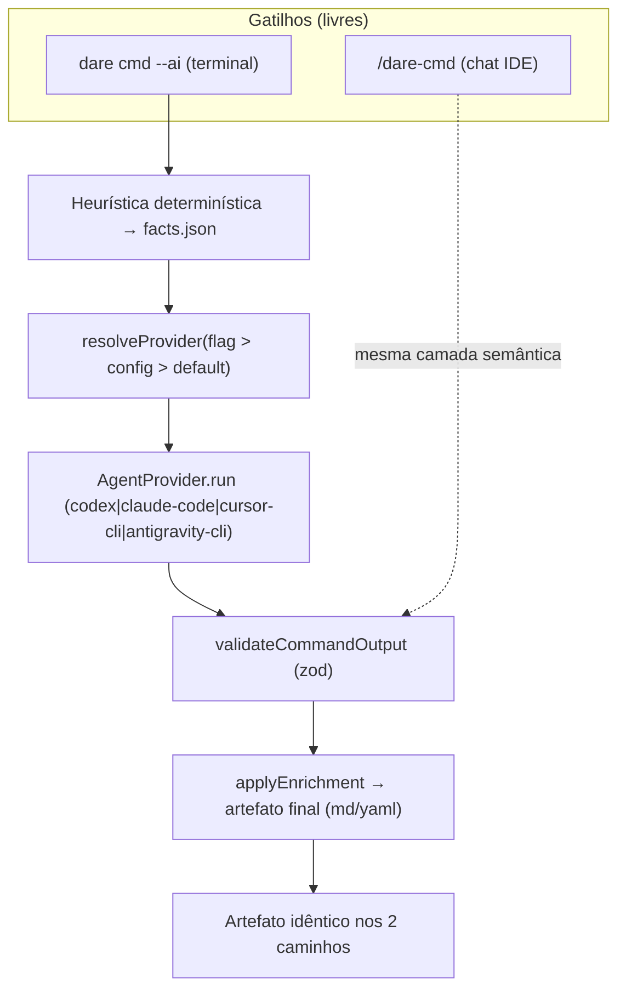

# Feature Blueprint: Terminal ↔ Chat Parity (assistente de código unificado no terminal)

> Derivado de [DESIGN-Feature-terminal-agent-parity.md](DESIGN-Feature-terminal-agent-parity.md).
> Único entregável desta etapa: este BLUEPRINT. Tasks/DAG/specs em `/dare-tasks`.
> Branch: `codex/cli-core-agent-providers` · Target: **v3.12.0** · License: MIT.
>
> **Base de evidências:** reusa `ai/providers.ts`, `ai/registry.ts`, `ai/pipeline.ts`, `ai/schemas.ts`,
> `agent/drivers/*`, `commands/execute.ts`, `exec/safe-spawn.ts`. Ancoragem nos commits da branch:
> `5a74f01` (camada `dare ai` + `--ai`) e `793d19c` (apply blueprint/refine).

---

## 1. Visão Geral da Arquitetura

### 1.1 Princípio reitor

**Um comando, dois gatilhos, um resultado.** Cada fase semântica do DARE tem uma camada determinística
(heurística → facts) e uma camada semântica (IA → enriquecimento). O **chat da IDE** (`/dare-<cmd>`) e o
**terminal** (`dare <cmd> --ai`) são apenas **dois gatilhos para a mesma camada semântica**, que sempre
passa por um `AgentProvider` e por validação de schema antes de tocar o artefato. Paridade = o conjunto de
seções que a IA preenche é **idêntico** nos dois caminhos.

### 1.2 Diagrama



### 1.3 Decisões Arquiteturais

| # | Decisão | Alternativas | Justificativa |
|---|---|---|---|
| A-1 | **Contrato de paridade explícito** (mapa comando → seções) | paridade implícita | O-01; torna testável (RNF-05) |
| A-2 | **Resolução de provider única** num helper compartilhado | cada comando resolve sozinho | RF-04; evita divergência de flags |
| A-3 | **`cursor-cli`/`antigravity-cli` viram `AgentDriver`** reusando o provider | SDK dedicado por IDE | RF-03; subprocess uniforme, sem SDK no core |
| A-4 | **`migrate`/`review` usam `applyEnrichment`** como os demais | manter sidecar/`--from-agent` | RF-02; fecha a paridade |
| A-5 | **Heurística sempre roda antes da IA** | IA-first | RNF-01; determinismo por baixo |
| A-6 | **Provider ausente => exit≠0 com instrução** | fallback silencioso | RF-08/RS-01; nunca grava texto não validado |
| A-7 | **Skills `/dare-*` documentam o equivalente terminal** | docs separadas | RF-06; mantém chat 1ª classe e aponta paridade |

---

## 2. Stack Técnica

| Camada | Tecnologia | Nota |
|---|---|---|
| Contrato provider | `ai/providers.ts` + `ai/registry.ts` | reuso |
| Resolução provider | `ai/resolve.ts` (NEW, extraído de execute+pipeline) | unifica |
| Pipeline enrichment | `ai/pipeline.ts` | + migrate/review apply |
| Schemas | `ai/schemas.ts` | + ajustes migrate/review |
| Drivers execução | `agent/drivers/cursor.ts`, `agent/drivers/antigravity.ts` (NEW) | reusam provider/subprocess |
| Seleção no execute | `commands/execute.ts` | + cursor/antigravity |
| Paridade IDE | `implementations/*` + `__tests__/terminal-parity.test.ts` (NEW) | capacidade |

---

## 3. Contratos TypeScript

### 3.1 `src/ai/resolve.ts` (NEW) — resolução única de provider

```ts
import type { AiConfig } from './config.js';
import type { AiProviderName } from './types.js';

/** Resolve provider: flag --provider > dare.config.json ai.defaultProvider > default 'codex'. */
export function resolveProviderName(
  flag: string | undefined,
  config: AiConfig,
): AiProviderName;

/** Mapeia o provider de IA para o id de AgentDriver do executor (codex|claude|cursor|antigravity|mock). */
export function providerToDriverId(name: AiProviderName): string;
```

### 3.2 `src/ai/parity.ts` (NEW) — contrato de paridade

```ts
import type { AiCommandName } from './types.js';

/** Seções/artefatos que a camada semântica preenche para cada comando. */
export interface ParityContract {
  readonly command: AiCommandName;
  readonly skillSlug: string;          // '/dare-reverse'
  readonly terminal: string;           // 'dare reverse --ai'
  readonly artifacts: ReadonlyArray<string>;   // arquivos que a IA mescla
  readonly schemaFields: ReadonlyArray<string>; // campos do schema preenchidos
}

export const PARITY_CONTRACTS: ReadonlyArray<ParityContract>;
export function parityFor(command: AiCommandName): ParityContract;
```

### 3.3 `src/agent/drivers/cursor.ts` e `antigravity.ts` (NEW)

```ts
import type { AgentDriver } from '../driver.js';

export interface CliDriverOptions {
  readonly command?: string;     // 'cursor-agent' / 'antigravity'
  readonly model?: string;
  readonly timeoutSeconds?: number;
}

/** Executor de task: roda o CLI da IDE em modo não-interativo no worktree. */
export function createCursorCliDriver(opts?: CliDriverOptions): AgentDriver;
export function createAntigravityCliDriver(opts?: CliDriverOptions): AgentDriver;
```

### 3.4 `src/ai/pipeline.ts` (EXTEND) — apply de migrate/review

```ts
// applyEnrichment ganha cobertura completa:
async function applyMigrateEnrichment(cwd, semantic): Promise<string>; // reescreve MIGRATION/MIGRATION.md
async function applyReviewEnrichment(cwd, semantic): Promise<string>;  // grava review-semantic.json + injeta veredito
```

---

## 4. Mudanças por Arquivo

| Arquivo | Ação | Conteúdo |
|---|---|---|
| `ai/resolve.ts` | NEW | resolução única flag>config>default + map provider→driver |
| `ai/parity.ts` | NEW | `PARITY_CONTRACTS` + `parityFor` |
| `agent/drivers/cursor.ts` | NEW | `createCursorCliDriver` (subprocess `cursor-agent`) |
| `agent/drivers/antigravity.ts` | NEW | `createAntigravityCliDriver` (subprocess `antigravity`) |
| `commands/execute.ts` | EDIT | `resolveDriver` aceita `cursor`/`antigravity`; usa `resolve.ts` |
| `ai/pipeline.ts` | EDIT | `applyMigrateEnrichment`, `applyReviewEnrichment` completos |
| `commands/migrate.ts` | EDIT | `--ai` mescla no MIGRATION.md (não só sidecar) |
| `commands/review.ts` | EDIT | `--ai` injeta veredito direto no fluxo de review |
| `commands/ai.ts` | EDIT | `doctor` reporta capacidade (enrichment + execução) |
| `commands/*` (semânticos) | EDIT | `--json` em todos os `--ai`; usam `resolve.ts` |
| `implementations/**/dare-*.md|SKILL.md` | EDIT | cada skill cita `dare <cmd> --ai` |
| `__tests__/terminal-parity.test.ts` | NEW | valida `PARITY_CONTRACTS` ≡ skills ≡ flags |

---

## 5. Plano de Validação (Gates)

| Gate | Comando | Critério |
|---|---|---|
| Build | `tsc` | 0 erros |
| Unit — resolve | `vitest run resolve` | precedência flag>config>default |
| Unit — parity | `vitest run terminal-parity` | todo comando semântico tem contrato + skill + flag |
| Unit — drivers | `vitest run cursor-driver antigravity-driver` | subprocess argv correto; abort/timeout |
| Unit — pipeline | `vitest run pipeline` | migrate/review reescrevem artefato |
| Regressão | `vitest run` (suíte completa) | 0 falhas; `no-llm-in-core` verde |
| Paridade IDE | `vitest run ide-command-parity` | skills `/dare-*` existem nas 3 IDEs |

---

## 6. Sequenciamento (fases)

1. **Fundação** — `ai/resolve.ts` + `ai/parity.ts` (contrato e resolução únicos).
2. **Execução multi-provider** — drivers cursor/antigravity + wiring no `execute`.
3. **Apply completo** — migrate/review no pipeline; `--json` uniforme.
4. **Paridade & doutrina** — skills apontam terminal; teste de paridade por capacidade.
5. **Auditoria N-1 + docs** — regressão e CHANGELOG/docs-site.

---

> **Próximo passo:** `/dare-tasks` — decompor em tasks atômicas (bloco de IDs **12xx**), gerar
> `dare-dag-terminal-agent-parity.yaml` e os specs `EXECUTION/task-12xx-*.md`. Target: **v3.12.0**.
