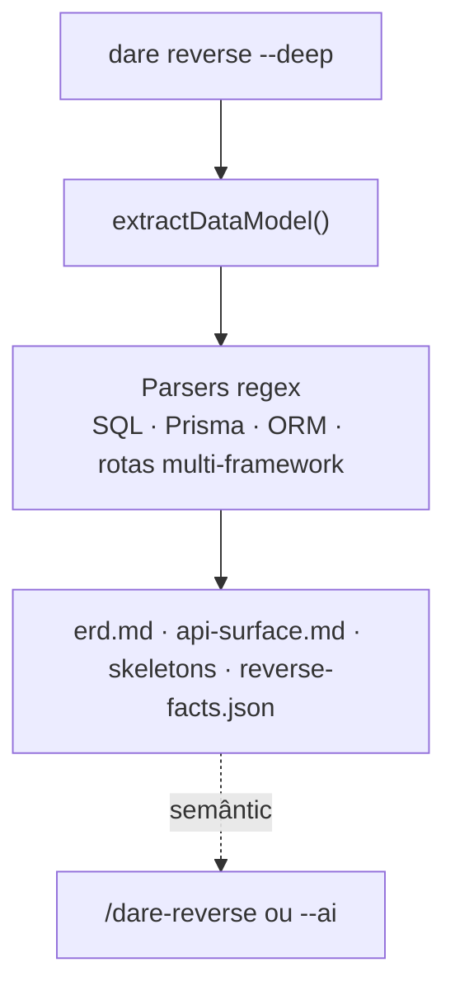
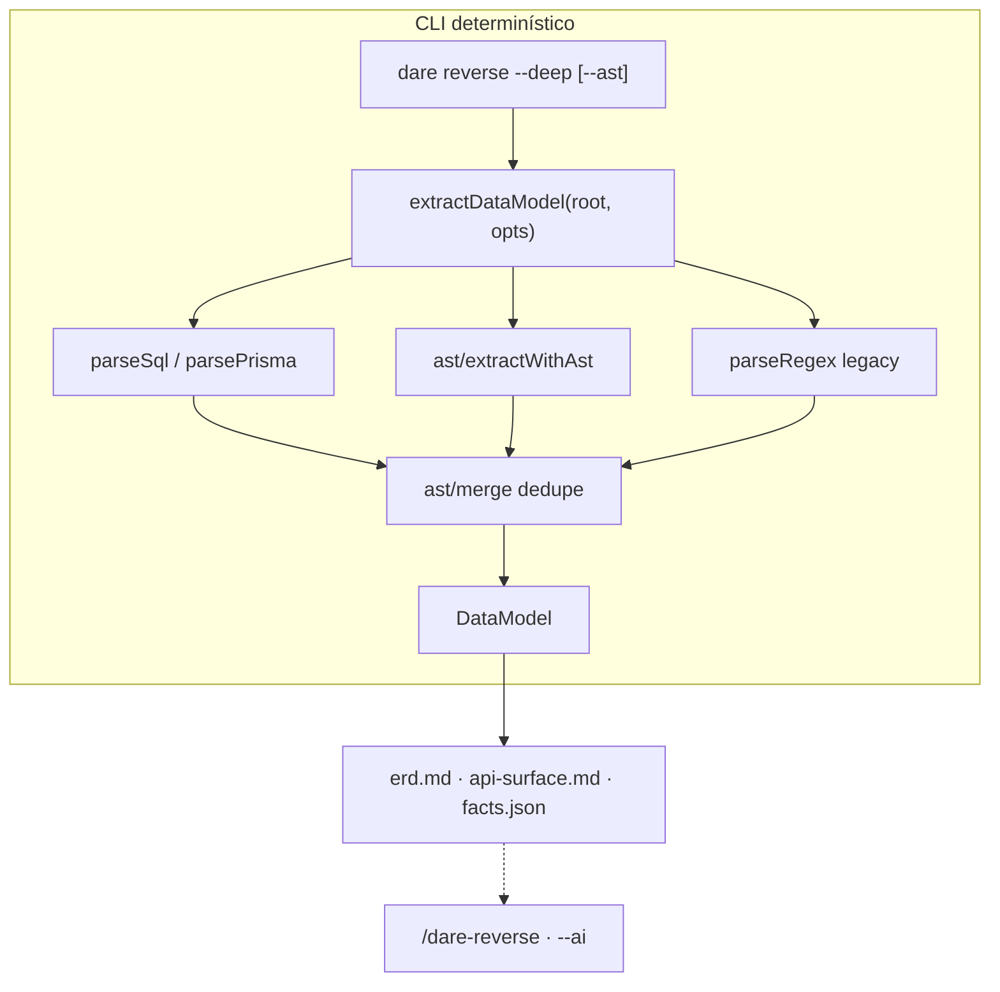

# Feature Design: Brownfield AST (tree-sitter no `reverse --deep`)

> Gerado seguindo o Método DARE (Fase D — Design). Artefato para **revisão humana**
> antes de `/dare-blueprint`. License: MIT.
>
> **Base de evidências:** v3.13.0 entregou monorepo CLI-only. O brownfield já tem
> `dare reverse` (Fase 0), `--report` (confiança 🟢/🟡/🔴), `--deep` (ERD + API +
> skeletons C4/regras/estados/permissões) e extração determinística default via
> `utils/datamodel.ts` — **explicitamente line/regex, sem AST** (comentário no
> fonte L5–8). `static-analyzer.ts` também é regex de propósito (evitar árvore de
> deps multi-linguagem no review). Esta feature adiciona **AST opt-in** só na trilha
> brownfield de modelo de dados/rotas, sem LLM no core.
>
> **Branch:** `feat/v3.14-brownfield-ast` · **Target:** v3.14.0 · **Repo base:** v3.13.0

## Contexto no Projeto Existente

### O que já existe (v3.13)

| Componente | Papel | Técnica hoje |
|---|---|---|
| `commands/reverse.ts` | Fase 0 brownfield; `--deep` chama `writeDeepArtifacts` | Orquestração |
| `utils/datamodel.ts` | `extractDataModel()` → entidades + endpoints | **Regex / line scan** |
| `utils/module-detector.ts` | Mapa de módulos por diretório/LOC | Heurística |
| `utils/dna-detector.ts` | Convenções → `PROJECT-DNA.md` | Regex |
| `utils/static-analyzer.ts` | Anti-stub no `dare review` | Regex (fora de escopo v3.14) |
| `utils/confidence.ts` | `--report` 🟢/🟡/🔴 | Parser de marcadores |
| Skill `/dare-reverse` | Camada semântica (regras, estados, C4 context) | IDE / `--ai` |

Fluxo atual de `--deep`:



### Problema que a AST resolve

O `datamodel.ts` cobre bem casos **lineares** (decorator numa linha, `Route::get('…')`,
`CREATE TABLE`), mas falha ou gera ruído quando:

- Rotas/endpoints estão **quebrados em várias linhas** (objeto de opções, middleware chain).
- Classes ORM usam **herança/indirection** (`extends BaseModel` sem `@Entity` na mesma linha).
- Atributos Python/TS usam **type aliases**, generics ou composição que regex confunde com entidade.
- Express/FastAPI registram rotas via **variáveis** ou factory, não literal na mesma linha.

Isso aparece como 🟡 na skill ou entidades fantasma filtradas por `looksLikeEntity()` —
correto para não mentir, mas **sub-extrai** projetos reais.

### Direção acordada pós-v3.13 (ROADMAP)

> Extração estrutural via AST para `dare reverse --deep` (substitui heurísticas regex **onde aplicável**).

**Não** reescrever o brownfield inteiro — **evoluir** `extractDataModel` com camada AST
paralela + fallback regex (compat v3.2+).

## Objetivos e Métricas de Sucesso

| ID | Objetivo | Métrica verificável | Meta |
|---|---|---|---|
| O-01 | Endpoints multi-linha parseáveis | Fixtures brownfield que falham hoje passam com `--ast` | ≥5 casos novos verdes |
| O-02 | Entidades ORM com menos falso positivo | Taxa de entidades descartadas por `looksLikeEntity` cai em fixtures | −30% vs regex-only |
| O-03 | Zero regressão default | `dare reverse` / `--deep` **sem** `--ast` byte-compatível nos testes atuais | `datamodel.test.ts` verde |
| O-04 | Core sem LLM | Gate `no-llm-in-core` verde | 0 SDK LLM novo |
| O-05 | Paridade terminal ↔ chat | `dare reverse --deep --ast --ai` documentado; skill cita flag | RF-06 |
| O-06 | Artefatos inalterados | Mesmos paths (`erd.md`, `api-surface.md`, `reverse-facts.json`) | schema estável |

## Stakeholders

| Papel | Interesse |
|---|---|
| Dev brownfield | ERD/API surface mais completos em legado real |
| Maintainer CLI | Deps opcionais; tarball npm não explode |
| CI | Testes determinísticos; grammars pinadas |
| IDE / skill | Menos 🟡 “complete manualmente” no ERD |

## Requisitos Funcionais

| ID | Requisito | Prioridade | Critério de aceite |
|---|---|---|---|
| RF-01 | **`--ast` flag** em `dare reverse` (requer `--deep` ou default-on em v3.14 — ver D-02) | MUST | `--help` documentado |
| RF-02 | **Camada `ast/`** com adapter tree-sitter por linguagem | MUST | módulo isolado em `packages/cli/src/ast/` |
| RF-03 | **Merge híbrido** AST + regex: união deduplicada por `(method,route)` / `(entity,field)` | MUST | testes de merge |
| RF-04 | **Linguagens P1:** TypeScript/JavaScript, Python, PHP | MUST | queries + fixtures cada |
| RF-05 | **Linguagens P2:** Go, Ruby, Rust | SHOULD | best-effort + fallback regex |
| RF-06 | **`reverse-facts.json`** registra `extraction: { mode, astLanguages, regexFallback }` | MUST | campo presente com `--ast` |
| RF-07 | **SQL + Prisma** permanecem parsers dedicados (não tree-sitter) | MUST | testes Prisma/SQL intactos |
| RF-08 | **`dare reverse --deep --check --ast`** preview sem escrever | SHOULD | exit 0 + counts stdout |
| RF-09 | **CHANGELOG + ROADMAP `[3.14.0]`** + docs-site `brownfield.md` | MUST | gate docs verde |
| RF-10 | **Skill `/dare-reverse`** cita `--ast` nas 3 IDEs | SHOULD | parity test verde |

### Escopo de extração AST (v3.14)

| Alvo | AST extrai | Regex mantém como fallback |
|---|---|---|
| HTTP routes/handlers | Sim (decorators, call expressions, attributes) | Sim |
| Classes entidade ORM | Sim (class name, bases, campos simples) | Sim |
| SQL migrations | Não (parser SQL existente) | Sim |
| Prisma schema | Não (parser Prisma existente) | Sim |
| `module-detector` / `dna-detector` | Não (v3.15+ backlog) | N/A |
| `static-analyzer` / `dare review` | **Fora de escopo** | Regex permanece |

## Requisitos Não-Funcionais

| ID | Requisito | Meta |
|---|---|---|
| RNF-01 | **Deps opcionais** | Grammars/tree-sitter como `optionalDependencies` ou lazy load WASM; `npm install` base não falha se WASM indisponível |
| RNF-02 | **Performance** | AST scan ≤ 2× tempo do regex-only em fixture médio (~500 arquivos) |
| RNF-03 | **Determinismo** | Mesmo input → mesmo `DataModel` (ordem estável) |
| RNF-04 | **Tarball** | `npm pack` ≤ +10% vs v3.13 (grammars WASM compactadas) |
| RNF-05 | **Compat** | Sem `--ast`, comportamento idêntico ao v3.13 |

## Requisitos de Segurança

| ID | Requisito | Nota |
|---|---|---|
| RS-01 | Parse só arquivos sob `targetDir` (path confinement) | Reusar `path-safety` / ignore dirs de `datamodel` |
| RS-02 | Grammars de supply chain pinadas (lockfile + audit) | `pnpm audit` no CI |
| RS-03 | Nenhum `eval` / `Function` em queries tree-sitter | WASM/query estática apenas |
| RS-04 | Limite de tamanho de arquivo parseável | Skip arquivos > N MB (config default 1MB) |

## Análise de Impacto

### Novos arquivos (proposta)

```
packages/cli/src/ast/
├── index.ts                 # facade: extractWithAst(root, opts)
├── types.ts                 # AstExtractResult, LanguageId
├── loader.ts                # lazy init web-tree-sitter + grammar wasm
├── merge.ts                 # mergeAstAndRegex(DataModel, DataModel)
├── languages/
│   ├── typescript.ts        # queries: decorators, call_expression
│   ├── python.ts            # FastAPI/Flask/Django routes, SQLAlchemy classes
│   ├── php.ts               # Laravel/Slim patterns
│   ├── go.ts                # gin.Register routes (P2)
│   ├── ruby.ts              # Rails routes.rb (P2)
│   └── rust.ts              # axum routes (P2)
└── __tests__/
    ├── ast-merge.test.ts
    ├── ast-typescript.test.ts
    └── fixtures/            # multi-line route samples

packages/cli/src/__tests__/
└── brownfield-ast-regression.test.ts   # N-1: regex default unchanged
```

### Modificados

| Arquivo | Mudança |
|---|---|
| `utils/datamodel.ts` | Delega para `ast/` quando `--ast`; export `extractDataModel(root, opts?)` |
| `commands/reverse.ts` | Flag `--ast`; repassa para `extractDataModel` e `reverse-facts.json` |
| `utils/reverse-facts.ts` | Tipo `ReverseFacts` + bloco `extraction` |
| `ai/parity.ts` | `reverse` terminal string inclui `--ast` opcional na doc |
| `docs-site/brownfield.md` (+ en/es) | Seção `--ast` |
| `implementations/*/dare-reverse` | Linha “Equivalente terminal: `dare reverse --deep --ast`” |
| `CHANGELOG.md`, `ROADMAP.md`, `package.json` | v3.14.0 |

### Banco de dados

N/A.

## Arquitetura

### Princípio reitor

**Regex permanece o baseline; AST é acelerador de precisão.** Nunca piorar o default;
`--ast` (ou default-on após estabilização) produz **superset** mergeado.

### Diagrama alvo



### Contrato TypeScript (proposta)

```ts
// ast/types.ts
export type AstLanguageId = 'typescript' | 'javascript' | 'python' | 'php' | 'go' | 'ruby' | 'rust';

export interface ExtractDataModelOptions {
  readonly ast?: boolean;           // default false em v3.14.0-rc; true em v3.14.0 final (D-02)
  readonly astLanguages?: AstLanguageId[];  // default: all built-in
  readonly maxFileBytes?: number;   // default 1_048_576
}

// utils/datamodel.ts — assinatura estendida (backward compatible)
export async function extractDataModel(
  root: string,
  opts?: ExtractDataModelOptions,
): Promise<DataModel>;
```

### Estratégia de dependências (D-03)

| Opção | Prós | Contras |
|---|---|---|
| **A — `web-tree-sitter` + WASM grammars bundled** | Offline, determinístico, CI simples | +tamanho tarball |
| **B — optionalDependencies lazy** | Install leve | Falha silenciosa → só regex |
| **C — native `tree-sitter` bindings** | Performance | Quebra cross-platform no npm global |

**Proposta:** **A + B** — WASM em `optionalDependencies`; se load falhar, log warning + regex-only (RNF-01).

## Restrições

- **Não** adicionar LLM ao core (RS-04 global do projeto).
- **Não** alterar saída de `dare reverse` sem `--deep` (só facts de API/entidade default continuam).
- **Não** migrar `static-analyzer` para AST nesta release (escopo diferente, comentário explícito no fonte).
- **Não** mudar schema de artefatos semânticos (`domain-rules.md` etc.) — só riqueza do determinístico.
- Grammars **pinadas** por versão; upgrade de grammar = minor bump + nota CHANGELOG.

## Fora do Escopo (v3.14)

| Item | Fase futura |
|---|---|
| AST em `dna-detector` / `patterns` | v3.15+ |
| AST no `static-analyzer` / review | backlog (deps vs valor) |
| Executor autônomo robusto (patch apply) | v3.15 |
| GraphRAG ↔ AI produto | v4.0 |
| Parse SQL via tree-sitter | backlog (parser SQL atual suficiente) |

## Riscos e Mitigações

| Risco | Prob. | Impacto | Mitigação |
|---|---|---|---|
| Tarball npm grande demais | Média | Médio | P1 só 3 grammars; lazy load; medir `npm pack` no CI |
| WASM falha em Windows ARM | Baixa | Médio | Fallback regex + teste smoke win32 |
| Query tree-sitter frágil entre versões grammar | Média | Médio | Pin + fixtures snapshot |
| Merge duplica endpoints | Média | Baixo | Dedupe por `(method, route, normalizedPath)` |
| Regressão default | Baixa | Alto | `brownfield-ast-regression.test.ts` trava regex path |

## Plano de Validação (gates)

```powershell
# Unit — AST + merge
pnpm --filter @dewtech/dare-cli exec vitest run ast datamodel brownfield-ast-regression

# Regressão brownfield existente
pnpm --filter @dewtech/dare-cli exec vitest run datamodel reverse

# Core invariants
pnpm --filter @dewtech/dare-cli exec vitest run no-llm-in-core cli-only-invariants

# Docs
node scripts/verify-docs-coverage.mjs

# Tarball budget (RNF-04)
cd packages/cli && npm pack --dry-run
```

## Definition of Done

- [ ] `--ast` funcional em `dare reverse --deep` com merge híbrido
- [ ] P1 languages (TS/JS, Python, PHP) com fixtures dedicadas
- [ ] Default sem `--ast` idêntico ao v3.13 (testes)
- [ ] `reverse-facts.json.extraction` populado
- [ ] Docs-site + skills `/dare-reverse` atualizados
- [ ] CHANGELOG + ROADMAP `[3.14.0]` + bump **antes** da tag
- [ ] `dare review` da feature sem achados

## Próximas Etapas

1. **Revisar e aprovar** este DESIGN
2. `/dare-blueprint` → `DARE/BLUEPRINT-Feature-brownfield-ast.md`
3. `/dare-tasks` → DAG bloco **14xx**
4. Branch `feat/v3.14-brownfield-ast` a partir de `main` @ v3.13.0
5. Release: bump → tag `v3.14.0` → npm publish

## Decisões Travadas (proposta — confirmar na revisão)

| # | Decisão | Alternativa rejeitada |
|---|---|---|
| D-01 | AST **só** na trilha `extractDataModel` / `--deep` | AST em todo o CLI — escopo explode |
| D-02 | **`--ast` opt-in** na v3.14.0; avaliar default-on em v3.14.1 após soak | Default-on day-1 — risco tarball/perf |
| D-03 | **`web-tree-sitter` + WASM** grammars bundled/optional | Native bindings — fragilidade npm global |
| D-04 | **Merge superset** AST ∪ regex, deduplicado | AST substitui regex — regressão em SQL/Prisma |
| D-05 | SQL/Prisma **fora** do tree-sitter | Unificar tudo em AST — ROI baixo |
| D-06 | **`static-analyzer` permanece regex** | Unificar stack AST — conflita com comentário de deps no review |
| D-07 | Target **v3.14.0** minor (feature additive, flag opt-in) | v4.0 — não breaking |
