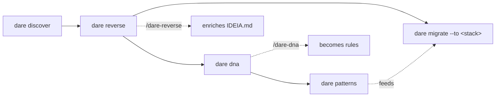

# Brownfield — legacy projects

The DARE **brownfield** suite understands code that already exists **before** you write the first new line. There are five deterministic commands (regex/line-based, **no LLM** in the CLI) that produce artifacts in `DARE/`. The semantic layer — filling in purpose, flows, rules — is left to the IDE *skills* (`/dare-reverse`, `/dare-dna`, `/dare-migrate`), which enrich the `<!-- AGENT -->` skeletons left by the CLI.

!!! info "Philosophy"
    The CLI extracts **facts** (modules, endpoints, entities, conventions, patterns) with `file:line` evidence. The AI adds **meaning**. The human validates at the checkpoints. No command here calls an LLM.

## Command overview

| Command | What for | Writes to | Needs a prerequisite? |
|---|---|---|---|
| `dare discover` | Detect the project and **install** the DARE files | `dare.config.json`, `DARE/`, IDE rules | No |
| `dare reverse` | Reverse engineering → IDEIA Phase 0 + module specs | `DARE/IDEIA.md`, `DARE/REVERSE/` | No |
| `dare dna` | Extract conventions (house style) from the legacy code | `DARE/PROJECT-DNA.md`, `DARE/dna-facts.json` | No |
| `dare patterns` | Mine recurring patterns from the code | `DARE/PATTERNS.md`, `DARE/patterns-facts.json` | Uses DNA/reverse if present |
| `dare migrate --to <stack>` | Plan a safe migration + Gherkin parity | `DARE/MIGRATION/` | **Requires** `dare reverse` first |

### Typical order



1. **`dare discover`** — installs DARE into the existing project.
2. **`dare reverse`** — reconstructs the module map + `IDEIA.md` (Phase 0).
3. **`dare dna`** — captures the conventions so new features respect the house style.
4. **`dare patterns`** — mines recurring idioms (suffixes, layers, validation, dominant ORM).
5. **`dare migrate`** *(optional)* — only when the goal is to rewrite in another stack.

!!! tip "All of them have `--check` and `-d, --dir`"
    `--check` is **read-only**: it runs the detection and prints the report, but **writes nothing** (it does not even install skills). `-d, --dir <path>` points to the target (default: current directory).

---

## `dare discover` — install DARE into an existing project

Detects the stack (structure, backend, frontend, MCP, IDE) and installs the DARE files, interactively confirming the detected values.

```bash
dare discover                 # detecta + instala (interativo) no cwd
dare discover --check         # só mostra a detecção; não escreve
dare discover --dir ./api     # aponta outro diretório
```

| Flag | Type | Default | Description |
|---|---|---|---|
| `-d, --dir <path>` | string | cwd | Target directory to analyze/install into. |
| `--check` | boolean | `false` | Only shows the detection results, without installing. |

In interactive mode it confirms: name, structure (`monorepo` / `backend` / `frontend` / `mcp-server` / `unknown`), backend/frontend stack or (for MCP) language/transport/capabilities, IDE/agent, GraphRAG backend (`sqlite` / `json` / `neo4j`), and whether to enable the **DARE MCP Server**.

**Installed artifacts:** `dare.config.json`, `DARE/` (`README.md`, `EXECUTION/`) and — depending on the IDE — `.cursorrules` + `.cursor/`, `.antigravityrules` + `.agents/`.

!!! note "If it is already installed"
    Without `--check`, the command offers to **reconfigure** or exit. With `--check`, it prints the current `dare.config.json`.

---

## `dare reverse` — reverse engineering (Phase 0)

Reconstructs the **module map** without an AST: it chooses boundaries through a cascade (declared workspaces → convention directories such as `src/modules`, `apps`, `packages`, `crates` → subdirectories of `src/` → top-level → the whole project), measures each module (files / LOC / size bucket `LOW`/`MED`/`HIGH`) and infers module-to-module dependencies from `import`/`require`/`from`. By default it also **deterministically** extracts the API surface (Nest/Express/Laravel/FastAPI/Gin/Axum routes/controllers) and the data model (Prisma/SQL/ORM/`*.entity.*`).

```bash
dare reverse                       # IDEIA.md + module specs + reverse-facts.json + .excalidraw
dare reverse --check               # só o mapa de módulos detectado, não escreve
dare reverse --modules auth,billing  # limita a módulos específicos
dare reverse --no-excalidraw       # não gera o canvas editável
dare reverse --deep                # + ERD + API surface + domain-rules/state-machines/permissions/C4
dare reverse --report              # calcula relatório de confiança a partir dos markers já marcados
```

| Flag | Type | Default | Description |
|---|---|---|---|
| `-d, --dir <path>` | string | cwd | Target directory. |
| `--check` | boolean | `false` | Only shows detected modules; does not write artifacts. |
| `--modules <list>` | string (csv) | — | Limits to specific modules (comma-separated ids/names). |
| `--no-excalidraw` | boolean | (generates) | Skips generating the `architecture.excalidraw` canvas. |
| `--report` | boolean | `false` | Computes the confidence report + code↔spec matrix from already-marked specs. |
| `--deep` | boolean | `false` | Extracts ERD + API surface (deterministic) and generates domain-rules / state-machines / permissions / C4 skeletons. |

### Generated artifacts

| Artifact | Content |
|---|---|
| `DARE/IDEIA.md` | Phase 0 index: inferred purpose (`<!-- AGENT -->`), detected stack + evidence, **module map** (table + Mermaid LR colored by size), Data Model and API Surface sections with real data when extracted, gaps and next steps. |
| `DARE/REVERSE/reverse-facts.json` | Deterministic facts: project, boundary strategy, summary (modules/files/LOC/tests), modules with files and `depends_on`, count of `api.endpoints`/`api.entities`. |
| `DARE/REVERSE/module-NN-<id>.md` | One spec per module: 🟢 facts (path, size, languages, dependencies), responsibility, public surface (real endpoints/entities of the module), flow (`sequenceDiagram`), coupling and file list. |
| `DARE/REVERSE/architecture.excalidraw` | Editable canvas of the module map (open at excalidraw.com). Omitted with `--no-excalidraw`. |

**With `--deep`** it adds to `DARE/REVERSE/`: `erd.md` + `api-surface.md` (deterministic), `domain-rules.md`, `state-machines.md`, `permissions.md` (skeletons for the skill) and `c4/` (`c4-component.md` deterministic from the module map + `c4-context.md` and `c4-container.md` skeletons). `reverse-facts.json` gains a `deep` block with entity names.

### Confidence: `--report`

Each semantic claim in the specs is marked by `/dare-reverse` with **🟢 CONFIRMED · 🟡 INFERRED · 🔴 GAP**. Then, `dare reverse --report` parses those markers (without re-scanning code) and writes:

- `DARE/REVERSE/confidence-report.md` — 🟢/🟡/🔴 aggregate and **confidence index** (%).
- `DARE/REVERSE/traceability/code-spec-matrix.md` — code ↔ spec matrix.
- `confidence` block in `reverse-facts.json` (index, counts, per-spec).

!!! warning "GAPs block"
    If there are 🔴 gaps, the report warns that they need human validation before proceeding — and `dare migrate` counts those 🔴 as *blocking gaps*.

---

## `dare dna` — legacy conventions (house style)

Extracts **how this project does things**, so new features follow the house style instead of generic defaults. Deterministic, and it reuses the file inventory from `reverse-facts.json` when it exists (otherwise it runs the module-detector).

```bash
dare dna           # PROJECT-DNA.md + dna-facts.json
dare dna --check   # só o relatório de convenções; não escreve
dare dna --dir ./service
```

| Flag | Type | Default | Description |
|---|---|---|---|
| `-d, --dir <path>` | string | cwd | Target directory. |
| `--check` | boolean | `false` | Only shows the detected conventions; does not write artifacts. |

### What it extracts

| Dimension | Detection |
|---|---|
| **Linters** | ESLint, Biome, RuboCop, PHPStan, Ruff, Clippy, golangci-lint (includes `package.json#eslintConfig`, `pyproject.toml[tool.ruff]`). |
| **Formatters** | Prettier, EditorConfig, rustfmt (with parsed rules: `semi`, `singleQuote`, `tabWidth`, `printWidth`, `indent_style`…). |
| **Naming** | Dominant convention per extension (`kebab-case`/`camelCase`/`snake_case`/`PascalCase`/`mixed`; "dominant" only if ≥ 60%). |
| **Architecture** | Detected layers + a guess: Hexagonal/Ports&Adapters, Layered (Controller→Service→Repository), MVC, Layered (Handler→Service), Component-based. |
| **Testing** | Framework (Vitest/Jest/Mocha/Playwright/pytest/RSpec/PHPUnit) + test/production ratio. |
| **Libraries** | ORM (Prisma/TypeORM/Sequelize/Drizzle/SQLx/Diesel/SeaORM/SQLAlchemy/Eloquent/ActiveRecord), HTTP (NestJS/Express/Fastify/Axum/FastAPI/Laravel), Auth (Passport/JWT/Sanctum/Devise), Validation (Zod/class-validator/Joi/Yup/Pydantic). |
| **Commits** | Samples ~100 commits via `git log`; classifies as Conventional Commits (≥ 50%) or free-form, with prefixes. |

**Artifacts:** `DARE/PROJECT-DNA.md` (skeleton for `/dare-dna` to turn into actionable rules) and `DARE/dna-facts.json` (the raw facts — consumed later by `dare patterns`).

---

## `dare patterns` — recurring patterns

Mines idioms that repeat across the code by **frequency/co-occurrence** (deterministic, no LLM). It reads `DARE/dna-facts.json` when it exists to focus on the dominant ORM/HTTP.

```bash
dare patterns            # PATTERNS.md + patterns-facts.json
dare patterns --check    # só os padrões detectados; não escreve
dare patterns --modules auth,users
dare patterns --inject   # confirma PATTERNS.md como base de steering
```

| Flag | Type | Default | Description |
|---|---|---|---|
| `-d, --dir <path>` | string | cwd | Target directory (validated against path escape). |
| `--check` | boolean | `false` | Only shows the detected patterns; does not write artifacts. |
| `--modules <list>` | string (csv) | — | Limits to specific modules. |
| `--inject` | boolean | `false` | Registers `PATTERNS.md` as a steering base (idempotent, preserves the user's steering). |

**Pattern types** (`PatternKind`): `naming-idiom` (suffixes `.service.ts`/`.controller.ts`/`.repository.ts`), `inferred-layer` (files co-occurring under a segment), `structural-idiom` (re-export barrel `index.ts`), `call-idiom` (controllers referencing `*Service`; validation `z.`/`schema.parse`), `implicit-decision` (dominant ORM/HTTP). Each pattern stores frequency, coverage, modules and evidence (`file:line`).

**Artifacts:** `DARE/PATTERNS.md` + `DARE/patterns-facts.json`. On a *best-effort* basis the patterns are also ingested into GraphRAG (absence of the graph does not fail the command).

---

## `dare migrate --to <stack>` — migration with parity (Phase 2)

Plans the rewrite of the legacy code onto a target stack. **Requires `dare reverse` first** — without `DARE/REVERSE/reverse-facts.json` the command aborts and asks you to understand the legacy code first.

```bash
dare migrate --to go-gin
dare migrate --to rust-axum --check   # source/target/módulos/gaps; não escreve
dare migrate                          # sem --to: escolhe a stack interativamente
```

| Flag | Type | Default | Description |
|---|---|---|---|
| `-d, --dir <path>` | string | cwd | Legacy project directory. |
| `--to <stack>` | string | (asks) | Target stack. If omitted, chosen interactively. |
| `--check` | boolean | `false` | Shows source/target/modules/blocking gaps; does not write. |

**Known target stacks:** `go-gin`, `rust-axum`, `node-nestjs`, `python-fastapi`, `php-laravel`, `ruby-rails-8`, `react`, `vue` (or type another one freely).

### Generated artifacts

| Artifact | Content |
|---|---|
| `DARE/MIGRATION/MIGRATION.md` | Plan: source → target stack, modules, architecture inherited from the DNA, **blocking gaps (🔴 from Phase 1)** per spec, table of modules→parity features. Strategy/risk sections are left to `/dare-migrate`. |
| `DARE/MIGRATION/migration-facts.json` | Migration facts (source, target, modules, conventions, blockingGaps). |
| `DARE/MIGRATION/parity/*.feature` | One **Gherkin** parity file per module — the acceptance baseline for reimplementing with the same behavior. |

!!! danger "The 🔴 gaps need a human"
    `--check` (and `MIGRATION.md`) sum up the 🔴 gaps that came from the `dare reverse --report` confidence report. Resolve them with a human **before** rewriting — they are what the machine could not infer safely.

**Next step:** reimplement on the target stack with the greenfield flow (`dare design` → `dare blueprint` → `dare execute`), using the `.feature` files as the acceptance criterion.
