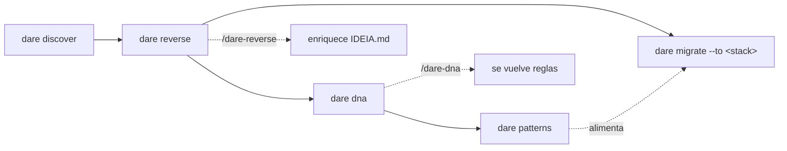

# Brownfield — proyectos heredados

La suite **brownfield** de DARE entiende un código que ya existe **antes** de que escribas la primera línea nueva. Son cinco comandos deterministas (basados en regex/líneas, **sin LLM** en la CLI) que producen artefactos en `DARE/`. La capa semántica — rellenar propósito, flujos, reglas — queda para los *skills* de IDE (`/dare-reverse`, `/dare-dna`, `/dare-migrate`), que enriquecen los esqueletos `<!-- AGENT -->` dejados por la CLI.

!!! info "Filosofía"
    La CLI extrae **hechos** (módulos, endpoints, entidades, convenciones, patrones) con evidencia `archivo:línea`. La IA agrega **significado**. El humano valida en los checkpoints. Ningún comando aquí llama a un LLM.

## Visión general de los comandos

| Comando | Para qué | Escribe en | ¿Necesita prerrequisito? |
|---|---|---|---|
| `dare discover` | Detectar el proyecto e **instalar** los archivos DARE | `dare.config.json`, `DARE/`, reglas de IDE | No |
| `dare reverse` | Ingeniería inversa → IDEIA Fase 0 + specs de módulo | `DARE/IDEIA.md`, `DARE/REVERSE/` | No |
| `dare dna` | Extraer convenciones (house style) del código heredado | `DARE/PROJECT-DNA.md`, `DARE/dna-facts.json` | No |
| `dare patterns` | Minar patrones recurrentes del código | `DARE/PATTERNS.md`, `DARE/patterns-facts.json` | Usa DNA/reverse si los hay |
| `dare migrate --to <stack>` | Planificar una migración segura + paridad Gherkin | `DARE/MIGRATION/` | **Exige** `dare reverse` antes |

### Orden típico



1. **`dare discover`** — instala DARE en el proyecto existente.
2. **`dare reverse`** — reconstruye el mapa de módulos + `IDEIA.md` (Fase 0).
3. **`dare dna`** — captura las convenciones para que las nuevas features respeten el estilo de la casa.
4. **`dare patterns`** — mina modismos recurrentes (sufijos, capas, validación, ORM dominante).
5. **`dare migrate`** *(opcional)* — solo cuando el objetivo es reescribir en otro stack.

!!! tip "Todos tienen `--check` y `-d, --dir`"
    `--check` es **de solo lectura**: ejecuta la detección e imprime el informe, pero **no escribe nada** (ni siquiera instala skills). `-d, --dir <path>` apunta al destino (predeterminado: directorio actual).

---

## `dare discover` — instalar DARE en un proyecto existente

Detecta el stack (estructura, backend, frontend, MCP, IDE) e instala los archivos de DARE, confirmando interactivamente los valores detectados.

```bash
dare discover                 # detecta + instala (interativo) no cwd
dare discover --check         # só mostra a detecção; não escreve
dare discover --dir ./api     # aponta outro diretório
```

| Flag | Tipo | Predeterminado | Descripción |
|---|---|---|---|
| `-d, --dir <path>` | string | cwd | Directorio destino a analizar/instalar. |
| `--check` | boolean | `false` | Solo muestra los resultados de la detección, sin instalar. |

En modo interactivo confirma: nombre, estructura (`monorepo` / `backend` / `frontend` / `mcp-server` / `unknown`), stack de backend/frontend o (para MCP) lenguaje/transport/capabilities, IDE/agente, backend de GraphRAG (`sqlite` / `json` / `neo4j`) y si se habilita el **DARE MCP Server**.

**Artefactos instalados:** `dare.config.json`, `DARE/` (`README.md`, `EXECUTION/`) y — según el IDE — `.cursorrules` + `.cursor/`, `.antigravityrules` + `.agents/`.

!!! note "Si ya está instalado"
    Sin `--check`, el comando ofrece **reconfigurar** o salir. Con `--check`, imprime el `dare.config.json` actual.

---

## `dare reverse` — ingeniería inversa (Fase 0)

Reconstruye el **mapa de módulos** sin AST: elige fronteras mediante una cascada (workspaces declarados → directorios de convención como `src/modules`, `apps`, `packages`, `crates` → subdirectorios de `src/` → top-level → proyecto entero), mide cada módulo (archivos / LOC / bucket de tamaño `LOW`/`MED`/`HIGH`) e infiere dependencias módulo a módulo a partir de los `import`/`require`/`from`. Por defecto también extrae **determinísticamente** la superficie de API (rutas/controllers de Nest/Express/Laravel/FastAPI/Gin/Axum) y el modelo de datos (Prisma/SQL/ORM/`*.entity.*`).

```bash
dare reverse                       # IDEIA.md + module specs + reverse-facts.json + .excalidraw
dare reverse --check               # só o mapa de módulos detectado, não escreve
dare reverse --modules auth,billing  # limita a módulos específicos
dare reverse --no-excalidraw       # não gera o canvas editável
dare reverse --deep                # + ERD + API surface + domain-rules/state-machines/permissions/C4
dare reverse --report              # calcula relatório de confiança a partir dos markers já marcados
```

| Flag | Tipo | Predeterminado | Descripción |
|---|---|---|---|
| `-d, --dir <path>` | string | cwd | Directorio destino. |
| `--check` | boolean | `false` | Solo muestra los módulos detectados; no escribe artefactos. |
| `--modules <list>` | string (csv) | — | Limita a módulos específicos (ids/nombres separados por comas). |
| `--no-excalidraw` | boolean | (genera) | Omite la generación del canvas `architecture.excalidraw`. |
| `--report` | boolean | `false` | Calcula el informe de confianza + matriz código↔spec a partir de specs ya marcadas. |
| `--deep` | boolean | `false` | Extrae ERD + API surface (determinista) y genera esqueletos de domain-rules / state-machines / permissions / C4. |

### Artefactos generados

| Artefacto | Contenido |
|---|---|
| `DARE/IDEIA.md` | Índice Fase 0: propósito inferido (`<!-- AGENT -->`), stack detectado + evidencias, **mapa de módulos** (tabla + Mermaid LR coloreado por tamaño), secciones de Modelo de Datos y Superficie de API con datos reales cuando se extraen, gaps y próximos pasos. |
| `DARE/REVERSE/reverse-facts.json` | Hechos deterministas: proyecto, estrategia de frontera, resumen (módulos/archivos/LOC/tests), módulos con archivos y `depends_on`, conteo de `api.endpoints`/`api.entities`. |
| `DARE/REVERSE/module-NN-<id>.md` | Un spec por módulo: hechos 🟢 (ruta, tamaño, lenguajes, dependencias), responsabilidad, superficie pública (endpoints/entidades reales del módulo), flujo (`sequenceDiagram`), acoplamiento y lista de archivos. |
| `DARE/REVERSE/architecture.excalidraw` | Canvas editable del mapa de módulos (ábrelo en excalidraw.com). Omitido con `--no-excalidraw`. |

**Con `--deep`** añade en `DARE/REVERSE/`: `erd.md` + `api-surface.md` (deterministas), `domain-rules.md`, `state-machines.md`, `permissions.md` (esqueletos para el skill) y `c4/` (`c4-component.md` determinista del mapa de módulos + `c4-context.md` y `c4-container.md` esqueletos). `reverse-facts.json` gana un bloque `deep` con nombres de entidades.

### Confianza: `--report`

Cada claim semántico en las specs es marcado por `/dare-reverse` con **🟢 CONFIRMED · 🟡 INFERRED · 🔴 GAP**. Después, `dare reverse --report` parsea esos markers (sin reescanear el código) y escribe:

- `DARE/REVERSE/confidence-report.md` — agregado 🟢/🟡/🔴 e **índice de confianza** (%).
- `DARE/REVERSE/traceability/code-spec-matrix.md` — matriz código ↔ spec.
- bloque `confidence` en `reverse-facts.json` (índice, conteos, por-spec).

!!! warning "Los GAPs bloquean"
    Si hay 🔴 gaps, el informe avisa que necesitan validación humana antes de continuar — y `dare migrate` cuenta esos 🔴 como *blocking gaps*.

---

## `dare dna` — convenciones del código heredado (house style)

Extrae **cómo este proyecto hace las cosas**, para que las nuevas features sigan el estilo de la casa en vez de defaults genéricos. Determinista y reutiliza el inventario de archivos de `reverse-facts.json` cuando existe (de lo contrario ejecuta el module-detector).

```bash
dare dna           # PROJECT-DNA.md + dna-facts.json
dare dna --check   # só o relatório de convenções; não escreve
dare dna --dir ./service
```

| Flag | Tipo | Predeterminado | Descripción |
|---|---|---|---|
| `-d, --dir <path>` | string | cwd | Directorio destino. |
| `--check` | boolean | `false` | Solo muestra las convenciones detectadas; no escribe artefactos. |

### Qué extrae

| Dimensión | Detección |
|---|---|
| **Linters** | ESLint, Biome, RuboCop, PHPStan, Ruff, Clippy, golangci-lint (incluye `package.json#eslintConfig`, `pyproject.toml[tool.ruff]`). |
| **Formatters** | Prettier, EditorConfig, rustfmt (con reglas parseadas: `semi`, `singleQuote`, `tabWidth`, `printWidth`, `indent_style`…). |
| **Naming** | Convención dominante por extensión (`kebab-case`/`camelCase`/`snake_case`/`PascalCase`/`mixed`; "dominante" solo si ≥ 60%). |
| **Arquitectura** | Capas detectadas + conjetura: Hexagonal/Ports&Adapters, Layered (Controller→Service→Repository), MVC, Layered (Handler→Service), Component-based. |
| **Testing** | Framework (Vitest/Jest/Mocha/Playwright/pytest/RSpec/PHPUnit) + razón test/producción. |
| **Libraries** | ORM (Prisma/TypeORM/Sequelize/Drizzle/SQLx/Diesel/SeaORM/SQLAlchemy/Eloquent/ActiveRecord), HTTP (NestJS/Express/Fastify/Axum/FastAPI/Laravel), Auth (Passport/JWT/Sanctum/Devise), Validation (Zod/class-validator/Joi/Yup/Pydantic). |
| **Commits** | Muestrea ~100 commits vía `git log`; clasifica como Conventional Commits (≥ 50%) o free-form, con prefijos. |

**Artefactos:** `DARE/PROJECT-DNA.md` (esqueleto para que `/dare-dna` lo convierta en reglas accionables) y `DARE/dna-facts.json` (los hechos crudos — consumido después por `dare patterns`).

---

## `dare patterns` — patrones recurrentes

Mina modismos que se repiten en el código por **frecuencia/coocurrencia** (determinista, sin LLM). Lee `DARE/dna-facts.json` cuando existe para enfocarse en el ORM/HTTP dominante.

```bash
dare patterns            # PATTERNS.md + patterns-facts.json
dare patterns --check    # só os padrões detectados; não escreve
dare patterns --modules auth,users
dare patterns --inject   # confirma PATTERNS.md como base de steering
```

| Flag | Tipo | Predeterminado | Descripción |
|---|---|---|---|
| `-d, --dir <path>` | string | cwd | Directorio destino (validado contra escape de ruta). |
| `--check` | boolean | `false` | Solo muestra los patrones detectados; no escribe artefactos. |
| `--modules <list>` | string (csv) | — | Limita a módulos específicos. |
| `--inject` | boolean | `false` | Registra `PATTERNS.md` como base de steering (idempotente, preserva el steering del usuario). |

**Tipos de patrón** (`PatternKind`): `naming-idiom` (sufijos `.service.ts`/`.controller.ts`/`.repository.ts`), `inferred-layer` (archivos que coocurren bajo un segmento), `structural-idiom` (barrel `index.ts` de reexport), `call-idiom` (controllers que referencian `*Service`; validación `z.`/`schema.parse`), `implicit-decision` (ORM/HTTP dominante). Cada patrón guarda frecuencia, cobertura, módulos y evidencia (`archivo:línea`).

**Artefactos:** `DARE/PATTERNS.md` + `DARE/patterns-facts.json`. En *best-effort* los patrones también se ingieren en GraphRAG (la ausencia del grafo no hace fallar el comando).

---

## `dare migrate --to <stack>` — migración con paridad (Fase 2)

Planifica la reescritura del código heredado en un stack destino. **Exige `dare reverse` antes** — sin `DARE/REVERSE/reverse-facts.json` el comando aborta y pide que entiendas el código heredado primero.

```bash
dare migrate --to go-gin
dare migrate --to rust-axum --check   # source/target/módulos/gaps; não escreve
dare migrate                          # sem --to: escolhe a stack interativamente
```

| Flag | Tipo | Predeterminado | Descripción |
|---|---|---|---|
| `-d, --dir <path>` | string | cwd | Directorio del proyecto heredado. |
| `--to <stack>` | string | (pregunta) | Stack destino. Si se omite, se elige interactivamente. |
| `--check` | boolean | `false` | Muestra source/target/módulos/blocking gaps; no escribe. |

**Stacks destino conocidos:** `go-gin`, `rust-axum`, `node-nestjs`, `python-fastapi`, `php-laravel`, `ruby-rails-8`, `react`, `vue` (o escribe otro libremente).

### Artefactos generados

| Artefacto | Contenido |
|---|---|
| `DARE/MIGRATION/MIGRATION.md` | Plan: stack de origen → destino, módulos, arquitectura heredada del DNA, **blocking gaps (🔴 de la Fase 1)** por spec, tabla de módulos→features de paridad. Las secciones de estrategia/riesgos quedan para `/dare-migrate`. |
| `DARE/MIGRATION/migration-facts.json` | Hechos de la migración (source, target, módulos, conventions, blockingGaps). |
| `DARE/MIGRATION/parity/*.feature` | Un archivo **Gherkin** de paridad por módulo — base de aceptación para reimplementar con el mismo comportamiento. |

!!! danger "Los 🔴 gaps necesitan un humano"
    `--check` (y `MIGRATION.md`) suman los 🔴 gaps que vinieron del informe de confianza de `dare reverse --report`. Resuélvelos con un humano **antes** de reescribir — son lo que la máquina no pudo inferir con seguridad.

**Próximo paso:** reimplementar en el stack destino con el flujo greenfield (`dare design` → `dare blueprint` → `dare execute`), usando los `.feature` como criterio de aceptación.
