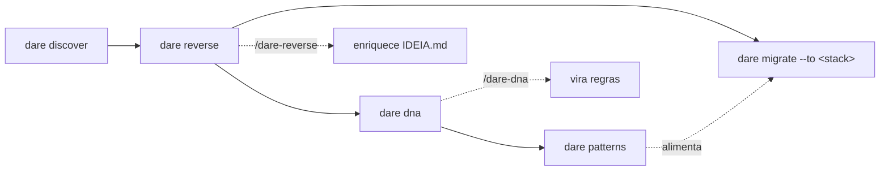

# Brownfield — projetos legados

A suíte **brownfield** do DARE entende um código que já existe **antes** de você escrever a primeira linha nova. São cinco comandos determinísticos (regex/line-based, **sem LLM** no CLI) que produzem artefatos em `DARE/`. A camada semântica — preencher propósito, fluxos, regras — fica para os *skills* de IDE (`/dare-reverse`, `/dare-dna`, `/dare-migrate`), que enriquecem os esqueletos `<!-- AGENT -->` deixados pelo CLI.

!!! info "Filosofia"
    O CLI extrai **fatos** (módulos, endpoints, entidades, convenções, padrões) com evidência `arquivo:linha`. A IA agrega **significado**. O humano valida nos checkpoints. Nenhum comando aqui chama um LLM.

## Visão geral dos comandos

| Comando | Para quê | Escreve em | Precisa de pré-requisito? |
|---|---|---|---|
| `dare discover` | Detectar o projeto e **instalar** os arquivos DARE | `dare.config.json`, `DARE/`, regras de IDE | Não |
| `dare reverse` | Engenharia reversa → IDEIA Fase 0 + specs de módulo | `DARE/IDEIA.md`, `DARE/REVERSE/` | Não |
| `dare dna` | Extrair convenções (house style) do legado | `DARE/PROJECT-DNA.md`, `DARE/dna-facts.json` | Não |
| `dare patterns` | Minerar padrões recorrentes do código | `DARE/PATTERNS.md`, `DARE/patterns-facts.json` | Usa DNA/reverse se houver |
| `dare migrate --to <stack>` | Planejar migração segura + paridade Gherkin | `DARE/MIGRATION/` | **Exige** `dare reverse` antes |

### Ordem típica



1. **`dare discover`** — instala o DARE no projeto existente.
2. **`dare reverse`** — reconstrói o mapa de módulos + `IDEIA.md` (Fase 0).
3. **`dare dna`** — captura as convenções para que features novas respeitem o estilo da casa.
4. **`dare patterns`** — minera idiomas recorrentes (sufixos, camadas, validação, ORM dominante).
5. **`dare migrate`** *(opcional)* — só quando o objetivo é reescrever em outra stack.

!!! tip "Todos têm `--check` e `-d, --dir`"
    `--check` é **read-only**: roda a detecção e imprime o relatório, mas **não escreve nada** (nem instala skills). `-d, --dir <path>` aponta o alvo (default: diretório atual).

---

## `dare discover` — instalar o DARE num projeto existente

Detecta a stack (estrutura, backend, frontend, MCP, IDE) e instala os arquivos do DARE, confirmando interativamente os valores detectados.

```bash
dare discover                 # detecta + instala (interativo) no cwd
dare discover --check         # só mostra a detecção; não escreve
dare discover --dir ./api     # aponta outro diretório
```

| Flag | Tipo | Default | Descrição |
|---|---|---|---|
| `-d, --dir <path>` | string | cwd | Diretório alvo a analisar/instalar. |
| `--check` | boolean | `false` | Só mostra os resultados da detecção, sem instalar. |

Em modo interativo confirma: nome, estrutura (`monorepo` / `backend` / `frontend` / `mcp-server` / `unknown`), stack de backend/frontend ou (para MCP) linguagem/transport/capabilities, IDE/agente, backend de GraphRAG (`sqlite` / `json` / `neo4j`) e se habilita o **DARE MCP Server**.

**Artefatos instalados:** `dare.config.json`, `DARE/` (`README.md`, `EXECUTION/`) e — conforme o IDE — `.cursorrules` + `.cursor/`, `.antigravityrules` + `.agents/`.

!!! note "Se já estiver instalado"
    Sem `--check`, o comando oferece **reconfigurar** ou sair. Com `--check`, imprime o `dare.config.json` atual.

---

## `dare reverse` — engenharia reversa (Fase 0)

Reconstrói o **mapa de módulos** sem AST: escolhe fronteiras por uma cascata (workspaces declarados → diretórios de convenção como `src/modules`, `apps`, `packages`, `crates` → subdiretórios de `src/` → top-level → projeto inteiro), mede cada módulo (arquivos / LOC / bucket de tamanho `LOW`/`MED`/`HIGH`) e infere dependências módulo-a-módulo a partir dos `import`/`require`/`from`. Por padrão também extrai **determinï­sticamente** a superfície de API (rotas/controllers de Nest/Express/Laravel/FastAPI/Gin/Axum) e o modelo de dados (Prisma/SQL/ORM/`*.entity.*`).

```bash
dare reverse                       # IDEIA.md + module specs + reverse-facts.json + .excalidraw
dare reverse --check               # só o mapa de módulos detectado, não escreve
dare reverse --modules auth,billing  # limita a módulos específicos
dare reverse --no-excalidraw       # não gera o canvas editável
dare reverse --deep                # + ERD + API surface + domain-rules/state-machines/permissions/C4
dare reverse --deep --ast          # híbrido tree-sitter + regex (superset, opt-in)
dare reverse --deep --check --ast  # preview contagens AST vs regex, sem escrever
dare reverse --report              # calcula relatório de confiança a partir dos markers já marcados
```

| Flag | Tipo | Default | Descrição |
|---|---|---|---|
| `-d, --dir <path>` | string | cwd | Diretório alvo. |
| `--check` | boolean | `false` | Só mostra módulos detectados; não escreve artefatos. |
| `--modules <list>` | string (csv) | — | Limita a módulos específicos (ids/nomes separados por vírgula). |
| `--no-excalidraw` | boolean | (gera) | Pula a geração do canvas `architecture.excalidraw`. |
| `--report` | boolean | `false` | Computa o relatório de confiança + matriz código↔spec a partir de specs já marcadas. |
| `--deep` | boolean | `false` | Extrai ERD + API surface (determinístico) e gera esqueletos de domain-rules / state-machines / permissions / C4. |
| `--ast` | boolean | `false` | Ativa extração **tree-sitter (WASM)** e faz merge superset com regex/SQL/Prisma. Requer `--deep` para efeito completo; com `--check --ast` imprime resumo `extraction` sem escrever. |

!!! tip "Regex é o baseline; AST é superset opt-in"
    Sem `--ast`, o comportamento é idêntico ao v3.13 (regex/line-based). Com `--ast`, rotas e entidades ORM multi-linha ganham precisão estrutural; o resultado **unifica** AST ∪ regex — nunca substitui parsers SQL/Prisma maduros. Dependências WASM são `optionalDependencies`; se ausentes, cai para regex-only silenciosamente.

### Artefatos gerados

| Artefato | Conteúdo |
|---|---|
| `DARE/IDEIA.md` | Índice Fase 0: propósito inferido (`<!-- AGENT -->`), stack detectada + evidências, **mapa de módulos** (tabela + Mermaid LR colorido por tamanho), seções de Modelo de Dados e Superfície de API com dados reais quando extraídos, gaps e próximos passos. |
| `DARE/REVERSE/reverse-facts.json` | Fatos determinísticos: projeto, estratégia de fronteira, sumário (módulos/arquivos/LOC/testes), módulos com arquivos e `depends_on`, contagem de `api.endpoints`/`api.entities`. Com `--deep --ast`, inclui bloco `extraction` (modo híbrido, langs AST, contagens ast vs regex). |
| `DARE/REVERSE/module-NN-<id>.md` | Um spec por módulo: fatos 🟢 (caminho, tamanho, linguagens, dependências), responsabilidade, superfície pública (endpoints/entidades reais do módulo), fluxo (`sequenceDiagram`), acoplamento e lista de arquivos. |
| `DARE/REVERSE/architecture.excalidraw` | Canvas editável do mapa de módulos (abra em excalidraw.com). Omitido com `--no-excalidraw`. |

**Com `--deep`** adiciona em `DARE/REVERSE/`: `erd.md` + `api-surface.md` (determinísticos), `domain-rules.md`, `state-machines.md`, `permissions.md` (esqueletos para o skill) e `c4/` (`c4-component.md` determinístico do mapa de módulos + `c4-context.md` e `c4-container.md` esqueletos). `reverse-facts.json` ganha um bloco `deep` com nomes de entidades.

### Confiança: `--report`

Cada claim semântico nas specs é marcado pelo `/dare-reverse` com **🟢 CONFIRMED · 🟡 INFERRED · 🔴 GAP**. Depois, `dare reverse --report` faz o parse desses markers (sem re-scan de código) e escreve:

- `DARE/REVERSE/confidence-report.md` — agregado 🟢/🟡/🔴 e **índice de confiança** (%).
- `DARE/REVERSE/traceability/code-spec-matrix.md` — matriz código ↔ spec.
- bloco `confidence` em `reverse-facts.json` (índice, contagens, por-spec).

!!! warning "GAPs bloqueiam"
    Se houver 🔴 gaps, o relatório avisa que precisam de validação humana antes de prosseguir — e o `dare migrate` conta esses 🔴 como *blocking gaps*.

---

## `dare dna` — convenções do legado (house style)

Extrai **como este projeto faz as coisas**, para que features novas sigam o estilo da casa em vez de defaults genéricos. Determinístico e reutiliza o inventário de arquivos do `reverse-facts.json` quando existe (senão roda o module-detector).

```bash
dare dna           # PROJECT-DNA.md + dna-facts.json
dare dna --check   # só o relatório de convenções; não escreve
dare dna --ast     # híbrido tree-sitter + regex (superset, opt-in)
dare dna --dir ./service
```

| Flag | Tipo | Default | Descrição |
|---|---|---|---|
| `-d, --dir <path>` | string | cwd | Diretório alvo. |
| `--check` | boolean | `false` | Só mostra as convenções detectadas; não escreve artefatos. |
| `--ast` | boolean | `false` | Ativa extração **tree-sitter (WASM)** e faz merge superset com regex. Grava bloco `extraction` em `dna-facts.json`. Reutiliza grammars v3.14; fallback silencioso se WASM ausente. |

### O que extrai

| Dimensão | Detecção |
|---|---|
| **Linters** | ESLint, Biome, RuboCop, PHPStan, Ruff, Clippy, golangci-lint (inclui `package.json#eslintConfig`, `pyproject.toml[tool.ruff]`). |
| **Formatters** | Prettier, EditorConfig, rustfmt (com regras parseadas: `semi`, `singleQuote`, `tabWidth`, `printWidth`, `indent_style`…). |
| **Naming** | Convenção dominante por extensão (`kebab-case`/`camelCase`/`snake_case`/`PascalCase`/`mixed`; "dominante" só se ≥ 60%). |
| **Arquitetura** | Camadas detectadas + palpite: Hexagonal/Ports&Adapters, Layered (Controller→Service→Repository), MVC, Layered (Handler→Service), Component-based. |
| **Testing** | Framework (Vitest/Jest/Mocha/Playwright/pytest/RSpec/PHPUnit) + razão teste/produção. |
| **Libraries** | ORM (Prisma/TypeORM/Sequelize/Drizzle/SQLx/Diesel/SeaORM/SQLAlchemy/Eloquent/ActiveRecord), HTTP (NestJS/Express/Fastify/Axum/FastAPI/Laravel), Auth (Passport/JWT/Sanctum/Devise), Validation (Zod/class-validator/Joi/Yup/Pydantic). |
| **Commits** | Amostra ~100 commits via `git log`; classifica como Conventional Commits (≥ 50%) ou free-form, com prefixos. |

**Artefatos:** `DARE/PROJECT-DNA.md` (esqueleto para o `/dare-dna` virar regras acionáveis) e `DARE/dna-facts.json` (os fatos crus — consumido depois por `dare patterns`). Com `--ast`, inclui bloco `extraction` (modo híbrido, langs AST, fallback).

---

## `dare patterns` — padrões recorrentes

Minera idiomas que se repetem no código por **frequência/co-ocorrência** (determinístico, sem LLM). Lê o `DARE/dna-facts.json` quando existe para focar no ORM/HTTP dominante.

```bash
dare patterns            # PATTERNS.md + patterns-facts.json
dare patterns --check    # só os padrões detectados; não escreve
dare patterns --ast      # híbrido tree-sitter + regex (superset, opt-in)
dare patterns --modules auth,users
dare patterns --inject   # confirma PATTERNS.md como base de steering
```

| Flag | Tipo | Default | Descrição |
|---|---|---|---|
| `-d, --dir <path>` | string | cwd | Diretório alvo (validado contra escape de path). |
| `--check` | boolean | `false` | Só mostra os padrões detectados; não escreve artefatos. |
| `--ast` | boolean | `false` | Ativa pattern mining **tree-sitter (WASM)** e faz merge superset com regex. Grava bloco `extraction` em `patterns-facts.json`. |
| `--modules <list>` | string (csv) | — | Limita a módulos específicos. |
| `--inject` | boolean | `false` | Registra `PATTERNS.md` como base de steering (idempotente, preserva o steering do usuário). |

**Tipos de padrão** (`PatternKind`): `naming-idiom` (sufixos `.service.ts`/`.controller.ts`/`.repository.ts`), `inferred-layer` (arquivos co-ocorrendo sob um segmento), `structural-idiom` (barrel `index.ts` de re-export), `call-idiom` (controllers referenciando `*Service`; validação `z.`/`schema.parse`), `implicit-decision` (ORM/HTTP dominante). Cada padrão guarda frequência, cobertura, módulos e evidência (`arquivo:linha`).

**Artefatos:** `DARE/PATTERNS.md` + `DARE/patterns-facts.json`. Com `--ast`, inclui bloco `extraction`. Em *best-effort* os padrões também são ingeridos no GraphRAG (ausência do grafo não falha o comando).

---

## `dare migrate --to <stack>` — migração com paridade (Fase 2)

Planeja a reescrita do legado numa stack alvo. **Exige `dare reverse` antes** — sem `DARE/REVERSE/reverse-facts.json` o comando aborta e pede que você entenda o legado primeiro.

```bash
dare migrate --to go-gin
dare migrate --to rust-axum --check   # source/target/módulos/gaps; não escreve
dare migrate                          # sem --to: escolhe a stack interativamente
```

| Flag | Tipo | Default | Descrição |
|---|---|---|---|
| `-d, --dir <path>` | string | cwd | Diretório do projeto legado. |
| `--to <stack>` | string | (pergunta) | Stack alvo. Se omitida, escolhe interativamente. |
| `--check` | boolean | `false` | Mostra source/target/módulos/blocking gaps; não escreve. |

**Stacks-alvo conhecidas:** `go-gin`, `rust-axum`, `node-nestjs`, `python-fastapi`, `php-laravel`, `ruby-rails-8`, `react`, `vue` (ou digite outra livremente).

### Artefatos gerados

| Artefato | Conteúdo |
|---|---|
| `DARE/MIGRATION/MIGRATION.md` | Plano: stack de origem → alvo, módulos, arquitetura herdada do DNA, **blocking gaps (🔴 da Fase 1)** por spec, tabela de módulos→features de paridade. Seções de estratégia/riscos ficam para `/dare-migrate`. |
| `DARE/MIGRATION/migration-facts.json` | Fatos da migração (source, target, módulos, conventions, blockingGaps). |
| `DARE/MIGRATION/parity/*.feature` | Um arquivo **Gherkin** de paridade por módulo — base de aceitação para reimplementar com o mesmo comportamento. |

!!! danger "Os 🔴 gaps precisam de humano"
    O `--check` (e o `MIGRATION.md`) somam os 🔴 gaps que vieram do relatório de confiança do `dare reverse --report`. Resolva-os com um humano **antes** de reescrever — eles são o que a máquina não conseguiu inferir com segurança.

**Próximo passo:** reimplementar na stack alvo com o fluxo greenfield (`dare design` → `dare blueprint` → `dare execute`), usando os `.feature` como critério de aceitação.
