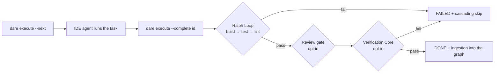
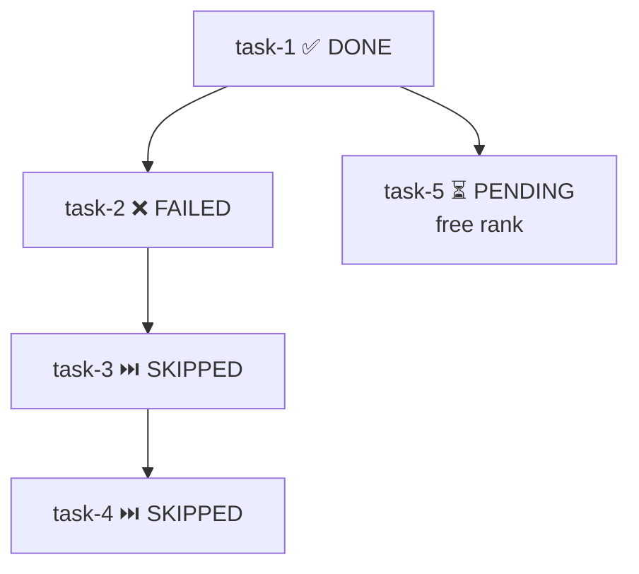
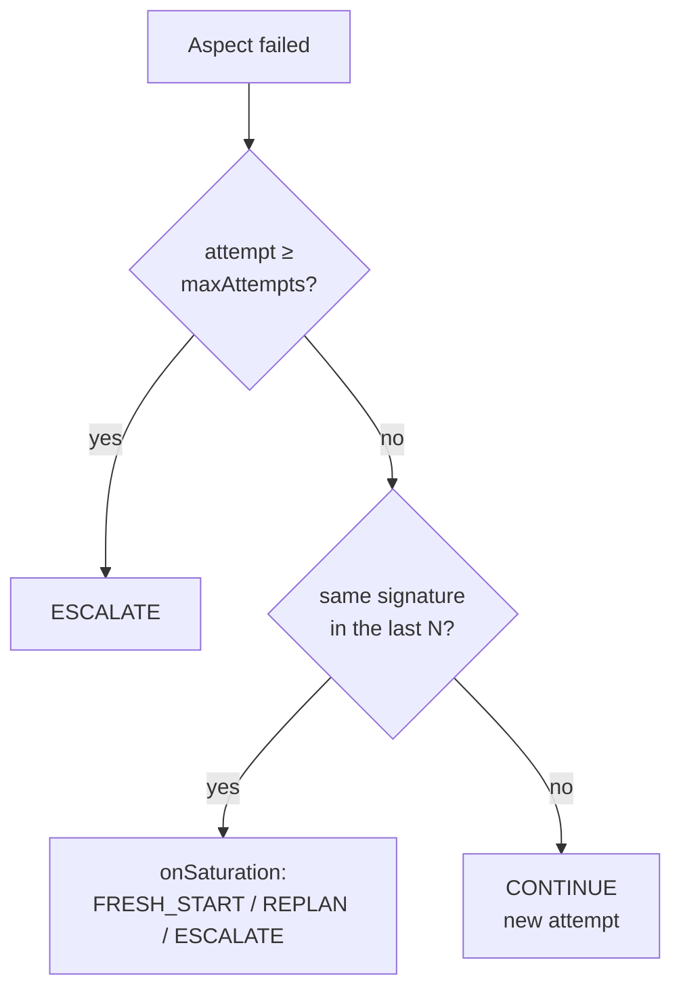

# Execution & Validation

The DARE **Execute** phase runs task by task over the DAG generated in the Blueprint. The CLI does **not** invoke any LLM API: execution happens inside the IDE where the user is already authenticated (Cursor / Antigravity / Claude Code). `dare execute` is just the **coordinator** — it orders the tasks, composes the prompt, runs the deterministic gates and records the state transitions.



!!! info "Where this lives in the code"
    `packages/cli/src/dag-runner/ralph-loop.ts` · `run_dag.ts` · `state-store.ts` · `packages/cli/src/commands/execute.ts` · `execute-verification.ts` · `bench.ts` · `packages/cli/src/verification/*`

---

## Ralph Loop

The **Ralph Loop** runs **for any and every task** before it can transition to `DONE`. There is no flag to skip it, no config to disable it, and no exception for "small" or "docs-only" tasks. Each `dare execute --complete <id>` triggers **build → test → lint** in that fixed order and only marks the task as `DONE` if all three pass.

### Sequence and gates per stack

Gates are resolved by `gatesFor(stack, cwd)` and executed via `safeSpawn` (argv, **no shell**). Execution is **sequential and stops on the first failure**.

| Stack (`dare.config.json`) | build | test | lint |
|---|---|---|---|
| `node-nestjs` | `npm run build` | `npm test -- --passWithNoTests` | `npm run lint` |
| `react` / `vue` | `npm run build` | `npm test -- --run --passWithNoTests` | `npm run lint` |
| `python-fastapi` | `python -m compileall -q .` | `pytest -q --tb=short` | `ruff check .` |
| `rust-axum` | `cargo build --quiet` | `cargo test --quiet` | `cargo clippy --quiet -- -D warnings` |
| `rust-leptos` | `cargo leptos build --release` | `cargo test --workspace` | `cargo clippy --all-targets --all-features -- -D warnings` **+** `cargo fmt --check` |
| `rust-leptos-csr` | `trunk build --release` | `cargo test --workspace` | `cargo clippy … -D warnings` **+** `cargo fmt --check` |
| `go-gin` / `go-stdlib` | `go build ./...` | `go test ./...` | `go vet ./...` |
| `php-laravel` | `composer dump-autoload --no-interaction` | `php artisan test` | `vendor/bin/pint --test` |
| `mcp-server-node-ts` | `npm run build` | `npm test -- --run --passWithNoTests` | `npm run lint` |
| `mcp-server-python` | `python -m compileall -q .` | `pytest -q --tb=short` | `ruff check .` |

!!! note "Stack and Python binary resolution"
    The stack comes from `resolveStackFromConfig()`: `structure: mcp-server` ⇒ `mcp-server-${mcpLanguage}` (default `node-ts`); otherwise it uses `backend`, falling back to `frontend`. For Python stacks, `resolvePythonBin()` prefers the project venv (`.venv/Scripts/<tool>.exe` on Windows, `.venv/bin/<tool>` on Unix) before falling back to the binary on the PATH. A stack with no definition in `gatesFor()` throws an error — there is no "generic" gate.

### Exit code → DONE / FAILED

Each gate is a process. The rule is simple and deterministic:

- **exit code `0`** on all gates ⇒ `RalphLoopResult.passed = true` ⇒ the task may proceed to Review/Verification and then `DONE`.
- **any exit code `≠ 0`** ⇒ stops immediately, returns `failedAt`, `failedCommand`, `stderr`/`stdout` (capped at `maxStderrChars`, default 4000) and marks the task `FAILED`.
- **timeout** (`timeoutSeconds`, default 600s): if the process times out with code `0`, the code is forced to **`124`** and a `[Ralph Loop] timed out` warning is appended to stderr.

```bash
# Try to complete a task: triggers the Ralph Loop (build → test → lint)
dare execute --complete task-101 --output "endpoint /login implementado"

# Failed on a gate? Fix it and reopen the task before trying again:
dare execute --reset task-101
```

!!! tip "Review gate (opt-in)"
    Between the Ralph Loop and the Verification Core, if `dare.config.json#review.onComplete: true`, `dare review` runs over the just-finished task and blocks `DONE` if it finds mocks/stubs/TODOs/unmet semantic criteria. Knobs: `review.strict` (warnings become errors) and `review.fromAgent` (path of the JSON verdict from the IDE skill).

---

## DAG Runner

The DAG runner is **orchestration, not execution** (`run_dag.ts`). The canonical spec lives in `dare-dag.yaml` (id / `depends_on` / complexity / `subtask_prompt` / `spec_file`); the runtime state (status, output, error, tokens, duration, attempts) is persisted **separately** in `.dare/state.json` (`state-store.ts`) — so the YAML stays diff-friendly and reviewable.

### Topological ranks

`computeRanks()` computes each task's execution rank by recursion over `depends_on` (Kahn-style algorithm):

- task with no dependencies ⇒ **rank 0**;
- otherwise ⇒ `max(parents' rank) + 1`;
- cycle detected ⇒ error `Circular dependency detected`.

Tasks at the **same rank** can run in parallel. `nextExecutableTasks()` returns the `PENDING` tasks whose parents are all `DONE`; by default (`currentRankOnly = true`) it restricts to the **lowest rank** still executable, giving a clean "rank by rank" cadence.

### Cascading skip

`applyCascadingSkip()` runs at a fixed point: any `PENDING` task whose parent is `FAILED` or `SKIPPED` becomes `SKIPPED`, and this propagates transitively downward. It is called automatically in `markFailed()` and at the start of `--next`.



### Commands

```bash
# Next executable tasks (current rank) + composed prompts for the agent
dare execute --next

# At each rank, mark every task as RUNNING (parallel agent fan-out)
dare execute --next --parallel-hint

# Mark DONE (runs the Ralph Loop; --tokens/--duration are optional)
dare execute --complete task-101 --output "resumo" --tokens 1200

# Mark FAILED (triggers cascading skip)
dare execute --fail task-101 --reason "API externa fora do ar"

# Reopen a task for a new attempt (clears output/error/duration/tokens
# and removes the stale node from the graph)
dare execute --reset task-101

# Summary + canvas (default action with no flags)
dare execute --status

# Continuous readiness stream (re-prints on every state.json change)
dare execute --watch
```

| Flag | Resulting state | Side effects |
|---|---|---|
| `--next` | (query) | auto cascading-skip; prints prompt + parent context (capped) |
| `--complete <id>` | Ralph Loop ✓ → `DONE` / fail → `FAILED` | opt-in review/verification; ingestion into the graph |
| `--fail <id>` | `FAILED` | downstream cascading-skip |
| `--reset <id>` | `PENDING` | clears runtime; removes `task:<id>` from the graph |
| `--status` | (query) | renders `DARE/.canvas.md` |

!!! info "States and the canvas"
    The possible states are `PENDING → RUNNING → DONE / FAILED / SKIPPED`. `renderCanvas()` writes a report to `DARE/.canvas.md` with a task table, per-status icons and a progress bar (`DONE/total`). Each task's prompt (`buildTaskPrompt`) includes an "Upstream context" block with capped snippets (`parent_context_chars`, default 2000) from each parent's output.

---

## Verification Core

The **Verification Core** is **opt-in** and runs **after** the Ralph Loop passes. It is turned on by `dare.config.json#verification` (`runner.ts` returns `passed:true` immediately if `verification.enabled` is `false`). It can be forced on a call with `--verify` or turned off with `--no-verify`.

A verification **passes** when all evaluated aspects have a `PASS` or `SKIP` verdict (`computePassed`). The execution order stops on the first blocking failure.

### Aspects

| Aspect | Config | Behavior |
|---|---|---|
| **fail-to-pass** | `failToPass.required` (default `true`) | requires a baseline + `specGlob` in the `.dare/verification/<id>.json` artifact; missing ⇒ error `FailToPassMissing` (**exit 4**). Verifies that the set of tests that failed before now passes. |
| **anti-tamper** | `antiTamper.enabled` (default `true`) | compares a snapshot of the tests; no snapshot ⇒ `SKIP`. Detects weakening/removal of asserts to "pass by cheating". |
| **type-check** | `typeCheck.enabled` (default `false`) | per-stack type-check (timeout 120s). |
| **mutation** | `mutation.enabled` (default `true`) | runs the stack's mutation tool; `score < minScore` ⇒ `FAIL`; zero mutants ⇒ `SKIP`. |
| **formal** | `formal.enabled` (default `false`) | formal proof (Dafny/Verus/Lean) over flagged modules; deterministic solver verdict + anti-bypass sub-gate. |

Effective order in `runVerification`: **fail-to-pass → anti-tamper → type-check → mutation → formal**. A `FAIL` in fail-to-pass, anti-tamper or type-check ends the verification immediately.

#### Mutation with `minScore`

```jsonc
"verification": {
  "enabled": true,
  "mutation": {
    "enabled": true,
    "minScore": 0.7,        // blocks DONE if score < 0.70
    "incremental": true,    // only mutates files from the task's git diff
    "maxMutants": 200,
    "timeoutSeconds": 900
  }
}
```

The adapter is resolved per stack (Stryker / mutmut / cargo-mutants / Infection). Tool missing from the PATH ⇒ error `MutationToolNotFound` (**exit 3**). The `--full-mutation` flag turns off incremental mode for the call (mutates everything, not just the diff).

#### Best-of-N over worktrees

With `--best-of <n>` (or `verification.bestOfN.default`, capped at `bestOfN.max`), the CLI creates **N isolated git worktrees**, lets the agent fill in each candidate, runs the verification on each one and selects the winner by **Pareto dominance** over the `test/lint/type/mutation` aspects:

1. discards candidates with any `FAIL` aspect (zero left ⇒ `NoViableCandidate`);
2. keeps the Pareto non-dominated set;
3. breaks ties by the highest `mutationScore` (and `id` as a stable tiebreak).

The winning patch is promoted via `git diff HEAD <branch>` applied at the root (`.dare/winner.patch`); all worktrees are removed in the `finally`.

#### Exec-free prerank

`--prerank` (or `verification.prerank.enabled`) enables a **heuristic reordering without execution** of the candidates: it prefers smaller diffs, fewer hunks and touches to test files, producing a score in `[0,1]`.

!!! danger "RS-07 — prerank NEVER authorizes DONE/PASS"
    Prerank only **reorders** candidates before verification. It never turns a verdict into `PASS`. The constant `PRERANK_NEVER_AUTHORIZES_DONE = true` documents the invariant for the safety tests.

#### Formal Verification Gate (v3.8, experimental)

The **formal gate** is one more **aspect** of the Verification Core: `runner.ts` runs it **after** mutation, and only when `verification.formal.enabled` is `true`. It is **strict two-level opt-in** — beyond the config flag, it only runs on **marked** modules (a `@dare-formal` tag in the code, discovered in the diff, or `verification.formal.modules` in `path::symbol` form). With no marked target the aspect returns `SKIP` before any execution. It can be toggled per call with `--formal` / `--no-formal` and have its backend overridden with `--formal-backend <dafny|verus|lean>`.

```jsonc
"verification": {
  "enabled": true,
  "formal": {
    "enabled": true,                // second gate (default false)
    "backend": "dafny",             // 'dafny' (default) | 'verus' | 'lean'
    "modules": ["src/crypto/sign.ts::verifySignature"],
    "maxRepairIterations": 5,
    "proofTimeoutSeconds": 120,
    "antiBypass": true
  }
}
```

- **Dafny is the default backend** (82.2% vs. Verus 44.3% vs. Lean 26.8% — Vericoding); Verus/Lean are optional.
- **External toolchain, not a CLI dependency.** Dafny/Z3/Verus/Lean are installed in the target project; each backend checks the binary via `isAvailable()` (without running a proof). Missing toolchain on an **unmarked** module ⇒ `SKIP`; on a **marked** module ⇒ `FormalToolNotFoundError` (**exit 5**) — never silently skips the gate.
- **Anti-bypass.** When `antiBypass: true`, the sub-gate rejects cheating patterns (`assume(false)`, `ensures true`, spec leaked into the impl) **even with a solver exit 0**: `verified = solverPassed && !bypassDetected`.
- **Deterministic verdict, no LLM in the CLI.** The CLI orchestrates the external verifier via `safeSpawn` and reads the verdict. The **spec/proof is generated in the IDE skill** (LLM outside the CLI): the skill formalizes the Dafny spec, returns the NL translation (the human validates only the NL — Dafny-as-IL) and iterates the repair (PREFACE). The `FormalVerdict` is persisted in `.dare/verification/<id>.json` and recorded in the graph as `task --proven_by--> formal-gate`.

### Exit codes

| Exit code | Meaning |
|---|---|
| `0` | verification passed (or turned off) |
| `1` | Ralph Loop, review or verification failed (DONE blocked) |
| `3` | `MutationToolNotFound` — install the tool or set `mutation.enabled: false` |
| `4` | `FailToPassMissing` — generate `EXECUTION/<id>.tests.*` / the baseline first |
| `5` | `FormalToolNotFound` — formal toolchain missing on a MARKED module (install it or unmark) |

### `dare bench`

`dare bench` runs deterministic fixtures (`fixtures/bench/suite.json`) as a **patch quality gate**, with no LLM.

```bash
# Runs the default suite and prints solve-rate
dare bench

# Compares against a baseline and fails on a regression greater than 3pp (default)
dare bench --baseline baseline.json --fail-on-regression 3

# JSON for CI / filter by fixture glob
dare bench --json --filter "node-*"
```

- **Fix Rate** (per fixture): `0` if there is a **pass-to-pass regression**; otherwise `failToPass.passed / failToPass.total` (or `1` when there are no fail-to-pass tests).
- **solved**: `fixRate === 1 && !passToPassRegressed`.
- **solve-rate** (suite): `solved / fixtures`.
- **regression**: `deltaPp = (solveRate − baselineSolveRate) × 100`; fails when `−deltaPp > failOnRegressionPp`.

Exit: `2` for an invalid or missing suite/baseline; `1` if there was a regression; `0` otherwise.

---

## Decay policy (decay-aware loop)

When an aspect fails, `recordFailureAndVerdict()` records the attempt in `.dare/state.json` (with a stable **failure signature**) and `decideNextAction()` decides the next step **deterministically, with no LLM** (`verification/decay/policy.ts`).

```jsonc
"verification": {
  "loop": {
    "policy": "decay",          // "decay" | "fixed"
    "maxAttempts": 5,           // hard cap → ESCALATE when reached
    "saturationWindow": 3,      // number of attempts with the SAME signature
    "onSaturation": "fresh-start" // "fresh-start" | "replan" | "escalate"
  }
}
```

**Failure signature** (`signature.ts`): SHA-256 hash (8 hex) of `failedAspect + normalized stderr` — paths, timestamps, hexes and line numbers are normalized, so failures that are "essentially the same" collide on the same signature.

**Decision** (`LoopVerdict.action`):

| Condition | Action |
|---|---|
| verification passed | `DONE` |
| `attempt ≥ maxAttempts` | `ESCALATE` (hard cap) |
| last `saturationWindow` attempts with the same signature | maps `onSaturation`: `fresh-start → FRESH_START`, `replan → REPLAN`, `escalate → ESCALATE` |
| `policy: fixed`, below the cap | `CONTINUE` (keeps trying the same plan) |
| `policy: decay`, no saturation | `CONTINUE` |

Saturation only triggers when the last `window` attempts share the **same non-null signature** — that is, the agent is repeatedly hitting the same error. `--policy <decay|fixed>` and `--verdict-json` let you override the policy and emit the verdict as JSON on the call.


