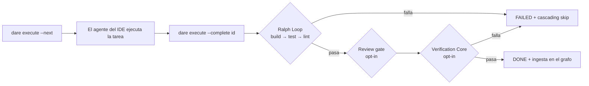
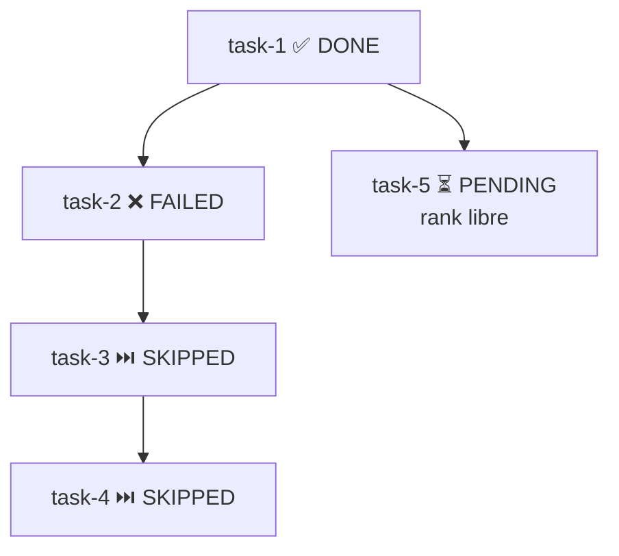
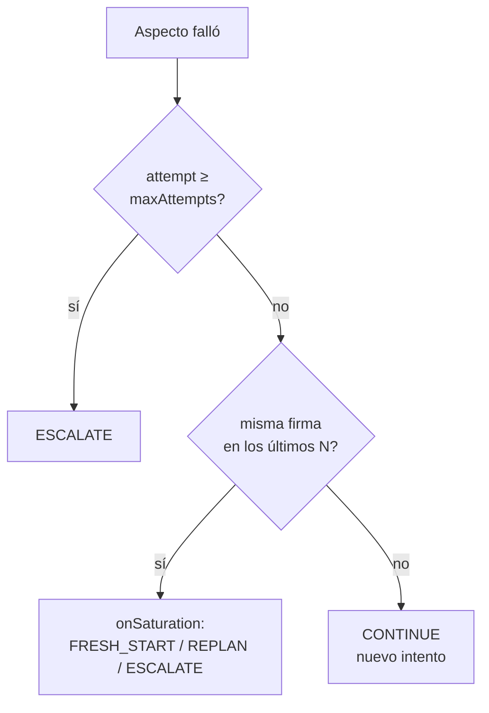

# Ejecución y Validación

La fase **Execute** de DARE corre tarea a tarea sobre el DAG generado en el Blueprint. La CLI **no** invoca ninguna API de LLM: la ejecución ocurre dentro del IDE en el que el usuario ya está autenticado (Cursor / Antigravity / Claude Code). `dare execute` es solo el **coordinador** — ordena las tareas, compone el prompt, corre los gates deterministas y registra las transiciones de estado.



!!! info "Dónde vive esto en el código"
    `packages/cli/src/dag-runner/ralph-loop.ts` · `run_dag.ts` · `state-store.ts` · `packages/cli/src/commands/execute.ts` · `execute-verification.ts` · `bench.ts` · `packages/cli/src/verification/*`

---

## Ralph Loop

El **Ralph Loop** corre **para toda y cada tarea** antes de que pueda transicionar a `DONE`. No hay flag para saltarlo, ni config para deshabilitarlo, ni excepción para tareas "pequeñas" o "solo de documentación". Cada `dare execute --complete <id>` dispara **build → test → lint** en ese orden fijo y solo marca la tarea como `DONE` si los tres pasan.

### Secuencia y gates por stack

Los gates se resuelven con `gatesFor(stack, cwd)` y se ejecutan vía `safeSpawn` (argv, **sin shell**). La ejecución es **secuencial y se detiene en la primera falla**.

| Stack (`dare.config.json`) | build | test | lint |
|---|---|---|---|
| `node-nestjs` | `npm run build` | `npm test -- --passWithNoTests` | `npm run lint` |
| `react` / `vue` | `npm run build` | `npm test -- --run --passWithNoTests` | `npm run lint` |
| `python-fastapi` | `python -m compileall -q .` | `pytest -q --tb=short` | `ruff check .` |
| `rust-axum` | `cargo build --quiet` | `cargo test --quiet` | `cargo clippy --quiet -- -D warnings` |
| `rust-leptos` | `cargo leptos build --release` | `cargo test --workspace` | `cargo clippy --all-targets --all-features -- -D warnings` **+** `cargo fmt --check` |
| `rust-leptos-csr` | `trunk build --release` | `cargo test --workspace` | `cargo clippy … -D warnings` **+** `cargo fmt --check` |
| `go-gin` / `go-stdlib` | `go build ./...` | `go test ./...` | `go vet ./...` |
| `php-laravel` | `composer dump-autoload --no-interaction` | `php artisan test` | `vendor/bin/pint --test` |
| `mcp-server-node-ts` | `npm run build` | `npm test -- --run --passWithNoTests` | `npm run lint` |
| `mcp-server-python` | `python -m compileall -q .` | `pytest -q --tb=short` | `ruff check .` |

!!! note "Resolución del stack y del binario de Python"
    El stack viene de `resolveStackFromConfig()`: `structure: mcp-server` ⇒ `mcp-server-${mcpLanguage}` (default `node-ts`); en caso contrario usa `backend`, y si no `frontend`. Para stacks de Python, `resolvePythonBin()` prefiere el venv del proyecto (`.venv/Scripts/<tool>.exe` en Windows, `.venv/bin/<tool>` en Unix) antes de recurrir al binario del PATH. Un stack sin definición en `gatesFor()` lanza un error — no hay gate "genérico".

### Exit code → DONE / FAILED

Cada gate es un proceso. La regla es simple y determinista:

- **exit code `0`** en todos los gates ⇒ `RalphLoopResult.passed = true` ⇒ la tarea puede seguir a Review/Verification y luego `DONE`.
- **cualquier exit code `≠ 0`** ⇒ se detiene de inmediato, devuelve `failedAt`, `failedCommand`, `stderr`/`stdout` (recortados en `maxStderrChars`, default 4000) y marca la tarea `FAILED`.
- **timeout** (`timeoutSeconds`, default 600s): si el proceso se agota con code `0`, el code se fuerza a **`124`** y se anexa al stderr un aviso `[Ralph Loop] timed out`.

```bash
# Intentar completar una tarea: dispara el Ralph Loop (build → test → lint)
dare execute --complete task-101 --output "endpoint /login implementado"

# ¿Falló en algún gate? Corrige y reabre la tarea antes de intentar de nuevo:
dare execute --reset task-101
```

!!! tip "Review gate (opt-in)"
    Entre el Ralph Loop y el Verification Core, si `dare.config.json#review.onComplete: true`, `dare review` corre sobre la tarea recién terminada y bloquea el `DONE` si encuentra mocks/stubs/TODOs/criterios semánticos no cumplidos. Knobs: `review.strict` (los warnings pasan a ser errores) y `review.fromAgent` (path del veredicto JSON del skill del IDE).

---

## DAG Runner

El DAG runner es **orquestación, no ejecución** (`run_dag.ts`). La spec canónica vive en `dare-dag.yaml` (id / `depends_on` / complexity / `subtask_prompt` / `spec_file`); el estado de runtime (status, output, error, tokens, duration, attempts) se persiste **por separado** en `.dare/state.json` (`state-store.ts`) — así el YAML sigue siendo diff-friendly y revisable.

### Ranks topológicos

`computeRanks()` calcula el rank de ejecución de cada tarea por recursión sobre `depends_on` (algoritmo estilo Kahn):

- tarea sin dependencias ⇒ **rank 0**;
- en caso contrario ⇒ `max(rank de los padres) + 1`;
- ciclo detectado ⇒ error `Circular dependency detected`.

Las tareas del **mismo rank** pueden correr en paralelo. `nextExecutableTasks()` devuelve las tareas `PENDING` cuyos padres están todos `DONE`; por defecto (`currentRankOnly = true`) restringe al **menor rank** aún ejecutable, dando una cadencia limpia "rank a rank".

### Cascading skip

`applyCascadingSkip()` corre en punto fijo: cualquier tarea `PENDING` cuyo padre esté `FAILED` o `SKIPPED` pasa a `SKIPPED`, y eso se propaga transitivamente hacia abajo. Se invoca automáticamente en `markFailed()` y al inicio de `--next`.



### Comandos

```bash
# Próximas tareas ejecutables (rank actual) + prompts compuestos para el agente
dare execute --next

# Marcar en cada rank toda tarea como RUNNING (fan-out paralelo del agente)
dare execute --next --parallel-hint

# Marcar DONE (corre el Ralph Loop; --tokens/--duration son opcionales)
dare execute --complete task-101 --output "resumo" --tokens 1200

# Marcar FAILED (dispara cascading skip)
dare execute --fail task-101 --reason "API externa fora do ar"

# Reabrir una tarea para un nuevo intento (limpia output/error/duration/tokens
# y elimina el nodo stale del grafo)
dare execute --reset task-101

# Resumen + canvas (acción por defecto sin flags)
dare execute --status

# Stream continuo de disponibilidad (re-imprime en cada cambio de state.json)
dare execute --watch
```

| Flag | Estado resultante | Efectos colaterales |
|---|---|---|
| `--next` | (consulta) | auto cascading-skip; imprime prompt + contexto de los padres (recortado) |
| `--complete <id>` | Ralph Loop ✓ → `DONE` / falla → `FAILED` | review/verification opt-in; ingesta en el grafo |
| `--fail <id>` | `FAILED` | cascading-skip downstream |
| `--reset <id>` | `PENDING` | limpia runtime; elimina `task:<id>` del grafo |
| `--status` | (consulta) | renderiza `DARE/.canvas.md` |

!!! info "Estados y el canvas"
    Los estados posibles son `PENDING → RUNNING → DONE / FAILED / SKIPPED`. `renderCanvas()` escribe un reporte en `DARE/.canvas.md` con tabla de tareas, íconos por status y barra de progreso (`DONE/total`). El prompt de cada tarea (`buildTaskPrompt`) incluye un bloque "Upstream context" con snippets recortados (`parent_context_chars`, default 2000) del output de cada padre.

---

## Verification Core

El **Verification Core** es **opt-in** y corre **después** de que el Ralph Loop pase. Se activa con `dare.config.json#verification` (`runner.ts` retorna de inmediato `passed:true` si `verification.enabled` es `false`). Puede forzarse en una llamada con `--verify` o apagarse con `--no-verify`.

Una verificación **pasa** cuando todos los aspectos evaluados tienen veredicto `PASS` o `SKIP` (`computePassed`). El orden de ejecución se detiene en la primera falla bloqueante.

### Aspectos

| Aspecto | Config | Comportamiento |
|---|---|---|
| **fail-to-pass** | `failToPass.required` (default `true`) | exige baseline + `specGlob` en el artefacto `.dare/verification/<id>.json`; ausente ⇒ error `FailToPassMissing` (**exit 4**). Verifica que el conjunto de tests que fallaba antes ahora pasa. |
| **anti-tamper** | `antiTamper.enabled` (default `true`) | compara un snapshot de los tests; sin snapshot ⇒ `SKIP`. Detecta debilitamiento/eliminación de asserts para "pasar haciendo trampa". |
| **type-check** | `typeCheck.enabled` (default `false`) | type-check por stack (timeout 120s). |
| **mutation** | `mutation.enabled` (default `true`) | corre el mutation tool del stack; `score < minScore` ⇒ `FAIL`; cero mutantes ⇒ `SKIP`. |
| **formal** | `formal.enabled` (default `false`) | prueba formal (Dafny/Verus/Lean) sobre módulos marcados; veredicto determinista del solver + sub-gate anti-bypass. |

Orden efectivo en `runVerification`: **fail-to-pass → anti-tamper → type-check → mutation**. Un `FAIL` en fail-to-pass, anti-tamper o type-check finaliza la verificación de inmediato.

#### Mutation con `minScore`

```jsonc
"verification": {
  "enabled": true,
  "mutation": {
    "enabled": true,
    "minScore": 0.7,        // bloqueia DONE se score < 0.70
    "incremental": true,    // só muta arquivos do git diff da task
    "maxMutants": 200,
    "timeoutSeconds": 900
  }
}
```

El adapter se resuelve por stack (Stryker / mutmut / cargo-mutants / Infection). Tool ausente en el PATH ⇒ error `MutationToolNotFound` (**exit 3**). La flag `--full-mutation` apaga el modo incremental para la llamada (muta todo, no solo el diff).

#### Best-of-N sobre worktrees

Con `--best-of <n>` (o `verification.bestOfN.default`, tope `bestOfN.max`), la CLI crea **N git worktrees** aislados, deja que el agente complete cada candidato, corre la verificación en cada uno y selecciona al ganador por **dominancia de Pareto** sobre los aspectos `test/lint/type/mutation`:

1. descarta candidatos con cualquier aspecto `FAIL` (si queda cero ⇒ `NoViableCandidate`);
2. mantiene el conjunto no-dominado de Pareto;
3. desempata por el mayor `mutationScore` (e `id` como tiebreak estable).

El patch ganador se promueve vía `git diff HEAD <branch>` aplicado en la raíz (`.dare/winner.patch`); todos los worktrees se eliminan en el `finally`.

#### Prerank exec-free

`--prerank` (o `verification.prerank.enabled`) activa un **reordenamiento heurístico sin ejecución** de los candidatos: prefiere diffs más pequeños, menos hunks y toques a archivos de test, produciendo un score en `[0,1]`.

!!! danger "RS-07 — prerank NUNCA autoriza DONE/PASS"
    El prerank solo **reordena** candidatos antes de la verificación. Jamás convierte un veredicto en `PASS`. La constante `PRERANK_NEVER_AUTHORIZES_DONE = true` documenta la invariante para los tests de seguridad.

### Exit codes

| Exit code | Significado |
|---|---|
| `0` | la verificación pasó (o está apagada) |
| `1` | el Ralph Loop, review o la verificación falló (DONE bloqueado) |
| `3` | `MutationToolNotFound` — instala el tool o `mutation.enabled: false` |
| `4` | `FailToPassMissing` — genera `EXECUTION/<id>.tests.*` / el baseline primero |

### `dare bench`

`dare bench` corre fixtures deterministas (`fixtures/bench/suite.json`) como **gate de calidad de patch**, sin LLM.

```bash
# Corre la suite default e imprime solve-rate
dare bench

# Compara con baseline y falla en regresión mayor a 3pp (default)
dare bench --baseline baseline.json --fail-on-regression 3

# JSON para CI / filtrar por glob de fixture
dare bench --json --filter "node-*"
```

- **Fix Rate** (por fixture): `0` si hay **regresión pass-to-pass**; si no `failToPass.passed / failToPass.total` (o `1` cuando no hay tests fail-to-pass).
- **solved**: `fixRate === 1 && !passToPassRegressed`.
- **solve-rate** (suite): `solved / fixtures`.
- **regresión**: `deltaPp = (solveRate − baselineSolveRate) × 100`; falla cuando `−deltaPp > failOnRegressionPp`.

Exit: `2` para suite/baseline inválido o ausente; `1` si hubo regresión; `0` en caso contrario.

---

## Decay policy (loop decay-aware)

Cuando un aspecto falla, `recordFailureAndVerdict()` registra el intento en `.dare/state.json` (con una **firma de falla** estable) y `decideNextAction()` decide el siguiente paso de forma **determinista, sin LLM** (`verification/decay/policy.ts`).

```jsonc
"verification": {
  "loop": {
    "policy": "decay",          // "decay" | "fixed"
    "maxAttempts": 5,           // teto duro → ESCALATE ao atingir
    "saturationWindow": 3,      // nº de tentativas com a MESMA assinatura
    "onSaturation": "fresh-start" // "fresh-start" | "replan" | "escalate"
  }
}
```

**Firma de falla** (`signature.ts`): hash SHA-256 (8 hex) de `failedAspect + stderr normalizado` — paths, timestamps, hexes y números de línea se normalizan, de modo que fallas "iguales en esencia" colisionen en la misma firma.

**Decisión** (`LoopVerdict.action`):

| Condición | Acción |
|---|---|
| la verificación pasó | `DONE` |
| `attempt ≥ maxAttempts` | `ESCALATE` (tope duro) |
| los últimos `saturationWindow` intentos con la misma firma | mapea `onSaturation`: `fresh-start → FRESH_START`, `replan → REPLAN`, `escalate → ESCALATE` |
| `policy: fixed`, por debajo del tope | `CONTINUE` (sigue intentando el mismo plan) |
| `policy: decay`, sin saturación | `CONTINUE` |

La saturación solo se dispara cuando los últimos `window` intentos comparten la **misma firma no nula** — es decir, el agente está chocando repetidamente con el mismo error. `--policy <decay|fixed>` y `--verdict-json` permiten sobrescribir la política y emitir el veredicto en JSON en la llamada.


