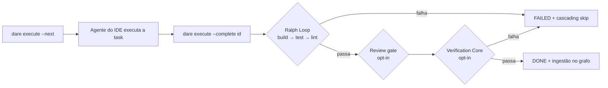
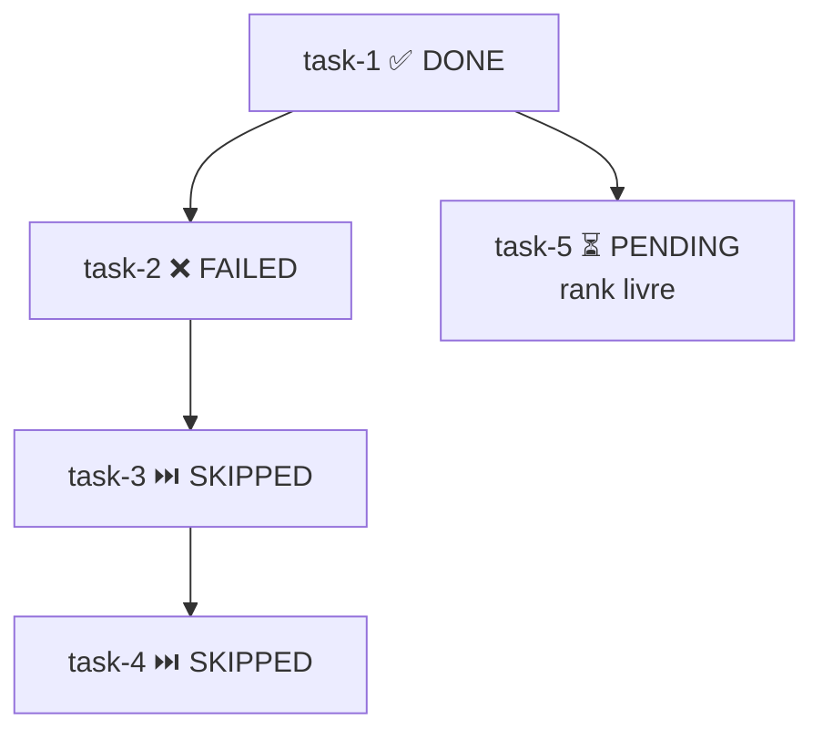
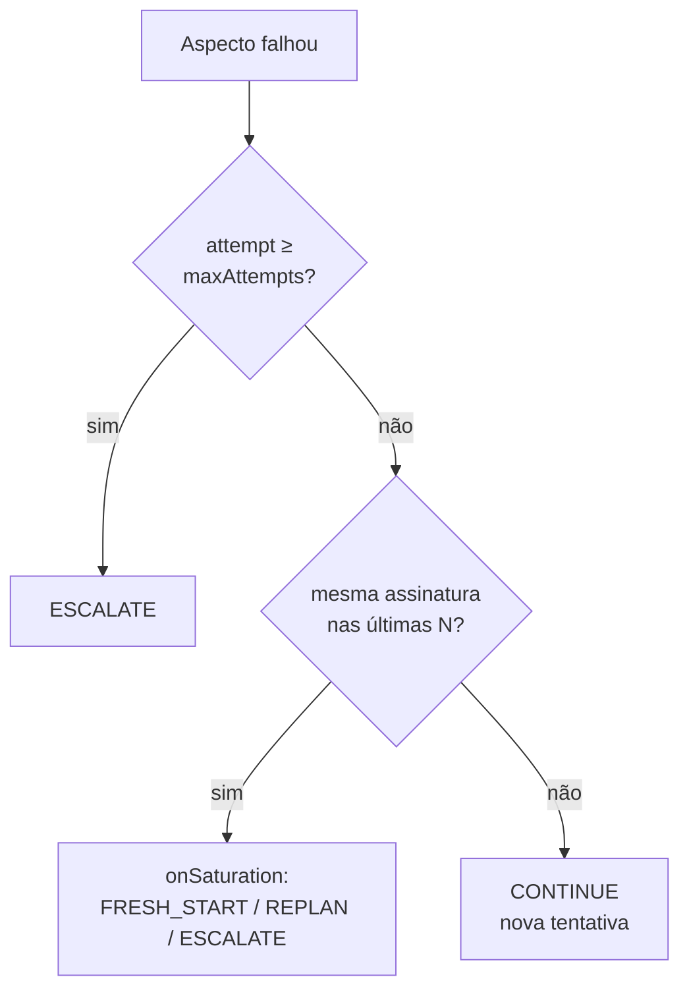

# Execução & Validação

A fase **Execute** do DARE roda task a task sobre o DAG gerado no Blueprint. O CLI **não** invoca nenhuma API de LLM: a execução acontece dentro do IDE em que o usuário já está autenticado (Cursor / Antigravity / Claude Code). O `dare execute` é apenas o **coordenador** — ele ordena as tasks, compõe o prompt, roda os gates determinísticos e registra as transições de estado.



!!! info "Onde isto vive no código"
    `packages/cli/src/dag-runner/ralph-loop.ts` · `run_dag.ts` · `state-store.ts` · `packages/cli/src/commands/execute.ts` · `execute-verification.ts` · `bench.ts` · `packages/cli/src/verification/*`

---

## Ralph Loop

O **Ralph Loop** roda **para toda e qualquer task** antes de ela poder transicionar para `DONE`. Não há flag para pular, nem config para desabilitar, nem exceção para tasks "pequenas" ou "só de documentação". Cada `dare execute --complete <id>` dispara **build → test → lint** nessa ordem fixa e só marca a task como `DONE` se os três passarem.

### Sequência e gates por stack

Os gates são resolvidos por `gatesFor(stack, cwd)` e executados via `safeSpawn` (argv, **sem shell**). A execução é **sequencial e para na primeira falha**.

| Stack (`dare.config.json`) | build | test | lint |
|---|---|---|---|
| `node-nestjs` | `npm run build` | `npm test -- --passWithNoTests` | `npm run lint` |
| `react` / `vue` | `npm run build` | `npm test -- --run --passWithNoTests` | `npm run lint` |
| `python-fastapi` | `python -m compileall -q .` | `pytest -q --tb=short` | `ruff check .` |
| `rust-axum` | `cargo build --quiet` | `cargo test --quiet` | `cargo clippy --quiet -- -D warnings` |
| `rust-leptos` | `cargo leptos build --release` | `cargo test --workspace` | `cargo clippy --all-targets --all-features -- -D warnings` **+** `cargo fmt --check` |
| `rust-leptos-csr` | `trunk build --release` | `cargo test --workspace` | `cargo clippy … -D warnings` **+** `cargo fmt --check` |
| `go-gin` / `go-stdlib` | `go build ./...` | `go test ./...` | `go vet ./...` |
| `php-laravel` | `composer dump-autoload --no-interaction` | `php artisan test` | `vendor/bin/pint --test` |
| `mcp-server-node-ts` | `npm run build` | `npm test -- --run --passWithNoTests` | `npm run lint` |
| `mcp-server-python` | `python -m compileall -q .` | `pytest -q --tb=short` | `ruff check .` |

!!! note "Resolução do stack e do binário Python"
    O stack vem de `resolveStackFromConfig()`: `structure: mcp-server` ⇒ `mcp-server-${mcpLanguage}` (default `node-ts`); caso contrário usa `backend`, senão `frontend`. Para stacks Python, `resolvePythonBin()` prefere o venv do projeto (`.venv/Scripts/<tool>.exe` no Windows, `.venv/bin/<tool>` em Unix) antes de cair no binário do PATH. Um stack sem definição em `gatesFor()` lança erro — não há gate "genérico".

### Exit code → DONE / FAILED

Cada gate é um processo. A regra é simples e determinística:

- **exit code `0`** em todos os gates ⇒ `RalphLoopResult.passed = true` ⇒ a task pode seguir para Review/Verification e então `DONE`.
- **qualquer exit code `≠ 0`** ⇒ para imediatamente, devolve `failedAt`, `failedCommand`, `stderr`/`stdout` (capados em `maxStderrChars`, default 4000) e marca a task `FAILED`.
- **timeout** (`timeoutSeconds`, default 600s): se o processo estourar com code `0`, o code é forçado para **`124`** e um aviso `[Ralph Loop] timed out` é anexado ao stderr.

```bash
# Tentar completar uma task: dispara o Ralph Loop (build → test → lint)
dare execute --complete task-101 --output "endpoint /login implementado"

# Falhou em algum gate? Corrija e reabra a task antes de tentar de novo:
dare execute --reset task-101
```

!!! tip "Review gate (opt-in)"
    Entre o Ralph Loop e o Verification Core, se `dare.config.json#review.onComplete: true`, o `dare review` roda sobre a task recém-terminada e bloqueia o `DONE` se encontrar mocks/stubs/TODOs/critérios semânticos não atendidos. Knobs: `review.strict` (warnings viram erros) e `review.fromAgent` (path do veredito JSON do skill do IDE).

---

## DAG Runner

O DAG runner é **orquestração, não execução** (`run_dag.ts`). A spec canônica fica em `dare-dag.yaml` (id / `depends_on` / complexity / `subtask_prompt` / `spec_file`); o estado de runtime (status, output, error, tokens, duration, attempts) é persistido **separadamente** em `.dare/state.json` (`state-store.ts`) — assim o YAML continua diff-friendly e revisável.

### Ranks topológicos

`computeRanks()` calcula o rank de execução de cada task por recursão sobre `depends_on` (algoritmo estilo Kahn):

- task sem dependências ⇒ **rank 0**;
- caso contrário ⇒ `max(rank dos pais) + 1`;
- ciclo detectado ⇒ erro `Circular dependency detected`.

Tasks no **mesmo rank** podem rodar em paralelo. `nextExecutableTasks()` devolve as tasks `PENDING` cujos pais estão todos `DONE`; por padrão (`currentRankOnly = true`) restringe ao **menor rank** ainda executável, dando uma cadência limpa "rank a rank".

### Cascading skip

`applyCascadingSkip()` roda em ponto-fixo: qualquer task `PENDING` cujo pai esteja `FAILED` ou `SKIPPED` vira `SKIPPED`, e isso propaga transitivamente para baixo. É chamado automaticamente em `markFailed()` e no início de `--next`.



### Comandos

```bash
# Próximas tasks executáveis (rank atual) + prompts compostos para o agente
dare execute --next

# Marcar a cada rank toda task como RUNNING (fan-out paralelo do agente)
dare execute --next --parallel-hint

# Marcar DONE (roda Ralph Loop; --tokens/--duration são opcionais)
dare execute --complete task-101 --output "resumo" --tokens 1200

# Marcar FAILED (dispara cascading skip)
dare execute --fail task-101 --reason "API externa fora do ar"

# Reabrir uma task para nova tentativa (limpa output/error/duration/tokens
# e remove o nó stale do grafo)
dare execute --reset task-101

# Resumo + canvas (ação padrão sem flags)
dare execute --status

# Stream contínuo de prontidão (re-imprime a cada mudança de state.json)
dare execute --watch
```

| Flag | Estado resultante | Efeitos colaterais |
|---|---|---|
| `--next` | (consulta) | auto cascading-skip; imprime prompt + contexto dos pais (capado) |
| `--complete <id>` | Ralph Loop ✓ → `DONE` / falha → `FAILED` | review/verification opt-in; ingestão no grafo |
| `--fail <id>` | `FAILED` | cascading-skip downstream |
| `--reset <id>` | `PENDING` | limpa runtime; remove `task:<id>` do grafo |
| `--status` | (consulta) | renderiza `DARE/.canvas.md` |

!!! info "Estados e o canvas"
    Os estados possíveis são `PENDING → RUNNING → DONE / FAILED / SKIPPED`. `renderCanvas()` escreve um relatório em `DARE/.canvas.md` com tabela de tasks, ícones por status e barra de progresso (`DONE/total`). O prompt de cada task (`buildTaskPrompt`) inclui um bloco "Upstream context" com snippets capados (`parent_context_chars`, default 2000) do output de cada pai.

---

## Verification Core

O **Verification Core** é **opt-in** e roda **depois** do Ralph Loop passar. É ligado por `dare.config.json#verification` (`runner.ts` retorna imediatamente `passed:true` se `verification.enabled` for `false`). Pode ser forçado por chamada com `--verify` ou desligado com `--no-verify`.

Uma verificação **passa** quando todos os aspectos avaliados têm verdito `PASS` ou `SKIP` (`computePassed`). A ordem de execução para na primeira falha bloqueante.

### Aspectos

| Aspecto | Config | Comportamento |
|---|---|---|
| **fail-to-pass** | `failToPass.required` (default `true`) | exige baseline + `specGlob` no artefato `.dare/verification/<id>.json`; ausente ⇒ erro `FailToPassMissing` (**exit 4**). Verifica que o teto de testes que falhava antes agora passa. |
| **anti-tamper** | `antiTamper.enabled` (default `true`) | compara snapshot dos testes; sem snapshot ⇒ `SKIP`. Detecta enfraquecimento/remoção de asserts para "passar trapaceando". |
| **type-check** | `typeCheck.enabled` (default `false`) | type-check por stack (timeout 120s). |
| **mutation** | `mutation.enabled` (default `true`) | roda o mutation tool do stack; `score < minScore` ⇒ `FAIL`; zero mutantes ⇒ `SKIP`. |
| **formal** | `formal.enabled` (default `false`) | prova formal (Dafny/Verus/Lean) sobre módulos marcados; veredito determinístico do solver + sub-gate anti-bypass. |

Ordem efetiva em `runVerification`: **fail-to-pass → anti-tamper → type-check → mutation**. Um `FAIL` em fail-to-pass, anti-tamper ou type-check encerra a verificação imediatamente.

#### Mutation com `minScore`

```jsonc
"verification": {
  "enabled": true,
  "mutation": {
    "enabled": true,
    "minScore": 0.7,        // bloqueia DONE se score < 0.70
    "incremental": true,    // só muta arquivos do git diff da task
    "maxMutants": 200,
    "timeoutSeconds": 900
  }
}
```

O adapter é resolvido por stack (Stryker / mutmut / cargo-mutants / Infection). Tool ausente no PATH ⇒ erro `MutationToolNotFound` (**exit 3**). A flag `--full-mutation` desliga o modo incremental para a chamada (muta tudo, não só o diff).

#### Best-of-N sobre worktrees

Com `--best-of <n>` (ou `verification.bestOfN.default`, teto `bestOfN.max`), o CLI cria **N git worktrees** isolados, deixa o agente preencher cada candidato, roda a verificação em cada um e seleciona o vencedor por **dominância de Pareto** sobre os aspectos `test/lint/type/mutation`:

1. descarta candidatos com qualquer aspecto `FAIL` (sobrando zero ⇒ `NoViableCandidate`);
2. mantém o conjunto não-dominado de Pareto;
3. desempata pelo maior `mutationScore` (e `id` como tiebreak estável).

O patch vencedor é promovido via `git diff HEAD <branch>` aplicado na raiz (`.dare/winner.patch`); todos os worktrees são removidos no `finally`.

#### Prerank exec-free

`--prerank` (ou `verification.prerank.enabled`) ativa uma **reordenação heurística sem execução** dos candidatos: prefere diffs menores, menos hunks e toques em arquivos de teste, produzindo um score em `[0,1]`.

!!! danger "RS-07 — prerank NUNCA autoriza DONE/PASS"
    O prerank só **reordena** candidatos antes da verificação. Ele jamais transforma um veredito em `PASS`. A constante `PRERANK_NEVER_AUTHORIZES_DONE = true` documenta a invariante para os testes de segurança.

### Exit codes

| Exit code | Significado |
|---|---|
| `0` | verificação passou (ou desligada) |
| `1` | Ralph Loop, review ou verificação falhou (DONE bloqueado) |
| `3` | `MutationToolNotFound` — instale o tool ou `mutation.enabled: false` |
| `4` | `FailToPassMissing` — gere `EXECUTION/<id>.tests.*` / o baseline primeiro |

### `dare bench`

`dare bench` roda fixtures determinísticos (`fixtures/bench/suite.json`) como **gate de qualidade de patch**, sem LLM.

```bash
# Roda a suíte default e imprime solve-rate
dare bench

# Compara com baseline e falha em regressão maior que 3pp (default)
dare bench --baseline baseline.json --fail-on-regression 3

# JSON para CI / filtrar por glob de fixture
dare bench --json --filter "node-*"
```

- **Fix Rate** (por fixture): `0` se houver **regressão pass-to-pass**; senão `failToPass.passed / failToPass.total` (ou `1` quando não há testes fail-to-pass).
- **solved**: `fixRate === 1 && !passToPassRegressed`.
- **solve-rate** (suíte): `solved / fixtures`.
- **regressão**: `deltaPp = (solveRate − baselineSolveRate) × 100`; falha quando `−deltaPp > failOnRegressionPp`.

Exit: `2` para suíte/baseline inválido ou ausente; `1` se houve regressão; `0` caso contrário.

---

## Decay policy (loop decay-aware)

Quando um aspecto falha, `recordFailureAndVerdict()` registra a tentativa em `.dare/state.json` (com uma **assinatura de falha** estável) e `decideNextAction()` decide o próximo passo de forma **determinística, sem LLM** (`verification/decay/policy.ts`).

```jsonc
"verification": {
  "loop": {
    "policy": "decay",          // "decay" | "fixed"
    "maxAttempts": 5,           // teto duro → ESCALATE ao atingir
    "saturationWindow": 3,      // nº de tentativas com a MESMA assinatura
    "onSaturation": "fresh-start" // "fresh-start" | "replan" | "escalate"
  }
}
```

**Assinatura de falha** (`signature.ts`): hash SHA-256 (8 hex) de `failedAspect + stderr normalizado` — paths, timestamps, hexes e números de linha são normalizados, de modo que falhas "iguais na essência" colidam na mesma assinatura.

**Decisão** (`LoopVerdict.action`):

| Condição | Ação |
|---|---|
| verificação passou | `DONE` |
| `attempt ≥ maxAttempts` | `ESCALATE` (teto duro) |
| últimas `saturationWindow` tentativas com a mesma assinatura | mapeia `onSaturation`: `fresh-start → FRESH_START`, `replan → REPLAN`, `escalate → ESCALATE` |
| `policy: fixed`, abaixo do teto | `CONTINUE` (continua tentando o mesmo plano) |
| `policy: decay`, sem saturação | `CONTINUE` |

A saturação só dispara quando as últimas `window` tentativas compartilham a **mesma assinatura não-nula** — ou seja, o agente está batendo repetidamente no mesmo erro. `--policy <decay|fixed>` e `--verdict-json` permitem sobrescrever a política e emitir o veredito em JSON na chamada.


