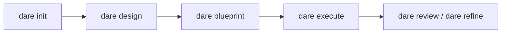

# Getting Started

The DARE Method is an AI-assisted development methodology organized into four phases — **D**esign · **A**rchitecture · **R**eview · **E**xecute. The `dare` CLI does not call any LLM API: it orchestrates the artifacts and the task graph, while the agent runs inside your IDE (Claude Code, Cursor or Antigravity), where you are already authenticated.

!!! info "What this page covers"
    Installation, `dare init` (interactive and non-interactive) with **all** the real flags, and `dare welcome`. At the end, links to the greenfield and brownfield workflows.

## Prerequisites

- **Node.js 18+** (the CLI ships as an npm package and uses ESM).
- A compatible IDE/agent: Claude Code, Cursor or Antigravity.
- Optional, depending on the chosen scaffolding: Docker (for the `docker`/`auto` toolchain) and the stack's native CLIs (`composer`, `cargo`, `python`, `go`, etc.).

## Installation

```bash
npm install -g @dewtech/dare-cli
```

Verify the installation:

```bash
dare --version
dare --help
```

!!! tip "ASCII banner"
    The banner appears in eligible commands (`init`, `--version`). To suppress it in any command, use the global `--no-banner` flag.

## `dare init`

Initializes a new DARE project. It works in two modes: **interactive** (questions via prompt) and **non-interactive** (everything via flags, ideal for CI/scripts/smoke tests).

```bash
dare init [project-name] [options]
```

| Flag | Type | Default | Description |
|------|------|---------|-----------|
| `[project-name]` | argument | (asked) | Project name. If omitted in interactive mode, it is prompted. |
| `--stack <id>` | string | — | Backend stack ID; **skips** the interactive prompt and triggers non-interactive mode. |
| `--mcp <language>` | string | — | MCP server language: `node-ts` \| `python` \| `rust` \| `go`. Triggers non-interactive mode. |
| `--transport <mode>` | string | `stdio` | MCP transport: `stdio` \| `sse` \| `http`. |
| `--toolchain <mode>` | string | `auto` | Scaffolding toolchain: `native` \| `docker` \| `auto`. |
| `--non-interactive` | boolean | `false` | Fails instead of asking; requires `--stack` or `--mcp`. |

!!! note "When non-interactive mode is activated"
    The CLI enters the non-interactive path if **any** of `--non-interactive`, `--stack` or `--mcp` is present. Otherwise, it opens the interactive questionnaire. (Reference: `packages/cli/src/commands/init.ts`.)

### Interactive mode

Without stack flags, `dare init` asks a sequence of questions. The questions and their actual values:

**1. Project structure** (`structure`)

| Option | Value |
|-------|-------|
| Monorepo (backend + frontend) | `monorepo` |
| Backend only | `backend` |
| Frontend only | `frontend` |
| MCP Server | `mcp-server` |

**2. Backend stack** (`backend`) — only when the structure is neither `frontend` nor `mcp-server`

| Option | Value |
|-------|-------|
| Ruby / Rails 8 | `ruby-rails-8` |
| Rust / Axum | `rust-axum` |
| Node.js / NestJS | `node-nestjs` |
| Python / FastAPI | `python-fastapi` |
| PHP / Laravel | `php-laravel` |
| Go / Gin | `go-gin` |
| Go / stdlib (net/http, no framework) | `go-stdlib` |

**3. Frontend stack** (`frontend`) — only when the structure is neither `backend` nor `mcp-server`

| Option | Value |
|-------|-------|
| React 18+ (TypeScript) | `react` |
| Vue 3+ (Composition API) | `vue` |
| Leptos fullstack (Rust SSR + WASM) | `rust-leptos` |
| Leptos CSR-only (Rust WASM + trunk) | `rust-leptos-csr` |
| None (backend only) | `none` |

!!! note "Rust workspace layout"
    When you choose `monorepo` + `rust-axum` + (`rust-leptos` or `rust-leptos-csr`), the CLI asks for the **Cargo workspace layout**: `single` (crates/server + crates/web, default) or `multi` ({prefix}-core / {prefix}-server / {prefix}-web / {prefix}-cli). In `multi` mode there is also a **crate prefix** question (e.g. `ars`).

**4. MCP-specific questions** — only when the structure is `mcp-server`

- **MCP server language** (`mcpLanguage`): `node-ts`, `python`, `rust` (beta), `go` (beta).
- **Transport type** (`mcpTransport`): `stdio`, `sse`, `http-stream`.
- **MCP capabilities** (`mcpFeatures`, multiple choice): `tools` (checked by default), `resources`, `prompts`. At least one is required.

**5. Primary IDE / Agent** (`ide`)

| Option | Value |
|-------|-------|
| Claude Code | `claude-code` |
| Cursor | `cursor` |
| Antigravity | `antigravity` |
| Cursor + Antigravity (Hybrid) | `hybrid` |
| Claude Code + Cursor (Hybrid) | `claude-hybrid` |

**6. GraphRAG backend** (`graphrag`)

| Option | Value |
|-------|-------|
| SQLite (recommended — fast, local) | `sqlite` |
| JSON Graph (simple, no dependencies) | `json` |
| Neo4j Docker (enterprise) | `neo4j` |

**7. DARE MCP Server** (`mcp`) — confirmation to enable DARE's MCP server for context queries. Default: `true`.

**8. Toolchain** (`toolchain`)

| Option | Value |
|-------|-------|
| Auto — native if on PATH, otherwise Docker (recommended) | `auto` |
| Native only — requires the CLI on PATH (faster, no image pulls) | `native` |
| Docker only — always uses the official image (hermetic) | `docker` |

### Non-interactive mode

Use flags to avoid any prompt. You need `--stack <id>` **or** `--mcp <language>`.

```bash
# Backend Rails, toolchain Docker
dare init minha-api --non-interactive --stack ruby-rails-8 --toolchain docker

# Servidor MCP em Python via HTTP
dare init meu-mcp --mcp python --transport http

# Backend Go (stdlib), defaults de toolchain (auto) e transport (stdio)
dare init svc --stack go-stdlib
```

**Valid backend stacks** (`--stack`): `ruby-rails-8`, `node-nestjs`, `python-fastapi`, `php-laravel`, `rust-axum`, `go-gin`, `go-stdlib`.

**Valid MCP languages** (`--mcp`): `node-ts`, `python`, `rust`, `go`.

!!! warning "Validation"
    `--non-interactive` without `--stack` or `--mcp` fails with an error. An unknown `--stack` or `--mcp` also aborts, listing the valid values. In non-interactive mode the applied defaults are `ide: cursor`, `graphrag: sqlite`, `mcp: false`.

### What `dare init` generates

The CLI routes everything through `generateProjectStructure` → registry scaffolders, creating the project structure according to the chosen stack/structure and printing the next steps. For an MCP project, it suggests installing dependencies, `dare design`, `dare blueprint`, `dare execute --parallel` and testing with the MCP Inspector. For the others, it suggests `dare design` → `dare blueprint` → `dare execute --parallel`.

!!! tip "Slash commands in Claude Code"
    If the chosen IDE is `claude-code` or `claude-hybrid`, you can use `/dare-design`, `/dare-blueprint` and `/dare-execute` as slash commands.

## `dare welcome`

Shows the welcome banner and a quick guide. Forces the banner even outside a TTY.

```bash
dare welcome
```

Abridged output:

```text
Quick start:
  dare new myapp --stack rails
  dare skill list
  dare skill add dare-ax

Docs:   https://docs.dare.dewtech.tech
GitHub: https://github.com/dewtech-technologies/dare-method
```

## Next steps



- **New project (greenfield):** see [Greenfield](greenfield.md) — `design` → `blueprint` → `execute` → `review`/`refine`.
- **Existing project (brownfield):** start with `dare discover` / `dare reverse` / `dare dna` to extract facts from the code before design.
