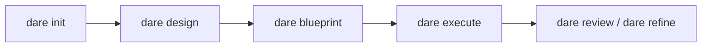

# Primeros pasos

El DARE Method es una metodología de desarrollo asistido por IA organizada en cuatro fases — **D**esign · **A**rchitecture · **R**eview · **E**xecute. El CLI `dare` no llama a ninguna API de LLM: orquesta los artefactos y el grafo de tareas, mientras que el agente se ejecuta dentro de tu IDE (Claude Code, Cursor o Antigravity), donde ya estás autenticado.

!!! info "Qué cubre esta página"
    Instalación, `dare init` (interactivo y no interactivo) con **todas** las flags reales, y `dare welcome`. Al final, enlaces al flujo greenfield y brownfield.

## Requisitos previos

- **Node.js 18+** (el CLI se distribuye como paquete npm y usa ESM).
- Un IDE/agente compatible: Claude Code, Cursor o Antigravity.
- Opcional, según el scaffolding elegido: Docker (para el toolchain `docker`/`auto`) y los CLIs nativos del stack (`composer`, `cargo`, `python`, `go`, etc.).

## Instalación

```bash
npm install -g @dewtech/dare-cli
```

Verifica la instalación:

```bash
dare --version
dare --help
```

!!! tip "Banner ASCII"
    El banner aparece en comandos elegibles (`init`, `--version`). Para suprimirlo en cualquier comando, usa la flag global `--no-banner`.

## `dare init`

Inicializa un nuevo proyecto DARE. Funciona en dos modos: **interactivo** (preguntas vía prompt) y **no interactivo** (todo por flags, ideal para CI/scripts/smoke tests).

```bash
dare init [project-name] [opciones]
```

| Flag | Tipo | Default | Descripción |
|------|------|---------|-----------|
| `[project-name]` | argumento | (pregunta) | Nombre del proyecto. Si se omite en modo interactivo, se pregunta. |
| `--stack <id>` | string | — | ID del stack de backend; **omite** el prompt interactivo y dispara el modo no interactivo. |
| `--mcp <language>` | string | — | Lenguaje del servidor MCP: `node-ts` \| `python` \| `rust` \| `go`. Dispara el modo no interactivo. |
| `--transport <mode>` | string | `stdio` | Transporte MCP: `stdio` \| `sse` \| `http`. |
| `--toolchain <mode>` | string | `auto` | Toolchain de scaffolding: `native` \| `docker` \| `auto`. |
| `--non-interactive` | boolean | `false` | Falla en vez de preguntar; exige `--stack` o `--mcp`. |

!!! note "Cuándo se activa el modo no interactivo"
    El CLI entra en el camino no interactivo si **cualquiera** de `--non-interactive`, `--stack` o `--mcp` está presente. De lo contrario, abre el cuestionario interactivo. (Referencia: `packages/cli/src/commands/init.ts`.)

### Modo interactivo

Sin flags de stack, `dare init` hace una secuencia de preguntas. Las preguntas y sus valores reales:

**1. Project structure** (`structure`)

| Opción | Valor |
|-------|-------|
| Monorepo (backend + frontend) | `monorepo` |
| Backend only | `backend` |
| Frontend only | `frontend` |
| MCP Server | `mcp-server` |

**2. Stack de backend** (`backend`) — solo cuando la estructura no es `frontend` ni `mcp-server`

| Opción | Valor |
|-------|-------|
| Ruby / Rails 8 | `ruby-rails-8` |
| Rust / Axum | `rust-axum` |
| Node.js / NestJS | `node-nestjs` |
| Python / FastAPI | `python-fastapi` |
| PHP / Laravel | `php-laravel` |
| Go / Gin | `go-gin` |
| Go / stdlib (net/http, sin framework) | `go-stdlib` |

**3. Stack de frontend** (`frontend`) — solo cuando la estructura no es `backend` ni `mcp-server`

| Opción | Valor |
|-------|-------|
| React 18+ (TypeScript) | `react` |
| Vue 3+ (Composition API) | `vue` |
| Leptos fullstack (Rust SSR + WASM) | `rust-leptos` |
| Leptos CSR-only (Rust WASM + trunk) | `rust-leptos-csr` |
| None (backend only) | `none` |

!!! note "Layout del workspace Rust"
    Cuando eliges `monorepo` + `rust-axum` + (`rust-leptos` o `rust-leptos-csr`), el CLI pregunta el **layout del workspace Cargo**: `single` (crates/server + crates/web, default) o `multi` ({prefix}-core / {prefix}-server / {prefix}-web / {prefix}-cli). En modo `multi` hay además una pregunta de **prefijo de crate** (ej.: `ars`).

**4. Preguntas específicas de MCP** — solo cuando la estructura es `mcp-server`

- **MCP server language** (`mcpLanguage`): `node-ts`, `python`, `rust` (beta), `go` (beta).
- **Transport type** (`mcpTransport`): `stdio`, `sse`, `http-stream`.
- **MCP capabilities** (`mcpFeatures`, opción múltiple): `tools` (marcado por defecto), `resources`, `prompts`. Al menos una es obligatoria.

**5. Primary IDE / Agent** (`ide`)

| Opción | Valor |
|-------|-------|
| Claude Code | `claude-code` |
| Cursor | `cursor` |
| Antigravity | `antigravity` |
| Cursor + Antigravity (Hybrid) | `hybrid` |
| Claude Code + Cursor (Hybrid) | `claude-hybrid` |

**6. GraphRAG backend** (`graphrag`)

| Opción | Valor |
|-------|-------|
| SQLite (recomendado — rápido, local) | `sqlite` |
| JSON Graph (simple, sin dependencias) | `json` |
| Neo4j Docker (enterprise) | `neo4j` |

**7. DARE MCP Server** (`mcp`) — confirmación para habilitar el servidor MCP de DARE para consultas de contexto. Default: `true`.

**8. Toolchain** (`toolchain`)

| Opción | Valor |
|-------|-------|
| Auto — nativo si está en el PATH, si no Docker (recomendado) | `auto` |
| Native only — exige el CLI en el PATH (más rápido, sin pull de imágenes) | `native` |
| Docker only — siempre usa la imagen oficial (hermético) | `docker` |

### Modo no interactivo

Usa flags para evitar cualquier prompt. Necesitas `--stack <id>` **o** `--mcp <language>`.

```bash
# Backend Rails, toolchain Docker
dare init minha-api --non-interactive --stack ruby-rails-8 --toolchain docker

# Servidor MCP em Python via HTTP
dare init meu-mcp --mcp python --transport http

# Backend Go (stdlib), defaults de toolchain (auto) e transport (stdio)
dare init svc --stack go-stdlib
```

**Stacks de backend válidos** (`--stack`): `ruby-rails-8`, `node-nestjs`, `python-fastapi`, `php-laravel`, `rust-axum`, `go-gin`, `go-stdlib`.

**Lenguajes MCP válidos** (`--mcp`): `node-ts`, `python`, `rust`, `go`.

!!! warning "Validación"
    `--non-interactive` sin `--stack` ni `--mcp` falla con error. Un `--stack` o `--mcp` desconocido también aborta, listando los valores válidos. En modo no interactivo los defaults aplicados son `ide: cursor`, `graphrag: sqlite`, `mcp: false`.

### Qué genera `dare init`

El CLI enruta todo a través de `generateProjectStructure` → scaffolders del registry, creando la estructura del proyecto según el stack/estructura elegidos e imprimiendo los próximos pasos. Para un proyecto MCP, sugiere instalar dependencias, `dare design`, `dare blueprint`, `dare execute --parallel` y probar con el MCP Inspector. Para los demás, sugiere `dare design` → `dare blueprint` → `dare execute --parallel`.

!!! tip "Slash commands en Claude Code"
    Si el IDE elegido es `claude-code` o `claude-hybrid`, puedes usar `/dare-design`, `/dare-blueprint` y `/dare-execute` como slash commands.

## `dare welcome`

Muestra el banner de bienvenida y una guía rápida. Fuerza el banner incluso fuera de TTY.

```bash
dare welcome
```

Salida resumida:

```text
Quick start:
  dare new myapp --stack rails
  dare skill list
  dare skill add dare-ax

Docs:   https://docs.dare.dewtech.tech
GitHub: https://github.com/dewtech-technologies/dare-method
```

## Próximos pasos



- **Proyecto nuevo (greenfield):** consulta [Greenfield](greenfield.md) — `design` → `blueprint` → `execute` → `review`/`refine`.
- **Proyecto existente (brownfield):** empieza con `dare discover` / `dare reverse` / `dare dna` para extraer hechos del código antes del design.
