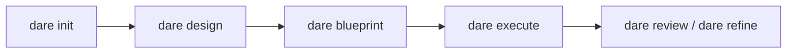

# Getting Started

O DARE Method é uma metodologia de desenvolvimento assistido por IA organizada em quatro fases — **D**esign · **A**rchitecture · **R**eview · **E**xecute. A CLI `dare` não chama nenhuma API de LLM: ela orquestra os artefatos e o grafo de tarefas, enquanto o agente roda dentro do seu IDE (Claude Code, Cursor ou Antigravity), onde você já está autenticado.

!!! info "O que esta página cobre"
    Instalação, `dare init` (interativo e não-interativo) com **todas** as flags reais, e `dare welcome`. No final, links para o fluxo greenfield e brownfield.

## Pré-requisitos

- **Node.js 18+** (a CLI é distribuída como pacote npm e usa ESM).
- Um IDE/agente compatível: Claude Code, Cursor ou Antigravity.
- Opcional, dependendo do scaffolding escolhido: Docker (para o toolchain `docker`/`auto`) e os CLIs nativos do stack (`composer`, `cargo`, `python`, `go`, etc.).

## Instalação

```bash
npm install -g @dewtech/dare-cli
```

Verifique a instalação:

```bash
dare --version
dare --help
```

!!! tip "Banner ASCII"
    O banner aparece em comandos elegíveis (`init`, `--version`). Para suprimi-lo em qualquer comando, use a flag global `--no-banner`.

## `dare init`

Inicializa um novo projeto DARE. Funciona em dois modos: **interativo** (perguntas via prompt) e **não-interativo** (tudo por flags, ideal para CI/scripts/smoke tests).

```bash
dare init [project-name] [opções]
```

| Flag | Tipo | Default | Descrição |
|------|------|---------|-----------|
| `[project-name]` | argumento | (pergunta) | Nome do projeto. Se omitido no modo interativo, é perguntado. |
| `--stack <id>` | string | — | ID do stack de backend; **pula** o prompt interativo e dispara o modo não-interativo. |
| `--mcp <language>` | string | — | Linguagem do servidor MCP: `node-ts` \| `python` \| `rust` \| `go`. Dispara o modo não-interativo. |
| `--transport <mode>` | string | `stdio` | Transporte MCP: `stdio` \| `sse` \| `http`. |
| `--toolchain <mode>` | string | `auto` | Toolchain de scaffolding: `native` \| `docker` \| `auto`. |
| `--non-interactive` | boolean | `false` | Falha em vez de perguntar; exige `--stack` ou `--mcp`. |

!!! note "Quando o modo não-interativo é ativado"
    A CLI entra no caminho não-interativo se **qualquer** de `--non-interactive`, `--stack` ou `--mcp` estiver presente. Caso contrário, abre o questionário interativo. (Referência: `packages/cli/src/commands/init.ts`.)

### Modo interativo

Sem flags de stack, `dare init` faz uma sequência de perguntas. As respostas e seus valores reais:

**1. Project structure** (`structure`)

| Opção | Valor |
|-------|-------|
| Monorepo (backend + frontend) | `monorepo` |
| Backend only | `backend` |
| Frontend only | `frontend` |
| MCP Server | `mcp-server` |

**2. Stack de backend** (`backend`) — só quando a estrutura não é `frontend` nem `mcp-server`

| Opção | Valor |
|-------|-------|
| Ruby / Rails 8 | `ruby-rails-8` |
| Rust / Axum | `rust-axum` |
| Node.js / NestJS | `node-nestjs` |
| Python / FastAPI | `python-fastapi` |
| PHP / Laravel | `php-laravel` |
| Go / Gin | `go-gin` |
| Go / stdlib (net/http, sem framework) | `go-stdlib` |

**3. Stack de frontend** (`frontend`) — só quando a estrutura não é `backend` nem `mcp-server`

| Opção | Valor |
|-------|-------|
| React 18+ (TypeScript) | `react` |
| Vue 3+ (Composition API) | `vue` |
| Leptos fullstack (Rust SSR + WASM) | `rust-leptos` |
| Leptos CSR-only (Rust WASM + trunk) | `rust-leptos-csr` |
| None (backend only) | `none` |

!!! note "Layout do workspace Rust"
    Quando você escolhe `monorepo` + `rust-axum` + (`rust-leptos` ou `rust-leptos-csr`), a CLI pergunta o **layout do workspace Cargo**: `single` (crates/server + crates/web, default) ou `multi` ({prefix}-core / {prefix}-server / {prefix}-web / {prefix}-cli). No modo `multi` há ainda uma pergunta de **prefixo de crate** (ex.: `ars`).

**4. Perguntas específicas de MCP** — só quando a estrutura é `mcp-server`

- **MCP server language** (`mcpLanguage`): `node-ts`, `python`, `rust` (beta), `go` (beta).
- **Transport type** (`mcpTransport`): `stdio`, `sse`, `http-stream`.
- **MCP capabilities** (`mcpFeatures`, múltipla escolha): `tools` (marcado por padrão), `resources`, `prompts`. Pelo menos uma é obrigatória.

**5. Primary IDE / Agent** (`ide`)

| Opção | Valor |
|-------|-------|
| Claude Code | `claude-code` |
| Cursor | `cursor` |
| Antigravity | `antigravity` |
| Cursor + Antigravity (Hybrid) | `hybrid` |
| Claude Code + Cursor (Hybrid) | `claude-hybrid` |

**6. GraphRAG backend** (`graphrag`)

| Opção | Valor |
|-------|-------|
| SQLite (recomendado — rápido, local) | `sqlite` |
| JSON Graph (simples, sem dependências) | `json` |
| Neo4j Docker (enterprise) | `neo4j` |

**7. DARE MCP Server** (`mcp`) — confirmação para habilitar o servidor MCP do DARE para consultas de contexto. Default: `true`.

**8. Toolchain** (`toolchain`)

| Opção | Valor |
|-------|-------|
| Auto — nativo se estiver no PATH, senão Docker (recomendado) | `auto` |
| Native only — exige o CLI no PATH (mais rápido, sem pull de imagens) | `native` |
| Docker only — sempre usa a imagem oficial (hermético) | `docker` |

### Modo não-interativo

Use flags para evitar qualquer prompt. Você precisa de `--stack <id>` **ou** `--mcp <language>`.

```bash
# Backend Rails, toolchain Docker
dare init minha-api --non-interactive --stack ruby-rails-8 --toolchain docker

# Servidor MCP em Python via HTTP
dare init meu-mcp --mcp python --transport http

# Backend Go (stdlib), defaults de toolchain (auto) e transport (stdio)
dare init svc --stack go-stdlib
```

**Stacks de backend válidos** (`--stack`): `ruby-rails-8`, `node-nestjs`, `python-fastapi`, `php-laravel`, `rust-axum`, `go-gin`, `go-stdlib`.

**Linguagens MCP válidas** (`--mcp`): `node-ts`, `python`, `rust`, `go`.

!!! warning "Validação"
    `--non-interactive` sem `--stack` nem `--mcp` falha com erro. Um `--stack` ou `--mcp` desconhecido também aborta, listando os valores válidos. No modo não-interativo os defaults aplicados são `ide: cursor`, `graphrag: sqlite`, `mcp: false`.

### O que `dare init` gera

A CLI roteia tudo por `generateProjectStructure` → scaffolders do registry, criando a estrutura do projeto conforme stack/estrutura escolhidos e imprimindo os próximos passos. Para um projeto MCP, ela sugere instalar dependências, `dare design`, `dare blueprint`, `dare execute --parallel` e testar com o MCP Inspector. Para os demais, sugere `dare design` → `dare blueprint` → `dare execute --parallel`.

!!! tip "Slash commands no Claude Code"
    Se o IDE escolhido for `claude-code` ou `claude-hybrid`, você pode usar `/dare-design`, `/dare-blueprint` e `/dare-execute` como slash commands.

## `dare welcome`

Mostra o banner de boas-vindas e um guia rápido. Força o banner mesmo fora de TTY.

```bash
dare welcome
```

Saída resumida:

```text
Quick start:
  dare new myapp --stack rails
  dare skill list
  dare skill add dare-ax

Docs:   https://docs.dare.dewtech.tech
GitHub: https://github.com/dewtech-technologies/dare-method
```

## Próximos passos



- **Projeto novo (greenfield):** veja [Greenfield](greenfield.md) — `design` → `blueprint` → `execute` → `review`/`refine`.
- **Projeto existente (brownfield):** comece com `dare discover` / `dare reverse` / `dare dna` para extrair fatos do código antes do design.
