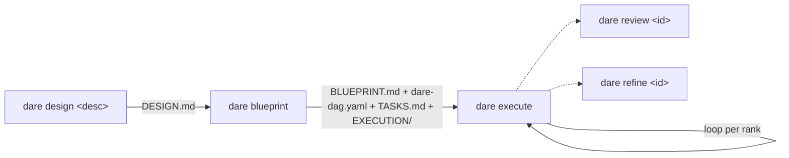
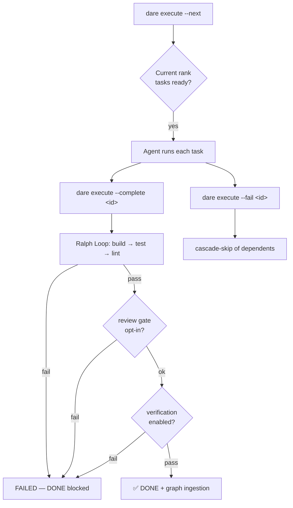

# Greenfield (New Project)

This is the end-to-end workflow for a project started from scratch with the DARE Method. Each phase produces versionable artifacts in `DARE/`, and your IDE's agent fills in the real content — the CLI only initializes, orders and validates.



## 1. Design — `dare design`

Generates `DARE/DESIGN.md` from a project description.

```bash
dare design "<descrição do projeto>" [--interactive]
```

| Flag | Type | Default | Description |
|------|------|---------|-----------|
| `<description>` | argument | (required) | Project description. |
| `--interactive` | boolean | `false` | Emits a deterministic planning questionnaire from the `dna`/`patterns` facts (no LLM). |

Without `--interactive`, it generates a static `DESIGN.md` with **Project Description / Goals / Constraints / Success Criteria** sections. With `--interactive`, the CLI reads `DARE/dna-facts.json` and `DARE/patterns-facts.json` (if they exist) and injects a questionnaire block into the document.

```bash
dare design "API de catálogo com auth JWT e busca full-text"
# → ✅ DESIGN.md created at .../DARE/DESIGN.md
# → Next: dare blueprint
```

!!! note "No LLM calls"
    `dare design` only writes the skeleton/questionnaire. The real filling is done by the IDE agent (slash command `/dare-design` or the `dare-design` skill). Reference: `packages/cli/src/commands/design.ts`.

## 2. Architecture — `dare blueprint`

Scaffolds the four architecture-phase artifacts from `DESIGN.md`.

```bash
dare blueprint [design-file] [-f|--force]
```

| Flag | Type | Default | Description |
|------|------|---------|-----------|
| `[design-file]` | argument | `DARE/DESIGN.md` | Path of the input DESIGN.md. |
| `-f, --force` | boolean | `false` | Overwrites existing files (by default, existing files are **preserved**). |

If `DESIGN.md` does not exist, the command aborts and suggests running `dare design` first. It creates:

| Artifact | Content |
|----------|----------|
| `DARE/BLUEPRINT.md` | Architecture specification (overview, stack, modules, API contracts, schema, strategy). |
| `DARE/dare-dag.yaml` | Task dependency graph in the canonical schema (`limits`, `models` per runner, `spec_file`, `subtask_prompt`). |
| `DARE/TASKS.md` | Human-readable task table with status. |
| `DARE/EXECUTION/task-*.md` | One spec per task (objective, dependencies, complexity, validation gates). |
| `DARE/dag-graph.mmd` | Mermaid visualization of the DAG (regenerated on each run from the YAML). |

```bash
dare blueprint
# → ✅ Files scaffolded (existing files preserved)
# → Next: dare execute --next
```

!!! note "dare-dag.yaml schema"
    Each task has `id`, `title`, `depends_on`, `complexity` (`LOW`/`MED`/`HIGH`), `spec_file` and `subtask_prompt`. The `limits` block carries `parent_context_chars: 2000`, `task_output_chars: 4000`, `timeout_seconds: 600`. The `models` block maps complexity → model per runner (`cursor`, `claude`, `antigravity`). The real task content is filled in by the agent (`/dare-blueprint` or the `dare-blueprint` skill).

## 3. Execute — `dare execute`

Orchestrates DAG execution. **The CLI does not run an LLM** — the IDE agent runs each task; this command coordinates: surfacing the next batch, persisting state, cascade-skip and rendering the canvas in `DARE/.canvas.md`.

```bash
dare execute [options]
```

| Flag | Type | Default | Description |
|------|------|---------|-----------|
| `--dag <file>` | string | `DARE/dare-dag.yaml` | Path of `dare-dag.yaml`. |
| `--next` | boolean | `false` | Prints the next executable batch (with composed prompts). |
| `--status` | boolean | `false` | Renders the canvas and shows the summary. **Default action** when no other flag is passed. |
| `--watch` | boolean | `false` | Streams task readiness (reprints on each state change). Implies `--next`. |
| `--complete <id>` | string | — | Marks a task as DONE (use with `--output`). Runs the Ralph Loop first. |
| `--fail <id>` | string | — | Marks a task as FAILED (use with `--reason`). Triggers cascade-skip. |
| `--reset <id>` | string | — | Reopens a task (back to PENDING) for retry. |
| `--output <text>` | string | — | Captured task output (with `--complete`). |
| `--reason <text>` | string | — | Failure reason (with `--fail`). |
| `--tokens <n>` | string | — | Tokens consumed (with `--complete`). |
| `--duration <ms>` | string | — | Task duration in ms (with `--complete`). |
| `--no-graph` | boolean | `false` | Skips knowledge graph ingestion on this call. |
| `--parallel-hint` | boolean | `false` | With `--next`, marks every same-rank task as RUNNING. |
| `--verify` | boolean | `false` | Runs the verification core after the Ralph Loop passes. |
| `--no-verify` | boolean | `false` | Skips verification even if enabled in `dare.config.json`. |
| `--full-mutation` | boolean | `false` | Disables incremental mutation on this completion. |
| `--verdict-json` | boolean | `false` | Emits the `LoopVerdict` as JSON to stdout. |
| `--best-of <n>` | string | — | Runs N verification candidates (best-of-N). |
| `--policy <p>` | string | — | Overrides the loop policy (`decay` \| `fixed`). |
| `--prerank` | boolean | `false` | Enables exec-free prerank ordering (never authorizes DONE). |

### How the execution flow works



Key points from `run_dag.ts` and `execute.ts`:

- **Topological ranks:** tasks are ordered by dependency (Kahn's algorithm). Same-rank tasks can run in parallel. `--next` shows only the lowest rank with ready tasks.
- **The Ralph Loop is mandatory:** there is no opt-out. A task only becomes DONE after **build → test → lint** pass for the project's stack. If the loop fails, the task is marked FAILED and DONE is blocked — fix it and use `--reset` before trying again.
- **Optional review gate:** if `dare.config.json#review.onComplete` is `true`, `dare review` runs before DONE and can block (it detects mocks/stubs/TODOs that build/test/lint don't catch).
- **Optional verification:** with `--verify` or enabled in config, it runs the verification core; `--best-of <n>` runs N candidates and picks the best.
- **Cascade-skip:** failing a task automatically marks its (PENDING) dependents as SKIPPED.
- **State and canvas:** state lives in `DARE/.dag-state/state.json` (via the state-store) and the human-readable canvas in `DARE/.canvas.md`.

### End-to-end walkthrough

```bash
# 0. Inicialize o projeto
dare init catalogo --non-interactive --stack python-fastapi

# 1. Design
dare design "API de catálogo com auth JWT e busca full-text"

# 2. Blueprint (scaffold dos artefatos a partir do DESIGN.md)
dare blueprint

# 3. Veja o status inicial (ação default, sem flags)
dare execute
# → 📊 mostra DONE/RUNNING/PENDING/FAILED/SKIPPED + caminho do canvas

# 4. Peça o próximo lote executável
dare execute --next
# → 📦 Rank 0 — N task(s) ready in parallel, com os prompts compostos
#    (o agente do IDE executa cada uma)

# 5. Ao concluir uma task, marque DONE (roda o Ralph Loop antes)
dare execute --complete task-001 --output "Dockerfile + compose + /healthz 200" --duration 42000

# 6. Se uma task falhar no agente, registre a falha (cascade-skip dos dependentes)
dare execute --fail task-003 --reason "schema de migração inválido"

# 7. Reabra uma task para retry
dare execute --reset task-003

# 8. Avance para o próximo rank
dare execute --next

# Variações úteis:
dare execute --next --parallel-hint           # marca o rank inteiro como RUNNING
dare execute --watch                           # stream contínuo da prontidão
dare execute --complete task-004 --verify      # roda verification após o Ralph Loop
dare execute --complete task-004 --best-of 3   # best-of-N na verificação
dare execute --complete task-004 --policy fixed --verdict-json
```

!!! tip "Loop per rank"
    The natural cycle is: `--next` → the agent executes → `--complete`/`--fail` for each task → `--next` again when the rank finishes. Repeat until `--status` shows everything resolved.

## 4. Review — `dare review`

Audits a task for stubs, mocks, TODOs and empty functions (static analysis), with an optional semantic verdict coming from the IDE agent.

```bash
dare review <task-id> [options]
```

| Flag | Type | Default | Description |
|------|------|---------|-----------|
| `<task-id>` | argument | (required) | Task ID (e.g. `task-001`); looks up `DARE/EXECUTION/<id>.md`. |
| `--strict` | boolean | `false` | Treats warnings as errors (CI-friendly). |
| `--errors-only` | boolean | `false` | Suppresses warnings in the human output. |
| `--files <files...>` | list | — | Explicit list of files to analyze (ignores spec/git). |
| `--from-agent <path>` | string | — | Path to JSON with a `SemanticVerdict` produced by the IDE agent. |
| `--format <fmt>` | string | `human` | Output: `human` \| `json`. |

**Exit codes:** `0` no errors (warnings tolerated, except with `--strict`); `1` with at least one error or a failed semantic verdict.

```bash
dare review task-005
dare review task-005 --strict --format json   # pre-commit / CI
dare review task-005 --files src/auth.py src/tokens.py
```

## 5. Refine — `dare refine`

Measures a task's complexity and, optionally, proposes breaking it into sub-tasks.

```bash
dare refine <task-id> [options]
```

| Flag | Type | Default | Description |
|------|------|---------|-----------|
| `<task-id>` | argument | (required) | Task ID (e.g. `task-001`). |
| `--split` | boolean | `false` | Emits a proposal to break it into sub-tasks. |
| `--apply` | boolean | `false` | Applies the split: marks the original task as SPLIT in `DARE/TASKS.md`. |
| `--strict` | boolean | `false` | Exit code `2` when complexity is HIGH/CRITICAL (CI-friendly). |
| `--format <fmt>` | string | `human` | Output: `human` \| `json`. |
| `--from-agent <path>` | string | — | JSON with a `RefineVerdict` produced by the IDE agent. |

**Exit codes:** `0` manageable task (LOW/MED) or split applied; `1` I/O error; `2` HIGH/CRITICAL task with `--strict`.

```bash
dare refine task-003 --split
dare refine task-003 --split --apply       # annotates TASKS.md with the split marker
dare refine task-003 --strict              # fails in CI if it is HIGH/CRITICAL
```

!!! note "Refine proposes, it does not rewrite the DAG"
    `--apply` only annotates `TASKS.md` with an idempotent marker. The coherent regeneration of the sub-task specs is done by the `/dare-refine` skill in the IDE, which has the necessary context. Reference: `packages/cli/src/commands/refine.ts`.

## Cycle summary

| Phase | Command | Artifact/effect |
|------|---------|-----------------|
| Design | `dare design "<desc>"` | `DARE/DESIGN.md` |
| Architecture | `dare blueprint` | `BLUEPRINT.md`, `dare-dag.yaml`, `TASKS.md`, `EXECUTION/`, `dag-graph.mmd` |
| Execute | `dare execute --next` / `--complete` / `--fail` | DAG state + canvas; Ralph Loop on each DONE |
| Review | `dare review <id>` | Static audit + semantic verdict |
| Refine | `dare refine <id>` | Complexity score + split proposal |
