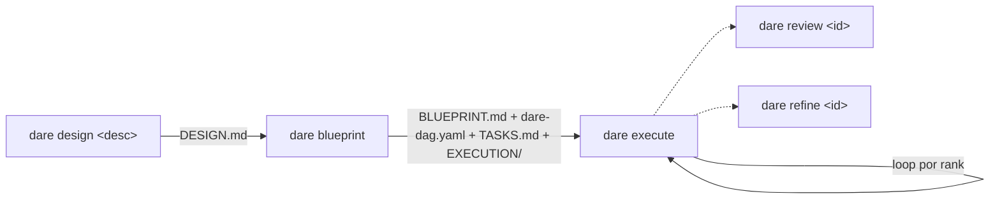
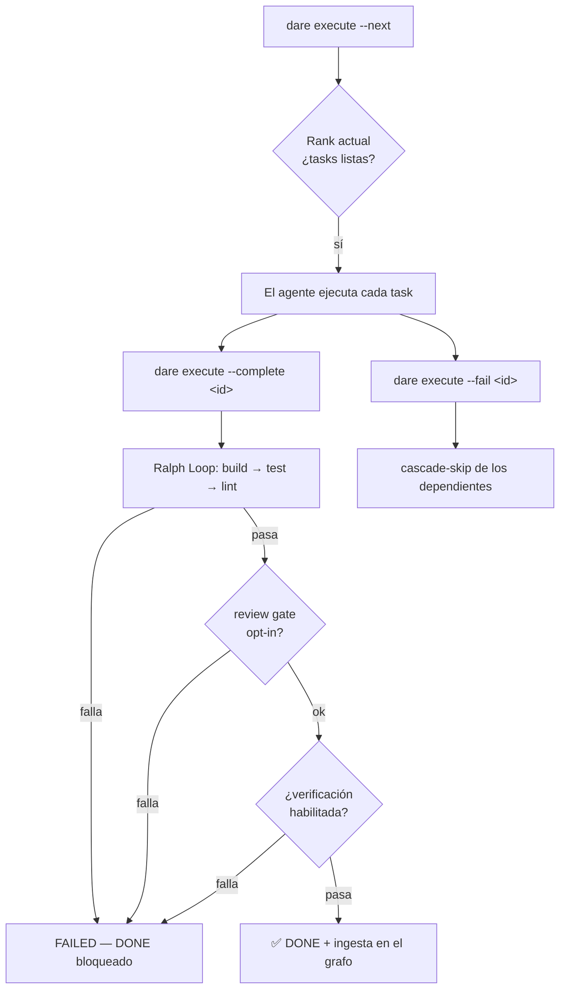

# Greenfield (Proyecto Nuevo)

Este es el flujo de extremo a extremo para un proyecto empezado desde cero con el DARE Method. Cada fase produce artefactos versionables en `DARE/`, y el agente de tu IDE rellena el contenido real — el CLI solo inicializa, ordena y valida.



## 1. Design — `dare design`

Genera `DARE/DESIGN.md` a partir de una descripción del proyecto.

```bash
dare design "<descrição do projeto>" [--interactive]
```

| Flag | Tipo | Default | Descripción |
|------|------|---------|-----------|
| `<description>` | argumento | (obligatorio) | Descripción del proyecto. |
| `--interactive` | boolean | `false` | Emite un cuestionario de planificación determinista a partir de los hechos de `dna`/`patterns` (sin LLM). |

Sin `--interactive`, genera un `DESIGN.md` estático con secciones **Project Description / Goals / Constraints / Success Criteria**. Con `--interactive`, el CLI lee `DARE/dna-facts.json` y `DARE/patterns-facts.json` (si existen) e inyecta un bloque de cuestionario en el documento.

```bash
dare design "API de catálogo com auth JWT e busca full-text"
# → ✅ DESIGN.md created at .../DARE/DESIGN.md
# → Next: dare blueprint
```

!!! note "Sin llamadas de LLM"
    `dare design` solo escribe el esqueleto/cuestionario. El relleno real lo hace el agente del IDE (slash command `/dare-design` o la skill `dare-design`). Referencia: `packages/cli/src/commands/design.ts`.

## 2. Architecture — `dare blueprint`

Hace el scaffold de los cuatro artefactos de la fase de arquitectura a partir del `DESIGN.md`.

```bash
dare blueprint [design-file] [-f|--force]
```

| Flag | Tipo | Default | Descripción |
|------|------|---------|-----------|
| `[design-file]` | argumento | `DARE/DESIGN.md` | Ruta del DESIGN.md de entrada. |
| `-f, --force` | boolean | `false` | Sobrescribe archivos existentes (por defecto, los archivos existentes se **preservan**). |

Si el `DESIGN.md` no existe, el comando aborta y sugiere ejecutar `dare design` antes. Crea:

| Artefacto | Contenido |
|----------|----------|
| `DARE/BLUEPRINT.md` | Especificación de arquitectura (overview, stack, módulos, contratos de API, schema, estrategia). |
| `DARE/dare-dag.yaml` | Grafo de dependencias de tareas en el schema canónico (`limits`, `models` por runner, `spec_file`, `subtask_prompt`). |
| `DARE/TASKS.md` | Tabla legible de tareas con status. |
| `DARE/EXECUTION/task-*.md` | Una spec por tarea (objetivo, dependencias, complejidad, gates de validación). |
| `DARE/dag-graph.mmd` | Visualización Mermaid del DAG (regenerada en cada run a partir del YAML). |

```bash
dare blueprint
# → ✅ Files scaffolded (existing files preserved)
# → Next: dare execute --next
```

!!! note "Schema de dare-dag.yaml"
    Cada task tiene `id`, `title`, `depends_on`, `complexity` (`LOW`/`MED`/`HIGH`), `spec_file` y `subtask_prompt`. El bloque `limits` trae `parent_context_chars: 2000`, `task_output_chars: 4000`, `timeout_seconds: 600`. El bloque `models` mapea complejidad → modelo por runner (`cursor`, `claude`, `antigravity`). El contenido real de las tasks lo rellena el agente (`/dare-blueprint` o la skill `dare-blueprint`).

## 3. Execute — `dare execute`

Orquesta la ejecución del DAG. **El CLI no ejecuta LLM** — el agente del IDE ejecuta cada task; este comando coordina: surfacing del siguiente lote, persistencia de estado, cascade-skip y renderizado del canvas en `DARE/.canvas.md`.

```bash
dare execute [opciones]
```

| Flag | Tipo | Default | Descripción |
|------|------|---------|-----------|
| `--dag <file>` | string | `DARE/dare-dag.yaml` | Ruta del `dare-dag.yaml`. |
| `--next` | boolean | `false` | Imprime el siguiente lote ejecutable (con prompts compuestos). |
| `--status` | boolean | `false` | Renderiza el canvas y muestra el resumen. **Acción por defecto** cuando no se pasa ninguna otra flag. |
| `--watch` | boolean | `false` | Hace stream de la disponibilidad de las tasks (reimprime en cada cambio de estado). Implica `--next`. |
| `--complete <id>` | string | — | Marca una task como DONE (usa con `--output`). Ejecuta el Ralph Loop antes. |
| `--fail <id>` | string | — | Marca una task como FAILED (usa con `--reason`). Dispara cascade-skip. |
| `--reset <id>` | string | — | Reabre una task (vuelve a PENDING) para retry. |
| `--output <text>` | string | — | Output capturado de la task (con `--complete`). |
| `--reason <text>` | string | — | Motivo del fallo (con `--fail`). |
| `--tokens <n>` | string | — | Tokens consumidos (con `--complete`). |
| `--duration <ms>` | string | — | Duración de la task en ms (con `--complete`). |
| `--no-graph` | boolean | `false` | Omite la ingesta en el knowledge graph en esta llamada. |
| `--parallel-hint` | boolean | `false` | Con `--next`, marca toda task del mismo rank como RUNNING. |
| `--verify` | boolean | `false` | Ejecuta el verification core después de que el Ralph Loop pase. |
| `--no-verify` | boolean | `false` | Omite la verificación aunque esté habilitada en `dare.config.json`. |
| `--full-mutation` | boolean | `false` | Deshabilita la mutación incremental en esta finalización. |
| `--verdict-json` | boolean | `false` | Emite el `LoopVerdict` como JSON en stdout. |
| `--best-of <n>` | string | — | Ejecuta N candidatos de verificación (best-of-N). |
| `--policy <p>` | string | — | Sobrescribe la policy del loop (`decay` \| `fixed`). |
| `--prerank` | boolean | `false` | Habilita el ordenamiento prerank exec-free (nunca autoriza DONE). |

### Cómo funciona el flujo de ejecución



Puntos clave de `run_dag.ts` y `execute.ts`:

- **Ranks topológicos:** las tasks se ordenan por dependencia (algoritmo de Kahn). Las tasks del mismo rank pueden ejecutarse en paralelo. `--next` muestra solo el rank más bajo con tasks listas.
- **El Ralph Loop es obligatorio:** no hay opt-out. Una task solo pasa a DONE después de que **build → test → lint** pasen para el stack del proyecto. Si el loop falla, la task se marca FAILED y DONE queda bloqueado — corrígelo y usa `--reset` antes de intentarlo de nuevo.
- **Review gate opcional:** si `dare.config.json#review.onComplete` es `true`, `dare review` se ejecuta antes del DONE y puede bloquear (detecta mocks/stubs/TODOs que build/test/lint no capturan).
- **Verificación opcional:** con `--verify` o habilitada en config, ejecuta el verification core; `--best-of <n>` ejecuta N candidatos y elige el mejor.
- **Cascade-skip:** fallar una task marca sus dependientes (PENDING) como SKIPPED automáticamente.
- **Estado y canvas:** el estado vive en `DARE/.dag-state/state.json` (vía state-store) y el canvas legible en `DARE/.canvas.md`.

### Walkthrough de extremo a extremo

```bash
# 0. Inicialize o projeto
dare init catalogo --non-interactive --stack python-fastapi

# 1. Design
dare design "API de catálogo com auth JWT e busca full-text"

# 2. Blueprint (scaffold dos artefatos a partir do DESIGN.md)
dare blueprint

# 3. Veja o status inicial (ação default, sem flags)
dare execute
# → 📊 mostra DONE/RUNNING/PENDING/FAILED/SKIPPED + caminho do canvas

# 4. Peça o próximo lote executável
dare execute --next
# → 📦 Rank 0 — N task(s) ready in parallel, com os prompts compostos
#    (o agente do IDE executa cada uma)

# 5. Ao concluir uma task, marque DONE (roda o Ralph Loop antes)
dare execute --complete task-001 --output "Dockerfile + compose + /healthz 200" --duration 42000

# 6. Se uma task falhar no agente, registre a falha (cascade-skip dos dependentes)
dare execute --fail task-003 --reason "schema de migração inválido"

# 7. Reabra uma task para retry
dare execute --reset task-003

# 8. Avance para o próximo rank
dare execute --next

# Variações úteis:
dare execute --next --parallel-hint           # marca o rank inteiro como RUNNING
dare execute --watch                           # stream contínuo da prontidão
dare execute --complete task-004 --verify      # roda verification após o Ralph Loop
dare execute --complete task-004 --best-of 3   # best-of-N na verificação
dare execute --complete task-004 --policy fixed --verdict-json
```

!!! tip "Loop por rank"
    El ciclo natural es: `--next` → el agente ejecuta → `--complete`/`--fail` para cada task → `--next` de nuevo cuando el rank termine. Repite hasta que `--status` muestre todo resuelto.

## 4. Review — `dare review`

Audita una task en busca de stubs, mocks, TODOs y funciones vacías (análisis estático), con veredicto semántico opcional proveniente del agente del IDE.

```bash
dare review <task-id> [opciones]
```

| Flag | Tipo | Default | Descripción |
|------|------|---------|-----------|
| `<task-id>` | argumento | (obligatorio) | ID de la task (ej.: `task-001`); busca `DARE/EXECUTION/<id>.md`. |
| `--strict` | boolean | `false` | Trata los warnings como errors (CI-friendly). |
| `--errors-only` | boolean | `false` | Suprime los warnings en la salida humana. |
| `--files <files...>` | lista | — | Lista explícita de archivos a analizar (ignora spec/git). |
| `--from-agent <path>` | string | — | Ruta a un JSON con `SemanticVerdict` producido por el agente del IDE. |
| `--format <fmt>` | string | `human` | Salida: `human` \| `json`. |

**Exit codes:** `0` sin errores (warnings tolerados, excepto con `--strict`); `1` con al menos un error o veredicto semántico fallido.

```bash
dare review task-005
dare review task-005 --strict --format json   # pre-commit / CI
dare review task-005 --files src/auth.py src/tokens.py
```

## 5. Refine — `dare refine`

Mide la complejidad de una task y, opcionalmente, propone su división en sub-tasks.

```bash
dare refine <task-id> [opciones]
```

| Flag | Tipo | Default | Descripción |
|------|------|---------|-----------|
| `<task-id>` | argumento | (obligatorio) | ID de la task (ej.: `task-001`). |
| `--split` | boolean | `false` | Emite una propuesta de división en sub-tasks. |
| `--apply` | boolean | `false` | Aplica el split: marca la task original como SPLIT en `DARE/TASKS.md`. |
| `--strict` | boolean | `false` | Exit code `2` cuando la complejidad sea HIGH/CRITICAL (CI-friendly). |
| `--format <fmt>` | string | `human` | Salida: `human` \| `json`. |
| `--from-agent <path>` | string | — | JSON con `RefineVerdict` producido por el agente del IDE. |

**Exit codes:** `0` task manejable (LOW/MED) o split aplicado; `1` error de I/O; `2` task HIGH/CRITICAL con `--strict`.

```bash
dare refine task-003 --split
dare refine task-003 --split --apply       # anota TASKS.md con el marcador de split
dare refine task-003 --strict              # falla en CI si es HIGH/CRITICAL
```

!!! note "Refine propone, no reescribe el DAG"
    `--apply` solo anota `TASKS.md` con un marcador idempotente. La regeneración coherente de las specs de sub-task la hace la skill `/dare-refine` en el IDE, que tiene el contexto necesario. Referencia: `packages/cli/src/commands/refine.ts`.

## Resumen del ciclo

| Fase | Comando | Artefacto/efecto |
|------|---------|-----------------|
| Design | `dare design "<desc>"` | `DARE/DESIGN.md` |
| Architecture | `dare blueprint` | `BLUEPRINT.md`, `dare-dag.yaml`, `TASKS.md`, `EXECUTION/`, `dag-graph.mmd` |
| Execute | `dare execute --next` / `--complete` / `--fail` | Estado del DAG + canvas; Ralph Loop en cada DONE |
| Review | `dare review <id>` | Auditoría estática + veredicto semántico |
| Refine | `dare refine <id>` | Score de complejidad + propuesta de split |
