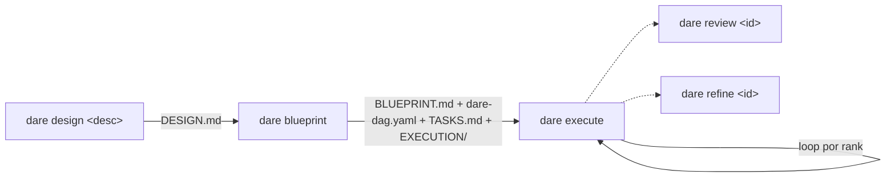
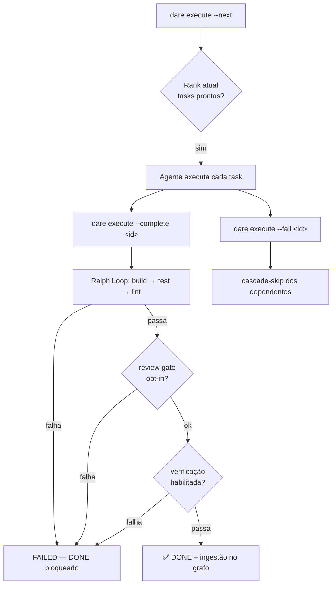

# Greenfield (Projeto Novo)

Este é o fluxo ponta-a-ponta para um projeto começado do zero com o DARE Method. Cada fase produz artefatos versionáveis em `DARE/`, e o agente do seu IDE preenche o conteúdo real — a CLI só inicializa, ordena e valida.



## 1. Design — `dare design`

Gera `DARE/DESIGN.md` a partir de uma descrição do projeto.

```bash
dare design "<descrição do projeto>" [--interactive]
```

| Flag | Tipo | Default | Descrição |
|------|------|---------|-----------|
| `<description>` | argumento | (obrigatório) | Descrição do projeto. |
| `--interactive` | boolean | `false` | Emite um questionário de planejamento determinístico a partir dos fatos de `dna`/`patterns` (sem LLM). |

Sem `--interactive`, gera um `DESIGN.md` estático com seções **Project Description / Goals / Constraints / Success Criteria**. Com `--interactive`, a CLI lê `DARE/dna-facts.json` e `DARE/patterns-facts.json` (se existirem) e injeta um bloco de questionário no documento.

```bash
dare design "API de catálogo com auth JWT e busca full-text"
# → ✅ DESIGN.md created at .../DARE/DESIGN.md
# → Next: dare blueprint
```

!!! note "Sem chamadas de LLM"
    `dare design` apenas escreve o esqueleto/questionário. O preenchimento real é feito pelo agente IDE (slash command `/dare-design` ou a skill `dare-design`). Referência: `packages/cli/src/commands/design.ts`.

## 2. Architecture — `dare blueprint`

Faz o scaffold dos quatro artefatos da fase de arquitetura a partir do `DESIGN.md`.

```bash
dare blueprint [design-file] [-f|--force]
```

| Flag | Tipo | Default | Descrição |
|------|------|---------|-----------|
| `[design-file]` | argumento | `DARE/DESIGN.md` | Caminho do DESIGN.md de entrada. |
| `-f, --force` | boolean | `false` | Sobrescreve arquivos existentes (por padrão, arquivos existentes são **preservados**). |

Se o `DESIGN.md` não existir, o comando aborta e sugere rodar `dare design` antes. Ele cria:

| Artefato | Conteúdo |
|----------|----------|
| `DARE/BLUEPRINT.md` | Especificação de arquitetura (overview, stack, módulos, contratos de API, schema, estratégia). |
| `DARE/dare-dag.yaml` | Grafo de dependências de tarefas no schema canônico (`limits`, `models` por runner, `spec_file`, `subtask_prompt`). |
| `DARE/TASKS.md` | Tabela legível de tarefas com status. |
| `DARE/EXECUTION/task-*.md` | Uma spec por tarefa (objetivo, dependências, complexidade, gates de validação). |
| `DARE/dag-graph.mmd` | Visualização Mermaid do DAG (regenerada a cada run a partir do YAML). |

```bash
dare blueprint
# → ✅ Files scaffolded (existing files preserved)
# → Next: dare execute --next
```

!!! note "Schema do dare-dag.yaml"
    Cada task tem `id`, `title`, `depends_on`, `complexity` (`LOW`/`MED`/`HIGH`), `spec_file` e `subtask_prompt`. O bloco `limits` traz `parent_context_chars: 2000`, `task_output_chars: 4000`, `timeout_seconds: 600`. O bloco `models` mapeia complexidade → modelo por runner (`cursor`, `claude`, `antigravity`). O conteúdo real das tasks é preenchido pelo agente (`/dare-blueprint` ou skill `dare-blueprint`).

## 3. Execute — `dare execute`

Orquestra a execução do DAG. **A CLI não executa LLM** — o agente do IDE roda cada task; este comando coordena: surfacing do próximo lote, gravação de estado, cascade-skip e renderização do canvas em `DARE/.canvas.md`.

```bash
dare execute [opções]
```

| Flag | Tipo | Default | Descrição |
|------|------|---------|-----------|
| `--dag <file>` | string | `DARE/dare-dag.yaml` | Caminho do `dare-dag.yaml`. |
| `--next` | boolean | `false` | Imprime o próximo lote executável (com prompts compostos). |
| `--status` | boolean | `false` | Renderiza o canvas e mostra o resumo. **Ação default** quando nenhuma outra flag é passada. |
| `--watch` | boolean | `false` | Faz stream da prontidão das tasks (reimprime a cada mudança de estado). Implica `--next`. |
| `--complete <id>` | string | — | Marca uma task como DONE (use com `--output`). Roda o Ralph Loop antes. |
| `--fail <id>` | string | — | Marca uma task como FAILED (use com `--reason`). Dispara cascade-skip. |
| `--reset <id>` | string | — | Reabre uma task (volta para PENDING) para retry. |
| `--output <text>` | string | — | Output capturado da task (com `--complete`). |
| `--reason <text>` | string | — | Motivo da falha (com `--fail`). |
| `--tokens <n>` | string | — | Tokens consumidos (com `--complete`). |
| `--duration <ms>` | string | — | Duração da task em ms (com `--complete`). |
| `--no-graph` | boolean | `false` | Pula ingestão no knowledge graph nesta chamada. |
| `--parallel-hint` | boolean | `false` | Com `--next`, marca toda task de mesmo rank como RUNNING. |
| `--verify` | boolean | `false` | Roda o verification core após o Ralph Loop passar. |
| `--no-verify` | boolean | `false` | Pula verificação mesmo se habilitada em `dare.config.json`. |
| `--full-mutation` | boolean | `false` | Desabilita mutação incremental nesta conclusão. |
| `--verdict-json` | boolean | `false` | Emite o `LoopVerdict` como JSON no stdout. |
| `--best-of <n>` | string | — | Roda N candidatos de verificação (best-of-N). |
| `--policy <p>` | string | — | Sobrescreve a policy do loop (`decay` \| `fixed`). |
| `--prerank` | boolean | `false` | Habilita ordenação prerank exec-free (nunca autoriza DONE). |

### Como o fluxo de execução funciona



Pontos-chave do `run_dag.ts` e `execute.ts`:

- **Ranks topológicos:** tasks são ordenadas por dependência (algoritmo de Kahn). Tasks de mesmo rank podem rodar em paralelo. `--next` mostra apenas o rank mais baixo com tasks prontas.
- **Ralph Loop é obrigatório:** não há opt-out. Uma task só vira DONE depois de **build → test → lint** passarem para o stack do projeto. Se o loop falhar, a task é marcada FAILED e DONE é bloqueado — corrija e use `--reset` antes de tentar de novo.
- **Review gate opcional:** se `dare.config.json#review.onComplete` for `true`, `dare review` roda antes do DONE e pode bloquear (detecta mocks/stubs/TODOs que build/test/lint não pegam).
- **Verificação opcional:** com `--verify` ou habilitada em config, roda o verification core; `--best-of <n>` roda N candidatos e escolhe o melhor.
- **Cascade-skip:** falhar uma task marca seus dependentes (PENDING) como SKIPPED automaticamente.
- **Estado e canvas:** o estado vive em `DARE/.dag-state/state.json` (via state-store) e o canvas legível em `DARE/.canvas.md`.

### Walkthrough ponta-a-ponta

```bash
# 0. Inicialize o projeto
dare init catalogo --non-interactive --stack python-fastapi

# 1. Design
dare design "API de catálogo com auth JWT e busca full-text"

# 2. Blueprint (scaffold dos artefatos a partir do DESIGN.md)
dare blueprint

# 3. Veja o status inicial (ação default, sem flags)
dare execute
# → 📊 mostra DONE/RUNNING/PENDING/FAILED/SKIPPED + caminho do canvas

# 4. Peça o próximo lote executável
dare execute --next
# → 📦 Rank 0 — N task(s) ready in parallel, com os prompts compostos
#    (o agente do IDE executa cada uma)

# 5. Ao concluir uma task, marque DONE (roda o Ralph Loop antes)
dare execute --complete task-001 --output "Dockerfile + compose + /healthz 200" --duration 42000

# 6. Se uma task falhar no agente, registre a falha (cascade-skip dos dependentes)
dare execute --fail task-003 --reason "schema de migração inválido"

# 7. Reabra uma task para retry
dare execute --reset task-003

# 8. Avance para o próximo rank
dare execute --next

# Variações úteis:
dare execute --next --parallel-hint           # marca o rank inteiro como RUNNING
dare execute --watch                           # stream contínuo da prontidão
dare execute --complete task-004 --verify      # roda verification após o Ralph Loop
dare execute --complete task-004 --best-of 3   # best-of-N na verificação
dare execute --complete task-004 --policy fixed --verdict-json
```

!!! tip "Loop por rank"
    O ciclo natural é: `--next` → o agente executa → `--complete`/`--fail` para cada task → `--next` de novo quando o rank terminar. Repita até `--status` mostrar tudo resolvido.

## 4. Review — `dare review`

Audita uma task em busca de stubs, mocks, TODOs e funções vazias (análise estática), com verdito semântico opcional vindo do agente IDE.

```bash
dare review <task-id> [opções]
```

| Flag | Tipo | Default | Descrição |
|------|------|---------|-----------|
| `<task-id>` | argumento | (obrigatório) | ID da task (ex.: `task-001`); busca `DARE/EXECUTION/<id>.md`. |
| `--strict` | boolean | `false` | Trata warnings como errors (CI-friendly). |
| `--errors-only` | boolean | `false` | Suprime warnings na saída humana. |
| `--files <files...>` | lista | — | Lista explícita de arquivos a analisar (ignora spec/git). |
| `--from-agent <path>` | string | — | Caminho para JSON com `SemanticVerdict` produzido pelo agente IDE. |
| `--format <fmt>` | string | `human` | Saída: `human` \| `json`. |

**Exit codes:** `0` sem erros (warnings tolerados, exceto com `--strict`); `1` com pelo menos um erro ou verdito semântico falho.

```bash
dare review task-005
dare review task-005 --strict --format json   # pre-commit / CI
dare review task-005 --files src/auth.py src/tokens.py
```

## 5. Refine — `dare refine`

Mede a complexidade de uma task e, opcionalmente, propõe a quebra em sub-tasks.

```bash
dare refine <task-id> [opções]
```

| Flag | Tipo | Default | Descrição |
|------|------|---------|-----------|
| `<task-id>` | argumento | (obrigatório) | ID da task (ex.: `task-001`). |
| `--split` | boolean | `false` | Emite uma proposta de quebra em sub-tasks. |
| `--apply` | boolean | `false` | Aplica o split: marca a task original como SPLIT em `DARE/TASKS.md`. |
| `--strict` | boolean | `false` | Exit code `2` quando a complexidade for HIGH/CRITICAL (CI-friendly). |
| `--format <fmt>` | string | `human` | Saída: `human` \| `json`. |
| `--from-agent <path>` | string | — | JSON com `RefineVerdict` produzido pelo agente IDE. |

**Exit codes:** `0` task manuseável (LOW/MED) ou split aplicado; `1` erro de I/O; `2` task HIGH/CRITICAL com `--strict`.

```bash
dare refine task-003 --split
dare refine task-003 --split --apply       # anota TASKS.md com o marcador de split
dare refine task-003 --strict              # falha em CI se for HIGH/CRITICAL
```

!!! note "Refine propõe, não reescreve o DAG"
    `--apply` apenas anota `TASKS.md` com um marcador idempotente. A regeneração coerente das specs de sub-task é feita pela skill `/dare-refine` no IDE, que tem o contexto necessário. Referência: `packages/cli/src/commands/refine.ts`.

## Resumo do ciclo

| Fase | Comando | Artefato/efeito |
|------|---------|-----------------|
| Design | `dare design "<desc>"` | `DARE/DESIGN.md` |
| Architecture | `dare blueprint` | `BLUEPRINT.md`, `dare-dag.yaml`, `TASKS.md`, `EXECUTION/`, `dag-graph.mmd` |
| Execute | `dare execute --next` / `--complete` / `--fail` | Estado do DAG + canvas; Ralph Loop em cada DONE |
| Review | `dare review <id>` | Auditoria estática + verdito semântico |
| Refine | `dare refine <id>` | Score de complexidade + proposta de split |
