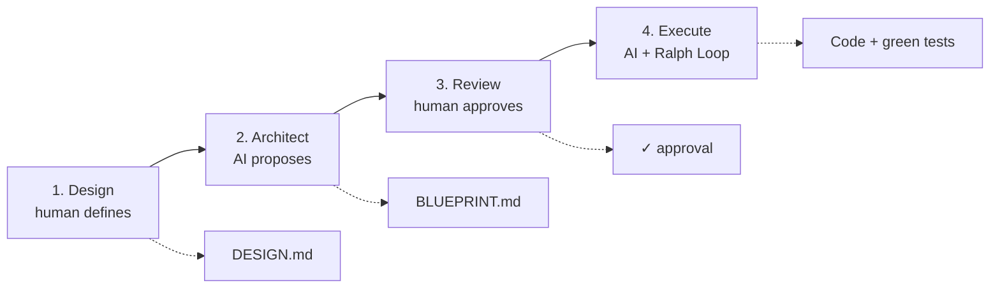

# DARE Method

> **Design. Architect. Review. Execute.**
> Methodology + CLI for AI-assisted software development, with **mandatory human checkpoints**.

DARE separates **strategy (human)** from **tactics (AI)** with explicit checkpoints: the human defines *what* and *why* and approves the plan; the AI implements *how*, iterating until tests/lint/types pass (the **Ralph Loop**).



| Phase | What | Who | Output |
|---|---|---|---|
| **Design** | the problem and the success criteria | human (AI assists) | `DARE/DESIGN.md` |
| **Architect** | architecture, contracts and tasks | AI proposes, human validates | `DARE/BLUEPRINT.md` |
| **Review** | explicit approval before spending tokens | human | ✓ approval |
| **Execute** | task-by-task implementation with the Ralph Loop | AI | code + green tests |

## Start here

<div class="grid cards" markdown>

- :material-rocket-launch: **[Getting Started](getting-started.md)** — install the CLI and run `dare init`.
- :material-sprout: **[Greenfield](greenfield.md)** — new project: design → blueprint → execute.
- :material-history: **[Brownfield](brownfield.md)** — legacy project: discover, reverse, dna, patterns, migrate.
- :material-cog: **[Configuration](configuration.md)** — the entire `dare.config.json`.
- :material-console: **[CLI Reference](cli-reference.md)** — every command and flag.
- :material-graph: **[Knowledge Graph](knowledge-graph.md)** — the project's knowledge graph.

</div>

## Quick install

```bash
npm install -g @dewtech/dare-cli
dare init meu-projeto
cd meu-projeto
dare design "Quero uma API de autenticação JWT"
```

## What's new

- **v3.7.0 — Brownfield Discovery:** deterministic auto-discovery of patterns (`dare patterns`) + lightweight planners.
- **v3.6.0 — Agent Hooks + Steering:** event-driven automations + pattern injection via MCP.
- **v3.5.0 — Dual Graph:** Requirement↔Code graph + `dare graph owners/impact/trace/locate`.
- **v3.4.0 — Security Hardening:** hardened MCP server + publish with provenance.
- **v3.3.0 — Reliable Verification Core:** mutation testing, fail-to-pass, decay policy, best-of-N and `dare bench`.

Details for each release in the [CHANGELOG](https://github.com/dewtech-technologies/dare-method/blob/main/CHANGELOG.md).
