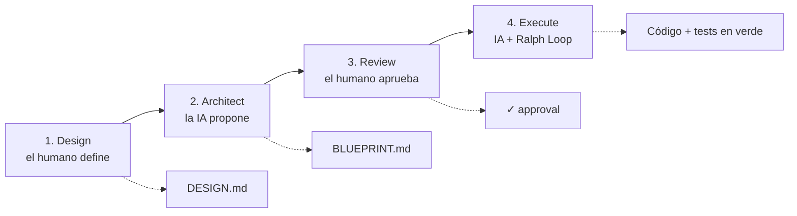

# DARE Method

> **Design. Architect. Review. Execute.**
> Metodología + CLI para desarrollo de software asistido por IA, con **checkpoints humanos obligatorios**.

DARE separa **estrategia (humano)** de **táctica (IA)** con checkpoints explícitos: el humano define *qué* y *por qué* y aprueba el plan; la IA implementa *cómo*, iterando hasta que los tests/lint/types pasen (el **Ralph Loop**).



| Fase | Qué | Quién | Salida |
|---|---|---|---|
| **Design** | el problema y los criterios de éxito | humano (la IA asiste) | `DARE/DESIGN.md` |
| **Architect** | arquitectura, contratos y tasks | la IA propone, el humano valida | `DARE/BLUEPRINT.md` |
| **Review** | aprobación explícita antes de gastar tokens | humano | ✓ approval |
| **Execute** | implementación task a task con el Ralph Loop | IA | código + tests en verde |

## Empieza por aquí

<div class="grid cards" markdown>

- :material-rocket-launch: **[Primeros pasos](getting-started.md)** — instala el CLI y ejecuta `dare init`.
- :material-sprout: **[Greenfield](greenfield.md)** — proyecto nuevo: design → blueprint → execute.
- :material-history: **[Brownfield](brownfield.md)** — proyecto heredado: discover, reverse, dna, patterns, migrate.
- :material-cog: **[Configuración](configuration.md)** — el `dare.config.json` completo.
- :material-console: **[Referencia del CLI](cli-reference.md)** — todos los comandos y flags.
- :material-graph: **[Knowledge Graph](knowledge-graph.md)** — el grafo de conocimiento del proyecto.

</div>

## Instalación rápida

```bash
npm install -g @dewtech/dare-cli
dare init meu-projeto
cd meu-projeto
dare design "Quero uma API de autenticação JWT"
```

## Novedades

- **v3.7.0 — Brownfield Discovery:** auto-discovery determinista de patrones (`dare patterns`) + planificadores ligeros.
- **v3.6.0 — Agent Hooks + Steering:** automatizaciones por evento + inyección de patrones vía MCP.
- **v3.5.0 — Dual Graph:** grafo Requisito↔Código + `dare graph owners/impact/trace/locate`.
- **v3.4.0 — Security Hardening:** servidor MCP endurecido + publish con provenance.
- **v3.3.0 — Reliable Verification Core:** mutation testing, fail-to-pass, decay policy, best-of-N y `dare bench`.

Detalles de cada release en el [CHANGELOG](https://github.com/dewtech-technologies/dare-method/blob/main/CHANGELOG.md).
