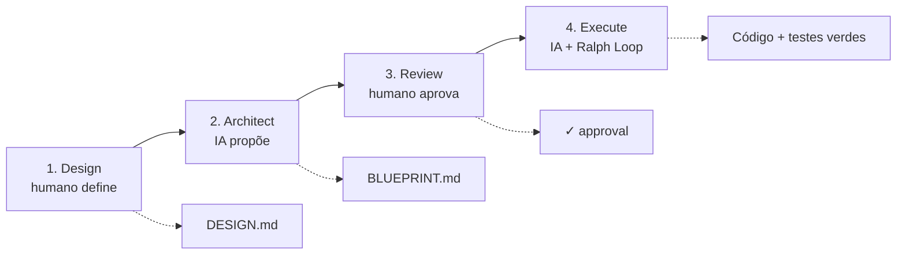

# DARE Method

> **Design. Architect. Review. Execute.**
> Metodologia + CLI para desenvolvimento de software assistido por IA, com **checkpoints humanos obrigatórios**.

O DARE separa **estratégia (humano)** de **tática (IA)** com checkpoints explícitos: o humano define *o quê* e *por quê* e aprova o plano; a IA implementa *como*, iterando até os testes/lint/types passarem (o **Ralph Loop**).



| Fase | O quê | Quem | Saída |
|---|---|---|---|
| **Design** | o problema e os critérios de sucesso | humano (IA auxilia) | `DARE/DESIGN.md` |
| **Architect** | arquitetura, contratos e tasks | IA propõe, humano valida | `DARE/BLUEPRINT.md` |
| **Review** | aprovação explícita antes de gastar tokens | humano | ✓ approval |
| **Execute** | implementação task a task com Ralph Loop | IA | código + testes verdes |

## Comece por aqui

<div class="grid cards" markdown>

- :material-rocket-launch: **[Começando](getting-started.md)** — instale o CLI e rode `dare init`.
- :material-sprout: **[Greenfield](greenfield.md)** — projeto novo: design → blueprint → execute.
- :material-history: **[Brownfield](brownfield.md)** — projeto legado: discover, reverse, dna, patterns, migrate.
- :material-cog: **[Configuração](configuration.md)** — o `dare.config.json` por inteiro.
- :material-console: **[Referência CLI](cli-reference.md)** — todos os comandos e flags.
- :material-graph: **[Knowledge Graph](knowledge-graph.md)** — o grafo de conhecimento do projeto.

</div>

## Instalação rápida

```bash
npm install -g @dewtech/dare-cli
dare init meu-projeto
cd meu-projeto
dare design "Quero uma API de autenticação JWT"
```

## O que há de novo

- **v3.7.0 — Brownfield Discovery:** auto-discovery determinístico de padrões (`dare patterns`) + planejadores leves.
- **v3.6.0 — Agent Hooks + Steering:** automações por evento + injeção de padrões via MCP.
- **v3.5.0 — Dual Graph:** grafo Requisito↔Código + `dare graph owners/impact/trace/locate`.
- **v3.4.0 — Security Hardening:** MCP server endurecido + publish com provenance.
- **v3.3.0 — Reliable Verification Core:** mutation testing, fail-to-pass, decay policy, best-of-N e `dare bench`.

Detalhes em cada release no [CHANGELOG](https://github.com/dewtech-technologies/dare-method/blob/main/CHANGELOG.md).
