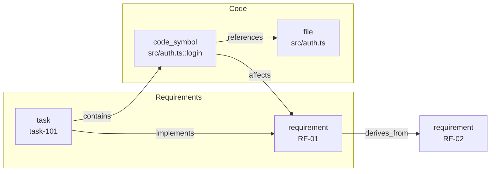

# Knowledge Graph

DARE maintains a **dual Requirement↔Code knowledge graph** of the project: requirements and tasks on one side, code symbols and files on the other, linked by typed edges. The graph is **populated automatically** by `dare execute --complete/--fail` (post-DONE ingestion) and queried by the `dare graph` subcommands.



!!! info "Where this lives in the code"
    `packages/cli/src/graphrag/factory.ts` · `types.ts` · `graph-rag.ts` · `json-graph.ts` · `neo4j-graph.ts` · `packages/cli/src/commands/graph.ts`

---

## Backends and configuration

The backend choice lives in `dare-graph.yml` at the project root. Without that file, the default is **sqlite** at `.dare/graph.db` (`loadGraphConfig`). `createGraph()` instantiates the backend and calls `init()`; the caller owns the lifecycle and calls `.close()`.

| Backend | Implementation | Default path | State |
|---|---|---|---|
| `sqlite` | `GraphRAG` (sql.js — WASM, **no native dependencies**) | `.dare/graph.db` | **default**, recommended |
| `json` | `JsonGraph` (single JSON file, no native deps) | `.dare/graph.json` | stable |
| `neo4j` | `Neo4jGraph` | — (server) | **experimental** |

```yaml
# dare-graph.yml — sqlite backend (default; you may omit the file)
backend: sqlite
sqlite:
  path: .dare/graph.db
```

```yaml
# json backend
backend: json
json:
  path: .dare/graph.json
```

```yaml
# neo4j backend (experimental — requires experimental: true)
backend: neo4j
neo4j:
  url: http://localhost:7474
  database: neo4j
  username: neo4j
  password: senha
  experimental: true
```

!!! warning "Neo4j is experimental"
    `createGraph()` refuses the Neo4j backend unless `neo4j.experimental: true` is explicit in `dare-graph.yml` ("until C1 is verified") and requires `neo4j.url`. For normal use, prefer **sqlite** (default) or **json**.

---

## Node and edge types

The graph is typed. The types live in `graphrag/types.ts` (`ALL_NODE_TYPES` / `ALL_EDGE_TYPES`), which guarantees zero-initialized statistics (absent types stay at `0`, never `NaN`).

### Nodes (`NodeType`)

| Type | Meaning |
|---|---|
| `task` | DAG task (`task:<id>`), with `status` and `complexity` |
| `file` | file (`file:<posixPath>`) |
| `schema` | data table/schema |
| `endpoint` | HTTP route (`method` + `path`) |
| `component` | UI component |
| `entity` | domain entity |
| `concept` | concept/idea |
| `gate` | validation gate |
| `code_symbol` | code symbol (`code_symbol:<path>::<symbol>`, with `kind` function/class/method and `line`) |
| `requirement` | requirement (`requirement:<reqId>`, e.g. `RF-01`, with `source` design/blueprint/tasks/dag and `priority` MUST/SHOULD/COULD) |
| `pattern` | discovered pattern (`pattern:<id>`, with `frequency` and `coverage`) |

### Edges (`EdgeType`)

| Type | Direction / use |
|---|---|
| `depends_on` | task → task (DAG dependency) |
| `implements` | task → requirement |
| `uses` | generic use |
| `references` | reference (e.g. symbol → file) |
| `related_to` | generic relation |
| `contains` | contains (e.g. task → code_symbol) |
| `extends` | inheritance/extension |
| `verified_by` | verified by (e.g. requirement → gate/test) |
| `affects` | symbol → requirement/task (**inverse impact**) |
| `derives_from` | child requirement → parent requirement |
| `evidenced_by` | pattern → file |
| `exhibits` | module → pattern |

!!! note "Dual Requirement↔Code graph"
    The **requirements** layer (`requirement`, `task`) and the **code** layer (`code_symbol`, `file`) are connected by `implements`/`contains`/`affects`/`derives_from`. This lets you navigate from requirements down to the code that realizes them and, in the reverse direction, discover which requirements/tasks a file impacts. The exports (`viz`) render these two layers as separate subgraphs.

---

## `dare graph` subcommands

```bash
dare graph stats               # node/edge count + breakdown by type
dare graph query <term>        # search in label/description
dare graph viz                 # exports Mermaid/DOT
dare graph ingest              # re-syncs from dare-dag.yaml + state
dare graph owners <path>       # who "owns" symbols under <path>
dare graph impact <path>       # tasks/requirements impacted by changes in <path>
dare graph trace <req>         # requirement/task → code symbols
dare graph locate <seed>       # locates symbols/files/tasks from a seed
```

### `stats`

Shows `totalNodes`, `totalEdges` and the breakdown by node type and edge type.

### `query <term>`

Searches nodes whose `label`/`description` contains `<term>`.

```bash
dare graph query login --type code_symbol --limit 5
```

- `--type <t>` / `-t`: restricts to a node type (`task`, `file`, `schema`, `endpoint`, `component`, `entity`, `concept`, `gate`, `code_symbol`, `requirement`, `pattern`). Unknown type ⇒ error.
- `--limit <n>` / `-l`: maximum number of results (default 10). With a type filter, it searches more broadly and trims afterward.

### `viz`

Exports the graph. The Requirements and Code layers come out as styled subgraphs/clusters.

```bash
dare graph viz --format mermaid -o grafo.mmd
dare graph viz --format dot -o grafo.dot
```

- `--format <fmt>` / `-f`: `mermaid` (default) or `dot`. Any other value ⇒ error.
- `--output <file>` / `-o`: writes to a file (default stdout).

### `ingest`

Re-syncs the graph from `dare-dag.yaml` + `.dare/state.json` (tasks) and from the requirements (DESIGN/BLUEPRINT/TASKS).

```bash
dare graph ingest                       # tasks + requirements
dare graph ingest --requirements-only   # only re-parses requirements, ignores the DAG
dare graph ingest --dag DARE/dare-dag.yaml
```

### `owners <path>`

Lists tasks/requirements that "own" symbols under `<path>` (valid relative path — paths with `..` ⇒ error).

```bash
dare graph owners src/auth --json --limit 20
```

### `impact <path>`

Shows tasks and requirements impacted by changes under `<path>`, traversing the graph.

```bash
dare graph impact src/auth/login.ts --hops 3
```

- `--hops <n>`: traversal depth (default 3, max 5).
- `--json`: emits `{ tasks, requirements }` as JSON.

### `trace <req>`

Traces a requirement/task down to the code symbols that realize it. Accepted format: `RF-N`, `O-N` or `task-N` (invalid format ⇒ error; not found ⇒ error).

```bash
dare graph trace RF-01
dare graph trace task-101 --json
```

### `locate <seed>`

Locates relevant symbols/files/tasks from a seed (text query), with weighted graph traversal and a per-candidate score.

```bash
dare graph locate "validação de token JWT" --hops 3 --limit 10 \
  --type code_symbol --type file --edge-type references
```

- `--hops <n>`: traversal hops (default 3).
- `--limit <n>`: maximum number of candidates (default 10).
- `--type <t>` (repeatable): filters node types.
- `--edge-type <e>` (repeatable): filters edge types.

!!! tip "`locate` in the Ralph Loop"
    The `locate` context also feeds each task's prompt in `dare execute --next` (via `buildLocateContext`), giving the IDE agent hints about **where** to touch the code before it starts.

---

## Automatic post-DONE ingestion

You do not need to run `ingest` by hand in the normal flow: the graph is fed at execution time.

- `dare execute --complete <id>` → on marking `DONE` (`markDone`), it does `safeIngest` of the task into the graph.
- `dare execute --fail <id>` → on marking `FAILED` (`markFailed`), it ingests the task and each task `SKIPPED` by cascade.
- `dare execute --reset <id>` → removes the `task:<id>` node (and its outgoing edges) so the next `DONE`/`FAILED` recreates it with fresh metadata.

!!! note "Ingestion is best-effort"
    Ingestion failures **never** break the orchestrator (`safeIngest` swallows exceptions). The graph is a supporting index: if it fails, the DAG runner carries on normally. Use `dare graph ingest` to rebuild from scratch at any time. Passing `--no-graph` to `dare execute` skips ingestion on that call.
