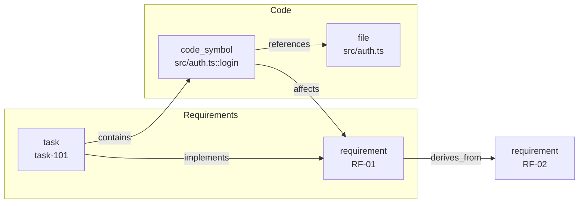

# Knowledge Graph

DARE mantiene un **grafo de conocimiento dual Requisito↔Código** del proyecto: requisitos y tareas de un lado, símbolos de código y archivos del otro, ligados por aristas tipadas. El grafo se **puebla automáticamente** con `dare execute --complete/--fail` (ingesta post-DONE) y se consulta con los subcomandos `dare graph`.



!!! info "Dónde vive esto en el código"
    `packages/cli/src/graphrag/factory.ts` · `types.ts` · `graph-rag.ts` · `json-graph.ts` · `neo4j-graph.ts` · `packages/cli/src/commands/graph.ts`

---

## Backends y configuración

La elección de backend vive en `dare-graph.yml` en la raíz del proyecto. Sin ese archivo, el default es **sqlite** en `.dare/graph.db` (`loadGraphConfig`). `createGraph()` instancia el backend y llama a `init()`; el llamador es dueño del ciclo de vida y llama a `.close()`.

| Backend | Implementación | Path default | Estado |
|---|---|---|---|
| `sqlite` | `GraphRAG` (sql.js — WASM, **sin dependencias nativas**) | `.dare/graph.db` | **default**, recomendado |
| `json` | `JsonGraph` (archivo JSON único, sin deps nativas) | `.dare/graph.json` | estable |
| `neo4j` | `Neo4jGraph` | — (servidor) | **experimental** |

```yaml
# dare-graph.yml — backend sqlite (default; pode omitir o arquivo)
backend: sqlite
sqlite:
  path: .dare/graph.db
```

```yaml
# backend json
backend: json
json:
  path: .dare/graph.json
```

```yaml
# backend neo4j (experimental — exige experimental: true)
backend: neo4j
neo4j:
  url: http://localhost:7474
  database: neo4j
  username: neo4j
  password: senha
  experimental: true
```

!!! warning "Neo4j es experimental"
    `createGraph()` rechaza el backend Neo4j a menos que `neo4j.experimental: true` esté explícito en `dare-graph.yml` ("hasta que C1 sea verificado") y exige `neo4j.url`. Para uso normal, prefiere **sqlite** (default) o **json**.

---

## Tipos de nodo y arista

El grafo es tipado. Los tipos están en `graphrag/types.ts` (`ALL_NODE_TYPES` / `ALL_EDGE_TYPES`), lo que garantiza estadísticas inicializadas en cero (los tipos ausentes quedan en `0`, nunca `NaN`).

### Nodos (`NodeType`)

| Tipo | Significado |
|---|---|
| `task` | task del DAG (`task:<id>`), con `status` y `complexity` |
| `file` | archivo (`file:<posixPath>`) |
| `schema` | tabla/esquema de datos |
| `endpoint` | ruta HTTP (`method` + `path`) |
| `component` | componente de UI |
| `entity` | entidad de dominio |
| `concept` | concepto/idea |
| `gate` | gate de validación |
| `code_symbol` | símbolo de código (`code_symbol:<path>::<symbol>`, con `kind` function/class/method y `line`) |
| `requirement` | requisito (`requirement:<reqId>`, ej. `RF-01`, con `source` design/blueprint/tasks/dag y `priority` MUST/SHOULD/COULD) |
| `pattern` | patrón descubierto (`pattern:<id>`, con `frequency` y `coverage`) |

### Aristas (`EdgeType`)

| Tipo | Dirección / uso |
|---|---|
| `depends_on` | task → task (dependencia del DAG) |
| `implements` | task → requirement |
| `uses` | uso genérico |
| `references` | referencia (ej. symbol → file) |
| `related_to` | relación genérica |
| `contains` | contiene (ej. task → code_symbol) |
| `extends` | herencia/extensión |
| `verified_by` | verificado por (ej. requirement → gate/test) |
| `affects` | symbol → requirement/task (**impacto inverso**) |
| `derives_from` | requirement-hijo → requirement-padre |
| `evidenced_by` | pattern → file |
| `exhibits` | módulo → pattern |

!!! note "Grafo dual Requisito↔Código"
    La capa de **requisitos** (`requirement`, `task`) y la de **código** (`code_symbol`, `file`) se conectan mediante `implements`/`contains`/`affects`/`derives_from`. Esto permite navegar desde los requisitos hasta el código que los realiza y, en sentido inverso, descubrir qué requisitos/tasks impacta un archivo. Las exportaciones (`viz`) renderizan esas dos capas como subgrafos separados.

---

## Subcomandos `dare graph`

```bash
dare graph stats               # contagem de nós/arestas + breakdown por tipo
dare graph query <term>        # busca em label/description
dare graph viz                 # exporta Mermaid/DOT
dare graph ingest              # re-sincroniza a partir do dare-dag.yaml + state
dare graph owners <path>       # quem "possui" símbolos sob <path>
dare graph impact <path>       # tasks/requisitos impactados por mudanças em <path>
dare graph trace <req>         # requisito/task → símbolos de código
dare graph locate <seed>       # localiza símbolos/arquivos/tasks a partir de um seed
```

### `stats`

Muestra `totalNodes`, `totalEdges` y el breakdown por tipo de nodo y de arista.

### `query <term>`

Busca nodos cuyo `label`/`description` contiene `<term>`.

```bash
dare graph query login --type code_symbol --limit 5
```

- `--type <t>` / `-t`: restringe a un tipo de nodo (`task`, `file`, `schema`, `endpoint`, `component`, `entity`, `concept`, `gate`, `code_symbol`, `requirement`, `pattern`). Tipo desconocido ⇒ error.
- `--limit <n>` / `-l`: máximo de resultados (default 10). Con filtro de tipo, busca más amplio y recorta después.

### `viz`

Exporta el grafo. Las capas Requirements y Code salen como subgrafos/clusters estilizados.

```bash
dare graph viz --format mermaid -o grafo.mmd
dare graph viz --format dot -o grafo.dot
```

- `--format <fmt>` / `-f`: `mermaid` (default) o `dot`. Otro valor ⇒ error.
- `--output <file>` / `-o`: escribe en archivo (default stdout).

### `ingest`

Re-sincroniza el grafo a partir de `dare-dag.yaml` + `.dare/state.json` (tasks) y de los requisitos (DESIGN/BLUEPRINT/TASKS).

```bash
dare graph ingest                       # tasks + requisitos
dare graph ingest --requirements-only   # só re-parseia requisitos, ignora o DAG
dare graph ingest --dag DARE/dare-dag.yaml
```

### `owners <path>`

Lista tasks/requisitos que "poseen" símbolos bajo `<path>` (ruta relativa válida — paths con `..` ⇒ error).

```bash
dare graph owners src/auth --json --limit 20
```

### `impact <path>`

Muestra tasks y requisitos impactados por cambios bajo `<path>`, recorriendo el grafo.

```bash
dare graph impact src/auth/login.ts --hops 3
```

- `--hops <n>`: profundidad de travesía (default 3, máx 5).
- `--json`: emite `{ tasks, requirements }` en JSON.

### `trace <req>`

Rastrea un requisito/task hasta los símbolos de código que lo realizan. Formato aceptado: `RF-N`, `O-N` o `task-N` (formato inválido ⇒ error; no encontrado ⇒ error).

```bash
dare graph trace RF-01
dare graph trace task-101 --json
```

### `locate <seed>`

Localiza símbolos/archivos/tasks relevantes a partir de un seed (consulta de texto), con travesía ponderada del grafo y score por candidato.

```bash
dare graph locate "validação de token JWT" --hops 3 --limit 10 \
  --type code_symbol --type file --edge-type references
```

- `--hops <n>`: hops de travesía (default 3).
- `--limit <n>`: máximo de candidatos (default 10).
- `--type <t>` (repetible): filtra tipos de nodo.
- `--edge-type <e>` (repetible): filtra tipos de arista.

!!! tip "`locate` en el Ralph Loop"
    El contexto de `locate` también alimenta el prompt de cada task en `dare execute --next` (vía `buildLocateContext`), dando al agente del IDE pistas de **dónde** tocar el código antes de empezar.

---

## Ingesta automática post-DONE

No hace falta correr `ingest` a mano en el flujo normal: el grafo se alimenta en tiempo de ejecución.

- `dare execute --complete <id>` → al marcar `DONE` (`markDone`), hace `safeIngest` de la task en el grafo.
- `dare execute --fail <id>` → al marcar `FAILED` (`markFailed`), ingiere la task y cada task `SKIPPED` en cascada.
- `dare execute --reset <id>` → elimina el nodo `task:<id>` (y sus aristas de salida) para que el próximo `DONE`/`FAILED` lo recree con metadatos frescos.

!!! note "La ingesta es best-effort"
    Las fallas de ingesta **nunca** rompen el orquestador (`safeIngest` se traga las excepciones). El grafo es un índice de apoyo: si falla, el DAG runner sigue normalmente. Usa `dare graph ingest` para reconstruir desde cero en cualquier momento. Pasar `--no-graph` a `dare execute` salta la ingesta en esa llamada.
