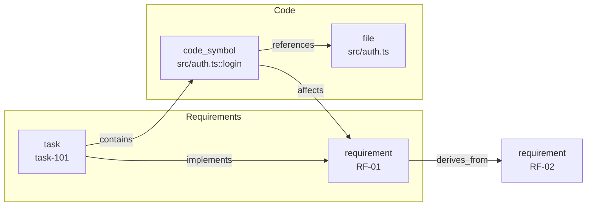

# Knowledge Graph

O DARE mantém um **grafo de conhecimento dual Requisito↔Código** do projeto: requisitos e tasks de um lado, símbolos de código e arquivos do outro, ligados por arestas tipadas. O grafo é **populado automaticamente** pelo `dare execute --complete/--fail` (ingestão pós-DONE) e consultado pelos subcomandos `dare graph`.



!!! info "Onde isto vive no código"
    `packages/cli/src/graphrag/factory.ts` · `types.ts` · `graph-rag.ts` · `json-graph.ts` · `neo4j-graph.ts` · `packages/cli/src/commands/graph.ts`

---

## Backends e configuração

A escolha de backend vive em `dare-graph.yml` na raiz do projeto. Sem esse arquivo, o default é **sqlite** em `.dare/graph.db` (`loadGraphConfig`). `createGraph()` instancia o backend e chama `init()`; o chamador é dono do ciclo de vida e chama `.close()`.

| Backend | Implementação | Path default | Estado |
|---|---|---|---|
| `sqlite` | `GraphRAG` (sql.js — WASM, **sem dependências nativas**) | `.dare/graph.db` | **default**, recomendado |
| `json` | `JsonGraph` (arquivo JSON único, sem deps nativas) | `.dare/graph.json` | estável |
| `neo4j` | `Neo4jGraph` | — (servidor) | **experimental** |

```yaml
# dare-graph.yml — backend sqlite (default; pode omitir o arquivo)
backend: sqlite
sqlite:
  path: .dare/graph.db
```

```yaml
# backend json
backend: json
json:
  path: .dare/graph.json
```

```yaml
# backend neo4j (experimental — exige experimental: true)
backend: neo4j
neo4j:
  url: http://localhost:7474
  database: neo4j
  username: neo4j
  password: senha
  experimental: true
```

!!! warning "Neo4j é experimental"
    `createGraph()` recusa o backend Neo4j a menos que `neo4j.experimental: true` esteja explícito em `dare-graph.yml` ("até C1 ser verificado") e exige `neo4j.url`. Para uso normal, prefira **sqlite** (default) ou **json**.

---

## Tipos de nó e aresta

O grafo é tipado. Os tipos estão em `graphrag/types.ts` (`ALL_NODE_TYPES` / `ALL_EDGE_TYPES`), o que garante estatísticas zero-inicializadas (tipos ausentes ficam `0`, nunca `NaN`).

### Nós (`NodeType`)

| Tipo | Significado |
|---|---|
| `task` | task do DAG (`task:<id>`), com `status` e `complexity` |
| `file` | arquivo (`file:<posixPath>`) |
| `schema` | tabela/esquema de dados |
| `endpoint` | rota HTTP (`method` + `path`) |
| `component` | componente de UI |
| `entity` | entidade de domínio |
| `concept` | conceito/ideia |
| `gate` | gate de validação |
| `code_symbol` | símbolo de código (`code_symbol:<path>::<symbol>`, com `kind` function/class/method e `line`) |
| `requirement` | requisito (`requirement:<reqId>`, ex. `RF-01`, com `source` design/blueprint/tasks/dag e `priority` MUST/SHOULD/COULD) |
| `pattern` | padrão descoberto (`pattern:<id>`, com `frequency` e `coverage`) |

### Arestas (`EdgeType`)

| Tipo | Direção / uso |
|---|---|
| `depends_on` | task → task (dependência do DAG) |
| `implements` | task → requirement |
| `uses` | uso genérico |
| `references` | referência (ex. symbol → file) |
| `related_to` | relação genérica |
| `contains` | contém (ex. task → code_symbol) |
| `extends` | herança/extensão |
| `verified_by` | verificado por (ex. requirement → gate/teste) |
| `affects` | symbol → requirement/task (**impacto inverso**) |
| `derives_from` | requirement-filho → requirement-pai |
| `evidenced_by` | pattern → file |
| `exhibits` | módulo → pattern |

!!! note "Grafo dual Requisito↔Código"
    A camada de **requisitos** (`requirement`, `task`) e a de **código** (`code_symbol`, `file`) são conectadas por `implements`/`contains`/`affects`/`derives_from`. Isso permite navegar dos requisitos até o código que os realiza e, no sentido inverso, descobrir que requisitos/tasks um arquivo impacta. As exportações (`viz`) renderizam essas duas camadas como subgrafos separados.

---

## Subcomandos `dare graph`

```bash
dare graph stats               # contagem de nós/arestas + breakdown por tipo
dare graph query <term>        # busca em label/description
dare graph viz                 # exporta Mermaid/DOT
dare graph ingest              # re-sincroniza a partir do dare-dag.yaml + state
dare graph owners <path>       # quem "possui" símbolos sob <path>
dare graph impact <path>       # tasks/requisitos impactados por mudanças em <path>
dare graph trace <req>         # requisito/task → símbolos de código
dare graph locate <seed>       # localiza símbolos/arquivos/tasks a partir de um seed
```

### `stats`

Mostra `totalNodes`, `totalEdges` e o breakdown por tipo de nó e de aresta.

### `query <term>`

Busca nós cujo `label`/`description` contém `<term>`.

```bash
dare graph query login --type code_symbol --limit 5
```

- `--type <t>` / `-t`: restringe a um tipo de nó (`task`, `file`, `schema`, `endpoint`, `component`, `entity`, `concept`, `gate`, `code_symbol`, `requirement`, `pattern`). Tipo desconhecido ⇒ erro.
- `--limit <n>` / `-l`: máximo de resultados (default 10). Com filtro de tipo, busca mais amplo e corta depois.

### `viz`

Exporta o grafo. As camadas Requirements e Code saem como subgrafos/clusters estilizados.

```bash
dare graph viz --format mermaid -o grafo.mmd
dare graph viz --format dot -o grafo.dot
```

- `--format <fmt>` / `-f`: `mermaid` (default) ou `dot`. Outro valor ⇒ erro.
- `--output <file>` / `-o`: escreve em arquivo (default stdout).

### `ingest`

Re-sincroniza o grafo a partir do `dare-dag.yaml` + `.dare/state.json` (tasks) e dos requisitos (DESIGN/BLUEPRINT/TASKS).

```bash
dare graph ingest                       # tasks + requisitos
dare graph ingest --requirements-only   # só re-parseia requisitos, ignora o DAG
dare graph ingest --dag DARE/dare-dag.yaml
```

### `owners <path>`

Lista tasks/requisitos que "possuem" símbolos sob `<path>` (caminho relativo válido — paths com `..` ⇒ erro).

```bash
dare graph owners src/auth --json --limit 20
```

### `impact <path>`

Mostra tasks e requisitos impactados por mudanças sob `<path>`, percorrendo o grafo.

```bash
dare graph impact src/auth/login.ts --hops 3
```

- `--hops <n>`: profundidade de travessia (default 3, máx 5).
- `--json`: emite `{ tasks, requirements }` em JSON.

### `trace <req>`

Rastreia um requisito/task até os símbolos de código que o realizam. Formato aceito: `RF-N`, `O-N` ou `task-N` (formato inválido ⇒ erro; não encontrado ⇒ erro).

```bash
dare graph trace RF-01
dare graph trace task-101 --json
```

### `locate <seed>`

Localiza símbolos/arquivos/tasks relevantes a partir de um seed (consulta de texto), com travessia ponderada do grafo e score por candidato.

```bash
dare graph locate "validação de token JWT" --hops 3 --limit 10 \
  --type code_symbol --type file --edge-type references
```

- `--hops <n>`: hops de travessia (default 3).
- `--limit <n>`: máximo de candidatos (default 10).
- `--type <t>` (repetível): filtra tipos de nó.
- `--edge-type <e>` (repetível): filtra tipos de aresta.

!!! tip "`locate` no Ralph Loop"
    O contexto do `locate` também alimenta o prompt de cada task em `dare execute --next` (via `buildLocateContext`), dando ao agente do IDE pistas de **onde** mexer no código antes de começar.

---

## Ingestão automática pós-DONE

Não é preciso rodar `ingest` à mão no fluxo normal: o grafo é alimentado em tempo de execução.

- `dare execute --complete <id>` → ao marcar `DONE` (`markDone`), faz `safeIngest` da task no grafo.
- `dare execute --fail <id>` → ao marcar `FAILED` (`markFailed`), ingere a task e cada task `SKIPPED` por cascata.
- `dare execute --reset <id>` → remove o nó `task:<id>` (e arestas de saída) para que o próximo `DONE`/`FAILED` o recrie com metadados frescos.

!!! note "Ingestão é best-effort"
    Falhas de ingestão **nunca** quebram o orquestrador (`safeIngest` engole exceções). O grafo é um índice de apoio: se ele falhar, o DAG runner segue normalmente. Use `dare graph ingest` para reconstruir do zero a qualquer momento. Passar `--no-graph` ao `dare execute` pula a ingestão naquela chamada.
