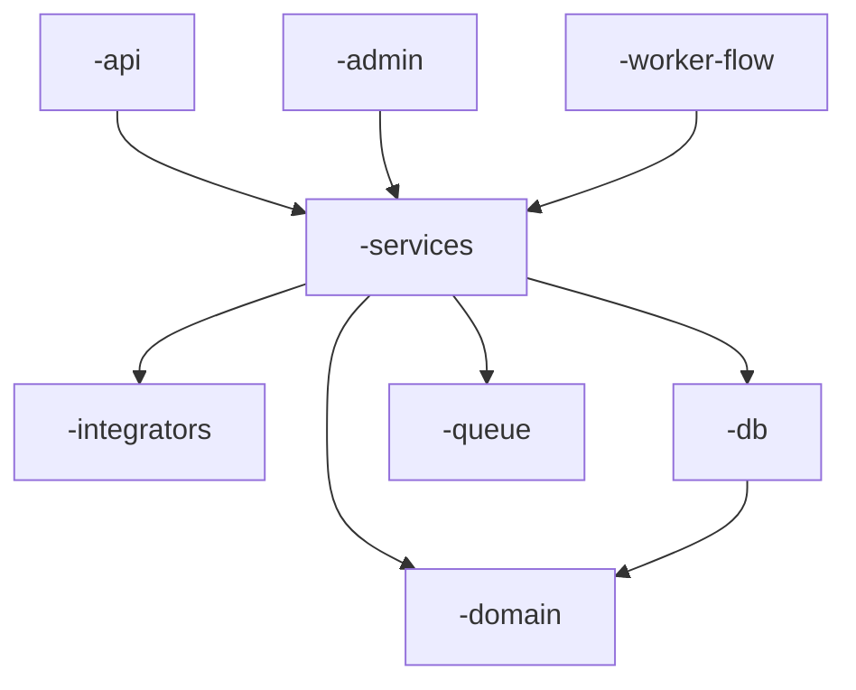

# DARE — Rust Workspace Skill (single-crate vs multi-crate)

Use esta skill em dois momentos:

- **Design / Blueprint:** projeto Rust novo na stack `rust-axum`. Decida
  desde o início se ele nasce single-crate ou em workspace multi-crate.
- **Migração:** projeto Rust single-crate **já existente** que cresceu
  demais e está doendo. Proponha o plano de migração.

Regra geral: **comece simples, migre quando os critérios objetivos
abaixo aparecerem.** Workspace é a estrutura idiomática Rust para projetos
maduros, mas é overengineering para o "hello world".

---

## Cenário A — Decisão na fase Design/Blueprint

### Comece **single-crate** quando TODOS forem verdadeiros

- Apenas **1 binário** (HTTP server).
- Estimativa de **< 30 arquivos `.rs`** no `src/`.
- **1–2 sistemas externos** (apenas DB; ou DB + cache).
- **Equipe ≤ 2 devs**.
- Nenhum requisito de deploy independente para subcomponentes.

### Comece **workspace multi-crate** quando QUALQUER um for verdadeiro

- **≥ 2 binários** previstos (API + worker; API + admin; API + CLI).
- **Múltiplos sistemas externos** (3+: PG + Redis + Rabbit + Qdrant + Neo4j…).
- **Deploy independente** desejado (workers em pods separados no k8s).
- **Fronteiras arquiteturais** críticas (domain puro sem HTTP/DB; SDK
  publicável; cliente compartilhado com outros projetos).
- **Equipe ≥ 3 devs** trabalhando em paralelo.

### Layout convencional para workspace

Use o prefixo do projeto (`<p>`) — ex: `wa-` para `wa-business-api`,
`agent-` para `agent-ai`.

```
projeto/
├── Cargo.toml                          # workspace root
├── docker-compose.yml
├── Dockerfile
├── crates/
│   ├── <p>-domain/         (lib)       # entities puras
│   ├── <p>-config/         (lib)       # AppConfig::from_env()
│   ├── <p>-db/             (lib)       # sqlx pool, migrations
│   ├── <p>-cache/          (lib)       # redis/moka
│   ├── <p>-queue/          (lib)       # lapin/kafka
│   ├── <p>-crypto/         (lib)       # bcrypt, jwt
│   ├── <p>-services/       (lib)       # business logic, sem HTTP
│   ├── <p>-integrators/    (lib)       # clientes externos (LLM, Stripe…)
│   ├── <p>-api/            (bin + lib) # HTTP server
│   ├── <p>-worker-<X>/     (bin)       # 1 binário por tipo de worker
│   ├── <p>-admin/          (bin)       # CLI admin
│   └── <p>-e2e/            (tests)     # integration tests
└── xtask/                              # scripts em Rust
```

Granularidade: **um crate por bounded context**, NÃO por arquivo. Resista
ao "crate util" / "common" — vira lixeira.

### Cargo.toml workspace template

```toml
[workspace]
resolver = "2"
members = [
    "crates/<p>-domain",
    "crates/<p>-config",
    "crates/<p>-db",
    "crates/<p>-services",
    "crates/<p>-api",
    "crates/<p>-worker-x",
    "crates/<p>-e2e",
    "xtask",
]

[workspace.package]
version = "0.1.0"
edition = "2021"
rust-version = "1.80"

[workspace.dependencies]
tokio = { version = "1.40", features = ["full"] }
axum = { version = "0.7", features = ["macros"] }
sqlx = { version = "0.8", features = ["runtime-tokio", "postgres", "uuid", "chrono", "migrate"] }
serde = { version = "1.0", features = ["derive"] }
serde_json = "1.0"
thiserror = "1.0"
anyhow = "1.0"
tracing = "0.1"
tracing-subscriber = { version = "0.3", features = ["env-filter", "json"] }
uuid = { version = "1.10", features = ["v4", "serde"] }
chrono = { version = "0.4", features = ["serde"] }

[profile.release]
opt-level = 3
lto = "thin"
codegen-units = 1
strip = true
```

Cada crate filho herda com `version.workspace = true` e
`<dep> = { workspace = true }`. Atualizar versão de uma dep = uma linha
no root.

### Diagrama Mermaid no BLUEPRINT.md



Regras de seta:
- `<p>-domain` no fundo: ninguém depende para baixo dele.
- `<p>-services` no meio: depende de domain/db/queue, nunca de api.
- Binários (api/admin/worker) no topo: dependem de services, nunca um do
  outro.

---

## Cenário B — Migração de single-crate para workspace

### Sintomas objetivos de "hora de migrar"

- `src/` tem > 30 arquivos `.rs` ou > 6 subpastas top-level.
- Múltiplos "domínios verticais" misturados (handlers, services, workers,
  integrators, mcp, acp, skills, tools…).
- Workers usam `tokio::spawn` no mesmo processo do API.
- `cargo build` incremental > 10s.
- Conflitos de merge frequentes no mesmo crate.
- Quer expor parte do código (cliente, SDK) como crate publicável.

### Plano em 4 PRs incrementais

Migração nunca é big-bang. Cada PR deve passar build/test/clippy no fim e
ser deployável.

#### PR 1 — Workers (mais isolados, menor risco)

```
src/workers/                  →  crates/<p>-worker-<nome>/
                                 ├── Cargo.toml
                                 └── src/main.rs
```

- Cada `tokio::spawn(worker_x)` do `main.rs` da API vira um binário
  próprio.
- API server **para de spawn workers** — workers sobem como processo
  independente.
- `docker-compose.yml` ganha service novo por worker.
- Em k8s, cada worker vira Deployment próprio com scaling independente.

#### PR 2 — Integrators (clientes externos)

```
src/integrators/{llm, neo4j, qdrant}.rs  →  crates/<p>-integrators/src/lib.rs
```

- Tudo que fala com o mundo externo (LLM, DB externo, Stripe, Meta…) vira
  lib.
- API e workers importam via `<p>-integrators = { path = "../<p>-integrators" }`.
- Crate é folha do grafo: NÃO depende de domain/services — só conhece
  tipos request/response da API externa.

#### PR 3 — Domain (entidades puras)

```
src/models/                              \
src/dto/                                  →  crates/<p>-domain/src/lib.rs
src/error.rs (parte DomainError)         /
```

- `<p>-domain` tem dependências **mínimas**: `serde`, `uuid`, `chrono`,
  `thiserror`. Nada de axum, sqlx, redis.
- Force a regra: o Cargo.toml do domain NÃO inclui essas deps. Build
  falha se alguém tentar.
- Todos os outros crates passam a usar `<p>-domain` em vez de
  `crate::models::`.

#### PR 4 — API e raiz do workspace

```
Cargo.toml (raiz)             →  vira [workspace] puro, sem [package]
src/ (resto)                  →  crates/<p>-api/src/
                                 ├── main.rs
                                 ├── lib.rs
                                 ├── handlers/
                                 ├── routes.rs
                                 └── middleware/
```

- `Cargo.toml` raiz só tem `[workspace]` + `[workspace.package]` +
  `[workspace.dependencies]` + `[profile.*]`.
- API vai pra `crates/<p>-api/`.
- Todas as deps centralizadas em `workspace.dependencies`.

### Validação após CADA PR

```bash
cargo build --workspace --all-targets
cargo test --workspace
cargo clippy --workspace --all-targets -- -D warnings
```

Mais o smoke E2E (subir compose, hitar `/healthz`, login, operação CRUD).
Se algum quebrar, o PR está incompleto.

### Antipatterns ao migrar

| Antipattern | Por que evitar |
|-------------|----------------|
| Big-bang (1 PR mexe em tudo) | Impossível revisar; impossível reverter |
| Crate `common`/`shared`/`utils` | Vira lixeira; viola SRP |
| Crate por arquivo (granular demais) | 50 crates de 100 linhas → parar build |
| Refactor de lógica + migração no mesmo PR | Bug fica escondido |
| Mover testes em PR separado | Crate sem test em produção é bug em standby |
| Esquecer de atualizar `xtask`/CI | Pipeline quebra; deploy vira pesadelo |

### Tradução de imports

| Antes (single-crate) | Depois (workspace) |
|----------------------|--------------------|
| `use crate::models::User;` | `use <p>_domain::User;` |
| `use crate::services::auth::login;` | `use <p>_services::auth::login;` |
| `use crate::integrators::llm::Gemini;` | `use <p>_integrators::llm::Gemini;` |
| `use crate::handlers::health::router;` | *fica igual — mesmo crate* |

Hifens (Cargo) viram underlines (Rust idents).

---

## Quando NÃO migrar

- Projeto < 30 arquivos, 1 binário, 1 dev → single-crate é mais simples.
- Sprint crítico em curso → migração é refactor estrutural; não combina
  com prazo.
- Sem sinais reais de dor → build < 5s, sem conflitos, sem segundo
  binário planejado.

Migração tem custo. Faça quando o ganho compensar.

## Checklist final

- [ ] Critérios objetivos documentados no BLUEPRINT
- [ ] Lista de crates com responsabilidade de cada
- [ ] Diagrama Mermaid do grafo de dependências
- [ ] `Cargo.toml` raiz com `workspace.dependencies` centralizadas
- [ ] `<p>-domain` sem dependência de HTTP/DB/cache
- [ ] Cada binário com `[[bin]]` no Cargo.toml do seu crate
- [ ] Migração em PRs incrementais (não big-bang)
- [ ] Ralph Loop verde após cada PR (`cargo build/test/clippy --workspace`)
