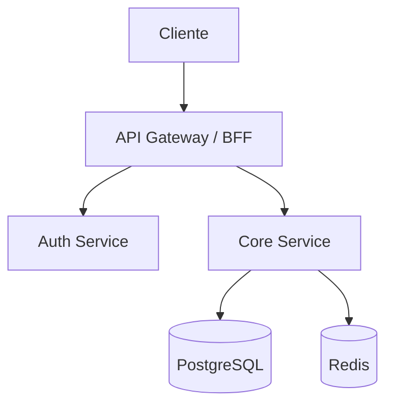

# BLUEPRINT: [Nome do Projeto]

> **Gerado a partir de:** `DARE/DESIGN.md` v[X.Y]  
> **Data:** YYYY-MM-DD | **Status:** DRAFT → APROVADO

---

## 1. VISÃO GERAL DA ARQUITETURA

[Descrição da arquitetura: Monolito modular / Microserviços / Hexagonal / Clean Architecture]



**Decisões arquiteturais principais:**

| Decisão | Escolha | Justificativa |
|---------|---------|---------------|
| Padrão de módulos | [ex: Hexagonal] | [motivo] |
| Comunicação inter-serviços | [ex: REST síncrono] | [motivo] |
| Autenticação | [ex: JWT stateless] | [motivo] |

---

## 2. STACK TÉCNICA DEFINIDA

| Camada | Tecnologia | Versão | Papel |
|--------|-----------|--------|-------|
| Linguagem | | | |
| Framework | | | |
| Banco principal | | | |
| Cache / filas | | | |
| Frontend | | | |
| Container | Docker | latest | Dev + CI |
| Observabilidade | | | Logs, métricas, traces |

---

## 3. ESTRUTURA DE PASTAS E ARQUIVOS

```text
[nome-do-projeto]/
├── [diretório principal]/
│   ├── [módulo 1]/
│   └── [módulo 2]/
├── DARE/
│   ├── DESIGN.md
│   ├── BLUEPRINT.md
│   ├── TASKS.md
│   ├── dare-dag.yaml
│   └── EXECUTION/
├── Dockerfile
├── docker-compose.yml
└── [arquivo de configuração principal]
```

> **Constraints de workspace (Rust):** se Cargo workspace, NÃO definir `[build] target` global no `.cargo/config.toml` (quebra crates WASM + native). Cada crate declara suas próprias features Leptos.

---

## 4. MODELO DE DADOS

### Entidades principais

```
[Entidade 1]
- id: UUID (PK)
- [campo]: [tipo] [restrições]
- created_at, updated_at

[Entidade 2]
- id: UUID (PK)
- [entidade_1_id]: FK → Entidade1
```

### Relacionamentos

| De | Para | Cardinalidade | Via |
|----|------|---------------|-----|
| [Entidade 1] | [Entidade 2] | 1:N | FK |

---

## 5. CONTRATOS DE API

| Método | Endpoint | Auth | Request Body | Response | Status codes |
|--------|----------|------|-------------|----------|--------------|
| POST | `/api/v1/[recurso]` | Não | `{campo1, campo2}` | `{id, ...}` | 201, 400, 422 |
| GET | `/api/v1/[recurso]` | JWT | — | `[{id, ...}]` | 200, 401 |
| GET | `/api/v1/[recurso]/:id` | JWT | — | `{id, ...}` | 200, 401, 404 |
| PUT | `/api/v1/[recurso]/:id` | JWT + Owner | `{campos}` | `{id, ...}` | 200, 401, 403, 404 |
| DELETE | `/api/v1/[recurso]/:id` | JWT + Admin | — | `{}` | 204, 401, 403, 404 |

---

## 6. PLANO DE EXECUÇÃO (FASES)

### Fase 1: Containerização e Setup ← **SEMPRE PRIMEIRA**
**Critério de DONE:** `docker compose up -d` sobe sem erros; healthcheck `/health` retorna 200.
- Dockerfile multi-stage
- docker-compose.yml com todos os serviços
- Variáveis de ambiente via `.env.example`

### Fase 2: Banco de Dados e Migrations
**Critério de DONE:** migrations rodando; schema validado; seeds de desenvolvimento funcionando.
- Migrations / schema inicial
- Seeds de desenvolvimento
- Índices para queries críticas

### Fase 3: Autenticação e Autorização
**Critério de DONE:** login retorna JWT; endpoint protegido rejeita token inválido com 401; acesso sem permissão retorna 403.
- Registro, login, refresh, logout
- Middleware de autenticação
- Sistema de permissões (RBAC/ACL)

### Fase 4: [Módulo de negócio principal]
**Critério de DONE:** [comportamento testável esperado].
- [Descrever aqui]

### Fase N-1: Auditoria de Segurança e Dependências
**Critério de DONE:** `[audit-cmd]` sem CVE HIGH/CRITICAL; security headers presentes; sem secrets em código.
- `npm audit --audit-level=high` / `cargo audit` / `pip-audit` / `composer audit`
- Headers HTTP de segurança (HSTS, CSP, X-Frame-Options)
- Scan de secrets no repositório

### Fase N: Observabilidade e Documentação
**Critério de DONE:** logs estruturados em JSON; endpoint `/metrics` ou equivalente; documentação API gerada.
- Logs estruturados (JSON) com trace-id
- Métricas de negócio e técnicas
- Documentação API (OpenAPI / Swagger)

---

## 7. VALIDAÇÃO E SEGURANÇA

### Validation Gates (Ralph Loop) por stack

| Stack | Build | Test | Lint/Audit |
|-------|-------|------|------------|
| Rust/Axum | `cargo build` | `cargo test --workspace` | `cargo clippy && cargo audit` |
| Node/NestJS | `npm run build` | `npm test` | `npx eslint src && npm audit --audit-level=high` |
| Python/FastAPI | `python -m py_compile` | `pytest` | `ruff check . && pip-audit` |
| PHP/Laravel | `php artisan config:cache` | `php artisan test` | `./vendor/bin/phpstan && composer audit` |
| Go | `go build ./...` | `go test ./...` | `golangci-lint run` |

### Controles de segurança obrigatórios

- [ ] Rate limiting em endpoints de autenticação e públicos
- [ ] Input validation no servidor para todos os endpoints
- [ ] Dados sensíveis (PII, tokens, senhas) nunca em logs
- [ ] Todas as dependências sem CVE HIGH/CRITICAL (ver Fase N-1)
- [ ] HTTP Security Headers em produção
- [ ] Secrets apenas em variáveis de ambiente / vault

---

## 8. ESTRATÉGIA DE TESTES

| Tipo | Ferramenta | Cobertura mínima | O que cobre |
|------|-----------|------------------|-------------|
| Unitários | [jest/pytest/cargo test] | 80 % das funções críticas | Lógica de negócio isolada |
| Integração | [supertest/httpx/reqwest] | Todos os endpoints | Contrato da API |
| Segurança | [npm audit/cargo audit/pip-audit] | 100 % deps | CVEs conhecidos |
| E2E | [playwright/cypress] se frontend | Fluxo principal | Jornada do usuário |

---

## 9. ESTRATÉGIA DE DEPLOY

| Ambiente | Branch | Trigger | Infra |
|----------|--------|---------|-------|
| `dev` | `develop` | Push automático | [ex: Docker local / Railway] |
| `staging` | `main` | PR merge | [ex: OKE / ECS / Fly.io] |
| `prod` | tag `v*.*.*` | Manual | [ex: OKE / ECS / Fly.io] |

---

## 10. CHECKLIST DE APROVAÇÃO DO BLUEPRINT

- [ ] Arquitetura revisada e aprovada
- [ ] Modelo de dados validado
- [ ] Contratos de API definidos e completos
- [ ] Fases com critérios de DONE claros
- [ ] Validation gates por stack definidos
- [ ] Controles de segurança mapeados
- [ ] Estratégia de testes cobrindo todos os tipos
- [ ] DAG de tasks gerado (`dare-dag.yaml`)
