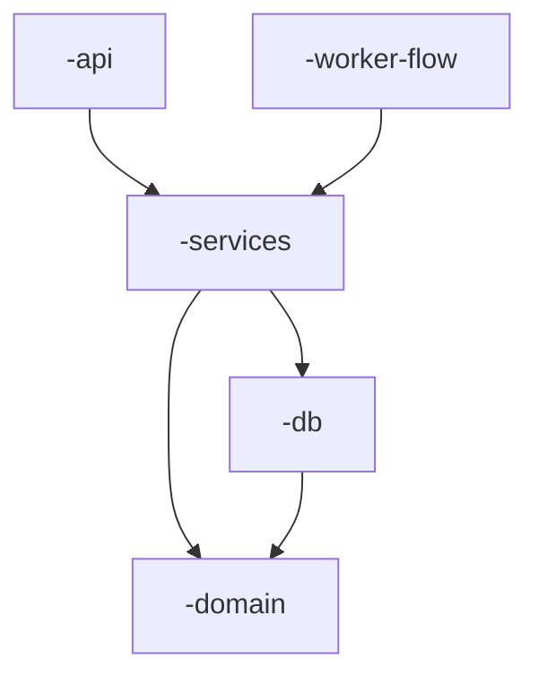

# /dare-rust-workspace

Decisão e migração de Cargo workspace multi-crate para projetos Rust/Axum.
Cobre dois cenários:

- **Cenário A — Design/Blueprint:** decidir desde o início se o projeto
  nasce single-crate ou workspace.
- **Cenário B — Migração:** propor plano de PRs incrementais para
  transformar um projeto single-crate maduro em workspace.

## Como usar

```
/dare-rust-workspace                # análise contextual (lê BLUEPRINT/src/)
/dare-rust-workspace --design       # foco em decisão para projeto novo
/dare-rust-workspace --migrate      # foco em plano de migração
```

## O que fazer

### 1) Detectar o cenário

- Se existe `DARE/BLUEPRINT.md` mas o `src/` ainda não existe ou tem < 5
  arquivos → Cenário A (decisão)
- Se `src/` tem > 30 arquivos `.rs` ou múltiplas subpastas top-level →
  Cenário B (migração)
- Caso intermediário (15–30 arquivos) → mostrar os critérios e perguntar
  ao usuário

### 2) Cenário A — Decisão na fase Design/Blueprint

Aplique os critérios:

**Comece single-crate quando TODOS forem verdadeiros:**
- Apenas 1 binário (HTTP server)
- < 30 arquivos `.rs` esperados
- 1–2 sistemas externos (DB; ou DB + cache)
- Equipe ≤ 2 devs
- Sem deploy independente para subcomponentes

**Comece workspace quando QUALQUER for verdadeiro:**
- ≥ 2 binários previstos (API + worker; API + admin)
- ≥ 3 sistemas externos (PG + Redis + Rabbit + Qdrant + Neo4j…)
- Deploy independente desejado (workers em pods separados)
- Fronteiras arquiteturais críticas (domain puro; SDK publicável)
- Equipe ≥ 3 devs em paralelo

**Layout recomendado para workspace** (use `<p>` como prefixo do projeto):

```
projeto/
├── Cargo.toml                    # workspace root
├── crates/
│   ├── <p>-domain/    (lib)      # entities puras
│   ├── <p>-config/    (lib)
│   ├── <p>-db/        (lib)
│   ├── <p>-cache/     (lib)
│   ├── <p>-queue/     (lib)
│   ├── <p>-services/  (lib)      # business logic
│   ├── <p>-integrators/ (lib)    # clientes externos
│   ├── <p>-api/       (bin+lib)  # HTTP server
│   ├── <p>-worker-<X>/ (bin)     # 1 binário por worker
│   └── <p>-e2e/       (tests)
└── xtask/                        # scripts em Rust
```

**`Cargo.toml` raiz:**
```toml
[workspace]
resolver = "2"
members = ["crates/<p>-domain", "crates/<p>-services", "crates/<p>-api", ...]

[workspace.package]
version = "0.1.0"
edition = "2021"
rust-version = "1.80"

[workspace.dependencies]
tokio = { version = "1.40", features = ["full"] }
axum = { version = "0.7", features = ["macros"] }
sqlx = { version = "0.8", features = ["runtime-tokio", "postgres", "uuid", "chrono", "migrate"] }
serde = { version = "1.0", features = ["derive"] }
thiserror = "1.0"
anyhow = "1.0"
tracing = "0.1"
uuid = { version = "1.10", features = ["v4", "serde"] }
chrono = { version = "0.4", features = ["serde"] }

[profile.release]
opt-level = 3
lto = "thin"
codegen-units = 1
strip = true
```

Cada crate filho usa `<dep> = { workspace = true }` para herdar versão.

**Diagrama no BLUEPRINT.md (Mermaid):**


Regra de seta: domain no fundo (ninguém depende para baixo), services no
meio (depende de domain/db, nunca de api), binários no topo.

### 3) Cenário B — Plano de migração em 4 PRs

Migração **nunca é big-bang**. Cada PR passa build/test/clippy no fim e é
deployável.

**PR 1 — Workers** (mais isolados, menor risco):
```
src/workers/  →  crates/<p>-worker-<X>/
                 ├── Cargo.toml
                 └── src/main.rs
```
- Cada `tokio::spawn(worker_x)` do `main.rs` da API vira binário próprio.
- API para de spawn workers; workers sobem como processo independente.
- `docker-compose.yml` ganha service novo por worker.
- Em k8s: Deployment próprio com scaling independente.

**PR 2 — Integrators** (clientes externos):
```
src/integrators/{llm, neo4j, qdrant}.rs  →  crates/<p>-integrators/src/lib.rs
```
- Tudo que fala com mundo externo (LLM, Stripe, Meta, DB externo) vira lib.
- API e workers importam via `path = "../<p>-integrators"`.
- Crate é folha do grafo — NÃO depende de domain/services.

**PR 3 — Domain** (entidades puras):
```
src/models/      \
src/dto/          →  crates/<p>-domain/src/lib.rs
src/error.rs     /
```
- `<p>-domain` tem deps **mínimas**: `serde`, `uuid`, `chrono`, `thiserror`.
- Nada de axum, sqlx, redis. Build do domain falha se alguém tentar.
- Outros crates passam a usar `<p>-domain` em vez de `crate::models::`.

**PR 4 — API e workspace root:**
```
Cargo.toml raiz   →  [workspace] puro
src/ (resto)      →  crates/<p>-api/src/
```
- `Cargo.toml` raiz só com `[workspace]` + `[workspace.package]` +
  `[workspace.dependencies]` + `[profile.*]`.
- API vai pra `crates/<p>-api/`.
- Todas as deps centralizadas no root.

### 4) Validação após cada PR

```bash
cargo build --workspace --all-targets
cargo test --workspace
cargo clippy --workspace --all-targets -- -D warnings
```

Mais smoke E2E do projeto. Se algum falhar, PR está incompleto.

### 5) Tradução de imports

| Antes (single-crate) | Depois (workspace) |
|----------------------|--------------------|
| `use crate::models::User;` | `use <p>_domain::User;` |
| `use crate::services::auth::login;` | `use <p>_services::auth::login;` |
| `use crate::integrators::llm::Gemini;` | `use <p>_integrators::llm::Gemini;` |
| `use crate::handlers::health::router;` | *fica igual — mesmo crate* |

Hifens (Cargo) viram underlines (Rust idents).

### 6) Antipatterns para alertar o usuário

| Antipattern | Por quê |
|-------------|---------|
| Big-bang (1 PR mexe em tudo) | Impossível revisar/reverter |
| Crate `common`/`shared`/`utils` | Vira lixeira; viola SRP |
| Crate por arquivo | 50 crates de 100 linhas → parar build |
| Refactor + migração no mesmo PR | Bug fica escondido |
| Mover testes em PR separado | Crate sem test = bug em standby |
| Esquecer atualizar `xtask`/CI | Pipeline quebra |

### 7) Quando NÃO migrar

- Projeto < 30 arquivos, 1 binário, 1 dev
- Sprint crítico em curso (migração é refactor estrutural)
- Sem sinais reais de dor (build < 5s, sem conflitos)

## Saída esperada

Para Cenário A: atualizar `DARE/BLUEPRINT.md` com a estrutura de crates
(diagrama + tabela de responsabilidades + `Cargo.toml` workspace).

Para Cenário B: gerar arquivo `DARE/MIGRATION-PLAN.md` com:
- Sintomas detectados (linhas de código, arquivos, etc.)
- 4 PRs em ordem com diff de pastas
- Critério de aceite por PR
- Estimativa de esforço

$ARGUMENTS
