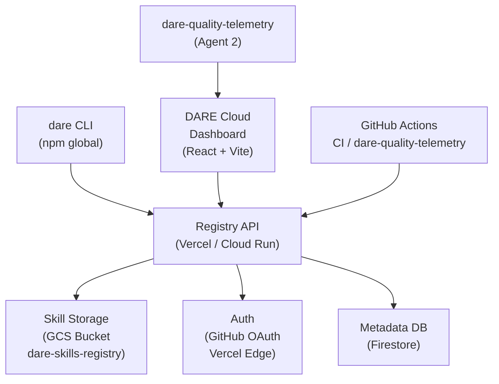

# DARE Cloud — Arquitetura e Roadmap

> Version 1.0 — May 2026
> License: MIT — DARE Method / Dewtech Technologies

---

## O que e DARE Cloud

**DARE Cloud** é a plataforma SaaS que transforma o DARE Method de uma ferramenta local em um ecossistema colaborativo hospedado. Ela fornece:

- **Registry remoto de skills** — publicar, descobrir e instalar skills de qualquer máquina ou pipeline CI/CD
- **CI/CD integrado** — validação automática de qualidade DARE em pull requests
- **Dashboard de métricas** — acompanhar adoção de skills, health de projetos e conformidade arquitetural
- **Marketplace da comunidade** — skills MIT revisadas e verificadas, com ratings e estatísticas de download

O objetivo é tornar o DARE o padrão de facto para times que levam arquitetura de software a sério.

---

## Fase 0 — Estado atual (Implementado pelo Agent 3)

O Agent 3 entregou a fundação do registry no sprint de Semana 3:

| Componente | Implementacao atual |
|---|---|
| Registry API | Vercel Functions — `api.dare.dewtech.tech` |
| Storage de skills | Filesystem local / Vercel Blob |
| Autenticacao | GitHub OAuth via Vercel Edge (basic) |
| CLI remoto | `dare skill publish` e `dare skill install` funcionais |
| CI integration | GitHub Actions workflow de validacao |

Esta fase valida o conceito. Todas as decisões de infraestrutura foram documentadas em `DECISIONS.md` (D-001 a D-008).

---

## Diagrama de arquitetura



---

## v1.0 — Beta fechado

**Objetivo:** registry remoto estável com autenticação robusta e CLI completamente integrado.

**Prazo estimado:** Q3 2026

### Funcionalidades

- **Registry remoto autenticado** — tokens de API pessoais (PAT), sem depender de sessão OAuth para automação
- **CLI publish/install** — `dare skill publish --tag stable`, `dare skill install @author/skill-name@version`
- **Versionamento semântico** — registry enforça semver; `dare skill install @author/skill-name@^2.0`
- **Dashboard básico** — listagem de skills publicadas, estatísticas de download, perfil de autor
- **Skill sandboxing** — skills executam em worker isolado, sem acesso ao filesystem do host sem permissão explícita

### Infraestrutura v1.0

| Componente | Tecnologia |
|---|---|
| Registry API | Cloud Run (migrado do Vercel) |
| Frontend Dashboard | React + Vite, deploy Cloud Run |
| Storage | GCS Bucket `dare-skills-registry` (multi-region US/BR) |
| Auth | GitHub OAuth + tokens PAT, gerenciado via Cloud IAM |
| DNS | `api.dare.dewtech.tech` (registry), `app.dare.dewtech.tech` (dashboard) |
| Monitoring | dare-quality-telemetry + Cloud Monitoring |
| Database | Firestore (metadata de skills, autores, downloads) |

### Migração Vercel → Cloud Run

A migração preserva a URL `api.dare.dewtech.tech` via CNAME — nenhuma mudança necessária nos CLIs em campo. O processo:

1. Deploy paralelo no Cloud Run com feature flag
2. Traffic splitting 10% → 50% → 100% ao longo de 2 semanas
3. Monitorar taxa de erro e latência p99
4. Remover Vercel Functions após 30 dias de estabilidade

---

## v1.1 — Early Access

**Objetivo:** abertura para a comunidade com modelo freemium e marketplace.

**Prazo estimado:** Q4 2026

### Funcionalidades

- **Multi-tenant** — namespaces por organização (`@org/skill-name`), permissões granulares
- **Billing** — plano gratuito (10 skills, 1k downloads/mês) e plano Pro (ilimitado, R$ 99/mês)
- **Community marketplace** — skills abertas com reviews, fork count e badge de verificação
- **Webhooks** — notify pipelines quando uma skill recebe update
- **dare skill audit** — varredura de skills instaladas em busca de versões deprecadas ou CVEs reportados

### Modelo de dados multi-tenant

```
Organization
  └── Members (roles: owner, admin, contributor)
  └── Namespaces (@org/*)
       └── Skills
            └── Versions (semver)
                 └── Artifacts (tarball no GCS)
                 └── Metadata (changelog, deps, test results)
```

---

## v2.0 — GA (General Availability)

**Objetivo:** features enterprise para adoção por times grandes, SLAs contratuais.

**Prazo estimado:** H1 2027

### Funcionalidades enterprise

- **SSO** — SAML 2.0 e OIDC para autenticação corporativa (Okta, Azure AD, Google Workspace)
- **Private registry** — repositório de skills privadas, sem exposição ao marketplace público
- **SLA 99.9%** — uptime garantido contratualmente para planos Enterprise
- **Audit log** — rastreabilidade completa de quem instalou o quê e quando
- **SBOM (Software Bill of Materials)** — geração automática de inventário de skills por projeto
- **On-premises** — opção de deploy do registry em infraestrutura do cliente (Kubernetes helm chart)
- **dare skill sign** — assinatura de skills com chave GPG do autor, verificação no install

### Precificacao planejada

| Plano | Preco | Skills | Downloads/mes | Suporte |
|---|---|---|---|---|
| Community | Gratis | 10 | 1.000 | Issues GitHub |
| Pro | R$ 99/mes | Ilimitado | 50.000 | Email 48h |
| Team | R$ 299/mes | Ilimitado | 500.000 | Email 24h |
| Enterprise | Sob consulta | Ilimitado | Ilimitado | SLA + telefone |

---

## Decisoes arquiteturais relevantes

| ID | Decisao |
|---|---|
| D-001 | Licenca MIT para todo codigo open source do DARE |
| D-003 | Registry API em Vercel Functions (Fase 0), Cloud Run (v1.0+) |
| D-005 | GCS como storage primario de artifacts |
| D-006 | GitHub OAuth como provedor de identidade principal |
| D-007 | Semver obrigatorio para todas as skills publicadas |

Consulte `DECISIONS.md` na raiz do repositório para o racional completo de cada decisão.

---

## Monitoramento e observabilidade

A integração com `dare-quality-telemetry` (entregue pelo Agent 2) fornece:

- **Métricas de adoção** — quantos projetos usam cada skill, versões ativas
- **Health score** — conformidade arquitetural dos projetos que reportam telemetria (opt-in)
- **Alertas de qualidade** — notificação quando um projeto instala uma skill com CVE aberto
- **Dashboard público** — página `/stats` no DARE Cloud mostrando métricas de uso da comunidade

O pipeline de CI inclui o workflow `dare-fork-monitor.yml` para detectar derivativos não autorizados semanalmente.

---

## Proximos passos imediatos

1. Provisionar GCS bucket `dare-skills-registry` no projeto GCP `dewtech-dare-prod`
2. Configurar Cloud Run service `dare-registry-api` com imagem a partir de `apps/registry-api`
3. Migrar DNS `api.dare.dewtech.tech` de Vercel para Cloud Run Load Balancer
4. Implementar tabela `skills` e `skill_versions` no Firestore
5. Publicar página de landing `app.dare.dewtech.tech` com formulário de beta waitlist
