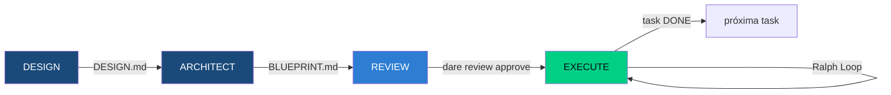
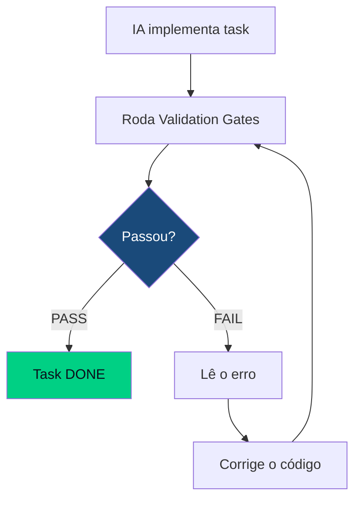

# Conceitos do DARE

## As 4 Fases



### 1. DESIGN — O quê e por quê

**Responsável:** humano (com IA auxiliando)

Na fase DESIGN, você define o que vai ser construído e por que. O resultado é o `DARE/DESIGN.md`, que contém:

- Objetivo do projeto
- Contexto e restrições
- Requisitos funcionais e não-funcionais
- Critérios de aceite

A IA pode ajudar a refinar os requisitos, mas a **decisão estratégica é sempre humana**.

### 2. ARCHITECT — Como construir

**Responsável:** IA (humano valida)

Com o DESIGN.md aprovado, a IA gera o `DARE/BLUEPRINT.md` contendo:

- Diagrama de componentes (Mermaid)
- Decisões de arquitetura com trade-offs
- Lista de tasks com complexidade estimada (LOW/MEDIUM/HIGH)
- Dependências entre tasks

### 3. REVIEW — Validação antes de implementar

**Responsável:** humano

O checkpoint mais importante do método. Você revisa o blueprint e decide:

- Aprovar: `dare review approve`
- Refinar: `dare blueprint --refine "nova restrição"`
- Rejeitar e redesenhar: `dare blueprint --reset`

!!! warning "Regra de ouro"
    Nenhum token deve ser gasto em implementação sem aprovação explícita.
    O Ralph Loop só roda após `dare review approve`.

### 4. EXECUTE — Implementação com Ralph Loop

**Responsável:** IA

A fase de execução processa as tasks sequencialmente (respeitando dependências) usando o **Ralph Loop**.

---

## Ralph Loop

O Ralph Loop é o ciclo de auto-correção iterativo da fase EXECUTE.



### Validation Gates

Cada skill pode registrar gates customizados. Os gates padrão são:

| Gate | Comando | Falha se |
|------|---------|----------|
| Testes unitários | `rspec spec/unit` | qualquer teste falhar |
| Testes de integração | `rspec spec/integration` | qualquer teste falhar |
| Linter | `rubocop --format json` | qualquer ofensa não-autofixável |
| Type check | `steep check` | erro de tipo |
| Cobertura | `simplecov` | cobertura < threshold configurado |

### Configurando gates

Em `.dare/config.json`:

```json
{
  "ralph": {
    "maxRetries": 10,
    "gates": [
      { "name": "tests",    "command": "bundle exec rspec",    "timeout": 120 },
      { "name": "lint",     "command": "bundle exec rubocop",  "timeout": 30  },
      { "name": "typecheck","command": "bundle exec steep check","timeout": 60 }
    ]
  }
}
```

---

## Arquivos do DARE

| Arquivo | Fase | Conteúdo |
|---------|------|----------|
| `DARE/DESIGN.md` | DESIGN | Requisitos, contexto, objetivos |
| `DARE/BLUEPRINT.md` | ARCHITECT | Arquitetura, decisões, task list |
| `DARE/TASKS.md` | REVIEW → EXECUTE | Tasks com status e dependências |
| `DARE/EXECUTION/task-NNN.md` | EXECUTE | Log de execução por task |
| `.dare/config.json` | Todos | Configuração do projeto DARE |

---

## Próximos passos

- [Skills disponíveis](../skills/index.md)
- [Referência do CLI](../cli/index.md)
